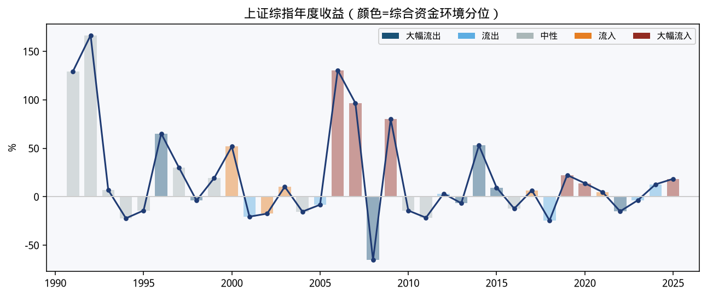
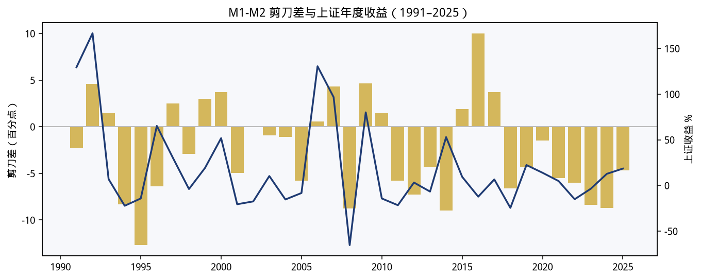
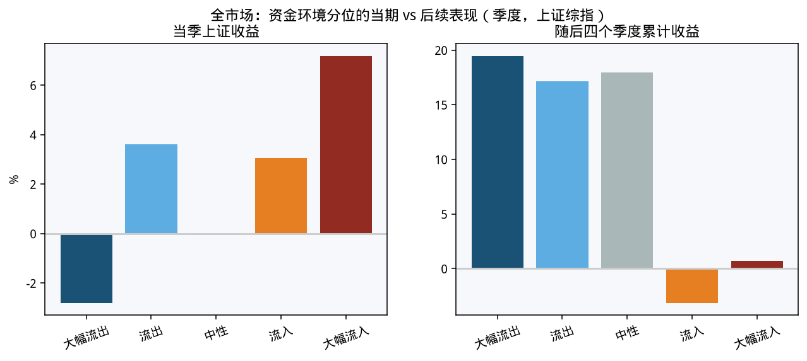
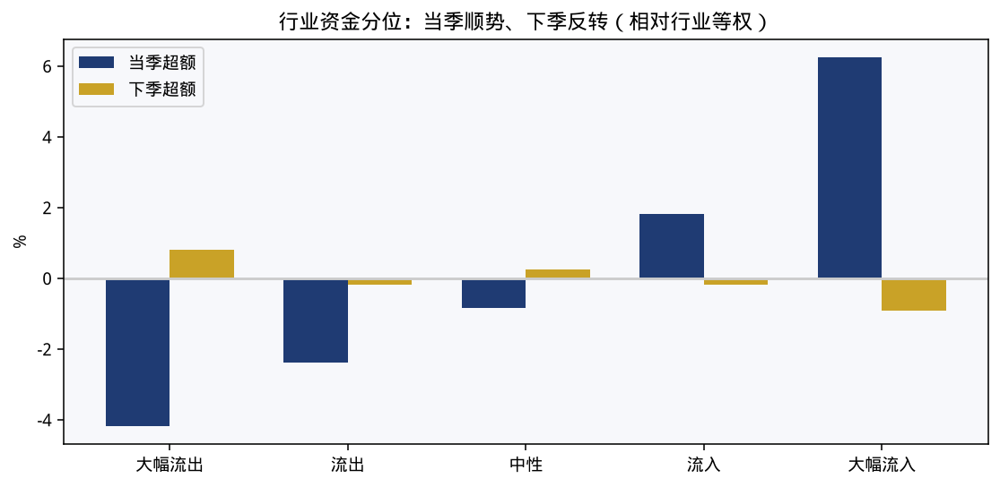

# A股市场资金流动长周期研究

数据截至 **2026-08-26**。完整年 2025，完整季 2026Q2。交互版报告见 [reports/ashare_capital_flow.html](reports/ashare_capital_flow.html)。

## 核心结论

A股资金流是行情的**同步指标**，不是可靠的领先指标。

| 问题 | 结果 |
| --- | --- |
| 资金流入时市场表现如何？ | 顺周期。年度相关 0.45；大幅流入年当年上证 60.3%，流出年 5.2%。 |
| 流入之后呢？ | 变差。流入季随后一年 0.7%，流出季随后一年 19.5%（p=0.067）。 |
| 最长的宏观代理？ | M1-M2 剪刀差：高分位年当年 58.3%，次年 -8.5%。 |
| 行业资金？ | 当季跟涨、下季拥挤回撤。流入组下季超额 -0.9%。季频轮动 -2.1%/季，年频轮动 6.8%/年。 |









## 数据覆盖

- 上证综指 / 上证A指：1990-12-19 起
- 深证成指：1991-04-03 起
- 全A近似：上证A指拼接国证A指（2005）
- M1/M2：1990 年代起（早期为年末或低频）
- 公募基金规模：1998Q2 起
- 两融：2010-03-31 起
- IPO 募资：2010 起
- 北向净买入：2014-11-17 至 **2024-08-16**（之后源字段缺失）
- 申万一级：16 个行业 1999-12-30 起，其余多自 2014-02-21

复现：

```bash
python3 scripts/fetch_data.py
python3 scripts/analyze.py
python3 scripts/build_report.py
```
