# 中美债券市场、利率与央行货币政策：熊陡、牛陡的机制与2026年实证

**研究报告**  
**日期：** 2026年8月23日  
**数据截止：** 2026年8月21日（美国财政部平价曲线、美联储 H.15 / FRED；中国中债国债收益率曲线及市场报价）

---

## 摘要

2026年夏季，中美国债市场同时处于“曲线变陡”的讨论之中，但驱动机制几乎相反。美国出现的是**熊陡（bear steepener）**：联邦基金利率被锚定在 3.50%–3.75%，2年期收益率大致稳定，30年期一度升至 5.31%，为2007年以来最高；曲线变陡的主因是长端卖盘与期限溢价上升，而非市场在定价一轮激进降息。中国则运行在**低利率、低通胀、政策利率按兵不动**的环境里：10年期国债约 1.68%–1.70%，接近2025年7月以来低点；同比看，1–7年期收益率明显下行、30年期反而上行约11个基点，呈现出“中短端偏牛、超长端相对偏熊”的结构分化。

本报告做三件事。第一，把债券市场中的**牛陡、熊陡、牛平、熊平**从定义、机制到交易含义讲清楚，避免把“曲线变陡”简单等同于经济复苏。第二，用官方利率数据还原2022年以来美国从深度倒挂到再陡峭化、以及2026年7–8月教科书式熊陡的过程。第三，对照中国人民银行“适度宽松但仍按兵不动”的政策组合，解释为何中美10年期利差仍在约300个基点的高位，以及这一分化对资产定价的含义。

核心判断可以概括为：

1. **陡峭化的方向重要，陡峭化的机制更重要。** 同样是利差走阔，牛陡通常对应短端政策放松，债券价格上涨；熊陡通常对应长端风险补偿上升，债券价格下跌。
2. **美联储仍然决定短端，但已不再主导长端。** 2026年8月旧金山联储模型显示，10年期国债中平均预期隔夜利率约为 3.43%，期限溢价升至 1.34%；长端定价越来越多由财政供给、买家结构与实际利率决定。
3. **中国债市的主要矛盾不是“会不会加息”，而是“宽松预期能否定价到长端”。** 政策利率连续15个月未动，资金面总体平稳，但超长端受供给、制度与风险偏好制约，曲线难以出现2010年代那种流畅的牛平。
4. **中美利率周期背离仍在延续。** 美国实际利率与名义长债同步走高，中国名义利率仍在历史底部附近。对跨境资金而言，利差本身已足够大；真正的约束更多在汇率、资本流动与两国增长/通胀预期的可持续性。

> 本报告仅供研究讨论，不构成投资建议。

---

## 目录

1. [问题的提出：为什么2026年都在谈“陡峭化”](#1-问题的提出为什么2026年都在谈陡峭化)
2. [分析框架：债券、利率与央行能决定什么](#2-分析框架债券利率与央行能决定什么)
3. [熊陡、牛陡、熊平、牛平：概念、机制与识别](#3-熊陡牛陡熊平牛平概念机制与识别)
4. [美国：从深度倒挂到财政驱动的熊陡](#4-美国从深度倒挂到财政驱动的熊陡)
5. [中国：低利率环境中的结构分化](#5-中国低利率环境中的结构分化)
6. [中美对照：同一套曲线语言，两套宏观故事](#6-中美对照同一套曲线语言两套宏观故事)
7. [对配置、金融条件与政策的含义](#7-对配置金融条件与政策的含义)
8. [情景与观察指标](#8-情景与观察指标)
9. [结论](#9-结论)
10. [数据附录与图表目录](#10-数据附录与图表目录)

---

## 1. 问题的提出：为什么2026年都在谈“陡峭化”

收益率曲线是把不同期限的国债收益率连成一条线。它看起来像一张静态图，实际上是市场对三件事的压缩定价：（1）未来短期政策利率路径；（2）通胀与增长预期；（3）持有长久期所要求的额外补偿，即**期限溢价（term premium）**。

2023年美国曲线曾经深度倒挂：2023年7月3日，10年期减2年期利差触及 **–108个基点**，是本轮周期最深水平之一。当时市场的主流叙事是“美联储加息过度、衰退将至”。倒挂解除后，传统教科书会把它读成“衰退风险过去、增长预期回来”。2026年的问题在于：曲线确实重新向上倾斜了，但推动力并不像典型的复苏期牛陡。

2026年7月29日，联邦公开市场委员会（FOMC）将联邦基金目标区间维持在 **3.50%–3.75%**，这是连续第五次按兵不动，投票结果为9票维持、3票主张加息。政策本身没有变。但随后两周，30年期美债收益率继续上行，8月17日收于 **5.31%**，为2007年以来最高收盘附近；2年期仅在4.18%–4.24%附近波动。短端跟着央行，长端跟着供给与风险补偿——这正是熊陡的定义。

中国的讨论语言相似，内容不同。2025年国内债市被概括为“快牛慢熊”，曲线经历过牛陡、熊平再转熊陡；进入2026年，10年期国债在1.6%–1.9%区间反复，8月中下旬又回到约1.68%。央行7天逆回购利率仍为 **1.40%**，1年期与5年期以上LPR分别为 **3.00%** 与 **3.50%**，已连续15个月未调。市场在问的不是“会不会加息”，而是：在政策利率不动、基本面偏弱、超长端供给仍在的组合下，曲线会继续牛陡，还是转为牛平，或再次熊陡。

要把这两条故事讲清楚，必须先回到定义。

---

## 2. 分析框架：债券、利率与央行能决定什么

### 2.1 价格与收益率：为何“熊”对应收益率上行

债券价格与到期收益率反向。对一只久期较长的国债，收益率上升1个基点，价格下跌的幅度远大于短债。因此固定收益市场里：

- **牛市（bull）**：收益率下行，债券价格上涨；
- **熊市（bear）**：收益率上行，债券价格下跌。

“陡”和“平”描述的不是水平，而是**形状**：长端与短端的利差走阔叫陡峭化，收窄叫平坦化。把方向和形状组合，就得到四种基本形态。

### 2.2 收益率的分解

任意期限 \(n\) 的名义国债收益率，都可以写成：

\[
y^{(n)} = \underbrace{\frac{1}{n}\sum_{t=1}^{n} \mathbb{E}[i_t]}_{\text{平均预期短期利率}} + \underbrace{\mathrm{TP}^{(n)}}_{\text{期限溢价}}
\]

其中 \(i_t\) 是未来短端政策利率。美联储能够较直接地影响第一项中的近端路径；第二项则取决于通胀不确定性、财政供给、杠杆资金、外国官方与国内机构的需求，以及流动性。2026年美国的关键事实是：第一项不再上升，第二项仍在上升。

### 2.3 央行的“势力范围”

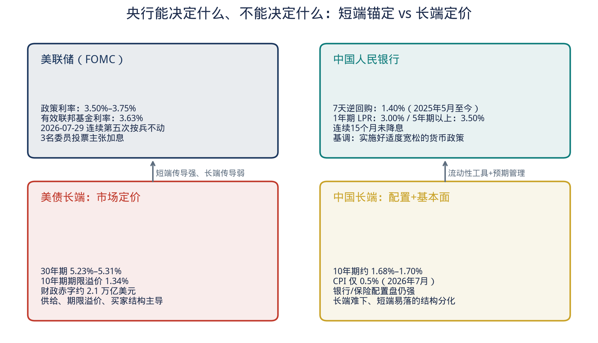

**图11　央行能决定什么、不能决定什么**

经验上可以这样划分：

| 区段 | 主要定价因子 | 央行影响 |
| --- | --- | --- |
| 隔夜至1年 | 政策利率、准备金、公开市场操作 | 很强 |
| 2–5年 | 政策路径预期、经济数据 | 强，但会被预期修正 |
| 10–30年 | 中性利率、通胀锚、期限溢价、供给 | 间接，且在量化紧缩后进一步减弱 |

美国方面，有研究指出美联储持有的公开债务占比已从2021年约26%降至2026年年中约14%，对长端的直接“压仓”能力明显下降。中国方面，央行仍可通过7天逆回购、买断式逆回购、国债买卖和预期管理影响资金面，但2024年以来多次出现“短端稳、长端自行定价”的局面——这说明即便在银行主导的市场里，长端也不是政策利率的简单平移。

---

## 3. 熊陡、牛陡、熊平、牛平：概念、机制与识别

### 3.1 一张图看懂四种形态

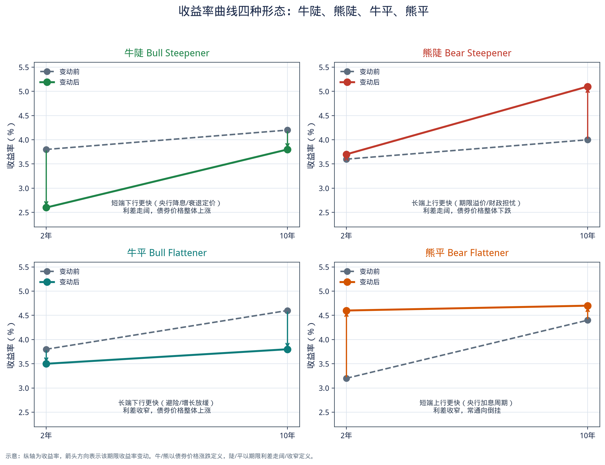

**图1　牛陡、熊陡、牛平、熊平（示意图）**

判断口诀只有两步：

1. **债券是涨还是跌？** 多数期限收益率下行 → 牛；多数期限收益率上行 → 熊。更严格的做法是看短端与长端各自的变动方向，以及总回报。
2. **利差是走阔还是收窄？** 常用 10年–2年，或 30年–2年。走阔 → 陡；收窄 → 平。若短端高于长端，则称为倒挂（inversion）。

由此得到：

| 形态 | 英文 | 短端 | 长端 | 利差 | 典型宏观含义 |
| --- | --- | --- | --- | --- | --- |
| **牛陡** | Bull steepener | 下行更快 | 下行较少或持稳 | 走阔 | 央行降息、衰退交易、流动性宽松 |
| **熊陡** | Bear steepener | 持稳或小幅上行 | 上行更快 | 走阔 | 通胀再起、财政供给、期限溢价、增长强于政策 |
| **牛平** | Bull flattener | 下行较少 | 下行更快 | 收窄 | 避险、增长放缓被确认、长端抢配 |
| **熊平** | Bear flattener | 上行更快 | 上行较少 | 收窄 | 加息周期、曲线常由此走向倒挂 |

实践中还有一种常见的**扭转（twist）**：短端与长端反向运动。例如短端下行、长端上行，利差必然走阔，它同时带有牛（短端）和熊（长端）的成分。2025年下半年至2026年的部分美债交易日，以及中国2025年三季度的长端调整，都属于扭转型陡峭化。识别时不要只看利差，还要看“是谁在动”。

### 3.2 为什么牛陡常常被误读成“利好经济”

历史统计里，曲线在衰退前后往往会先倒挂、再在衰退确认或美联储转向后**牛陡**——因为短端迅速定价降息，长端已经部分计入宽松，下行幅度更小。这类牛陡与经济“变好”可以同时出现，但逻辑顺序是：政策放松 → 短端下降 → 随后增长企稳。如果把所有陡峭化都读成复苏，就会把2026年美国这种**长端卖盘推动的熊陡**错判为“软着陆成功”。

反过来，熊陡也并不自动等于过热。如果长端上行主要来自供给和期限溢价，而不是来自上修的增长与通胀预期，它更接近**财政溢价重估**。对股票、地产和信用债，这种熊陡的含义更接近贴现率冲击，而不是盈利上修。

### 3.3 如何用数据确认“当前是哪一种”

建议同时观察三组指标：

1. **水平**：2年、10年、30年绝对收益率；
2. **斜率**：10s2s、30s2s、30s10s；
3. **分解**：盈亏平衡通胀（TIPS隐含）、实际利率、以及模型期限溢价。

2026年8月美国给出的组合是：名义长债上行、实际利率几乎同步上行、10年期盈亏平衡通胀大致稳定在2.3%附近、期限溢价上升。这是熊陡、而且是**实际利率/期限溢价型熊陡**，不是通胀预期失控型熊陡。

中国8月给出的组合是：政策利率不动，资金利率多数时间不高于7天逆回购，10年期在1.70%关口下破后维持低位，但30年期同比仍高于一年前。这更接近**中短端牛、超长端相对熊陡**的结构性行情，而不是美国式的财政溢价冲击。

### 3.4 对交易与机构行为的含义（概念层）

- **牛陡**：利于短久期债券、杠杆套息；曲线骑乘（riding the curve）收益上升；银行净息差若负债端迅速重定价向下，可能阶段性改善。
- **熊陡**：长久期损失最大（如20年期以上国债ETF）；银行账面利息收入随新发放贷款利率上升而改善，但存量久期资产会记亏损；住房按揭、公用事业、高杠杆房地产对长端更敏感。
- **牛平**：典型的衰退确认或“抢配长债”阶段，长久期是赢家。
- **熊平**：加息周期的经典形态，现金与浮息资产占优，曲线最终可能倒挂。

这些映射是统计规律，不是机械法则。2026年尤其需要把“谁在买长久期”考虑进去：美国缺少传统的官方买家与养老金的无弹性需求时，同样幅度的供给冲击会造成更大的熊陡；中国则仍有银行、保险的配置盘，长端可以在收益率并不高的情况下被“接下”，但超长端已经显示出买盘边界。

---

## 4. 美国：从深度倒挂到财政驱动的熊陡

### 4.1 2022–2025：加息、倒挂、再陡峭化

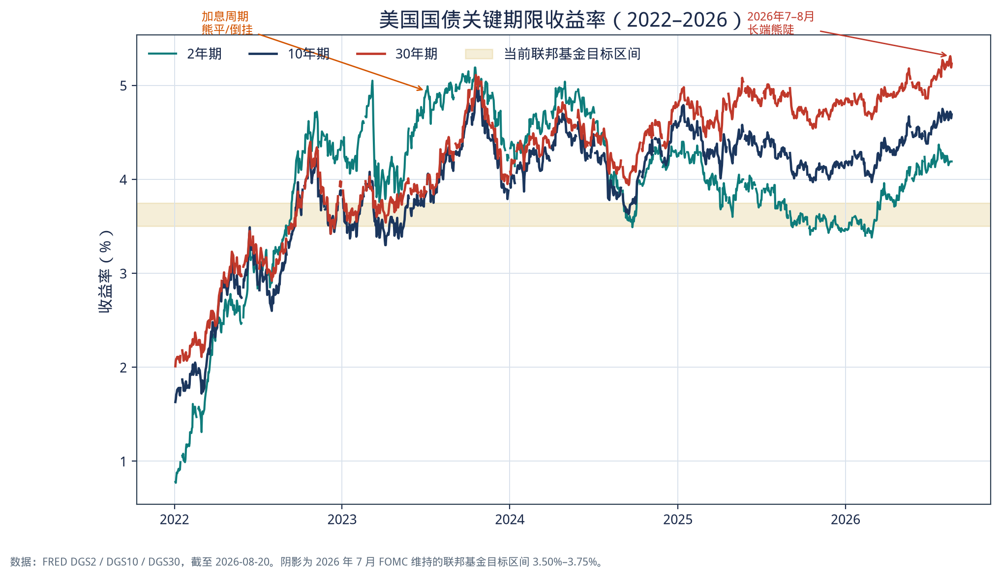

**图3　美国2年、10年、30年期国债收益率（2022–2026）**

本轮周期可以分成三段。

**第一段：2022–2023年中，熊平走向倒挂。** 美联储把政策利率从近零抬升至5.25%–5.50%。2年期紧跟政策，10年期上行更慢，曲线倒挂。2023年6月30日，2年期 4.87%、10年期 3.81%、30年期 3.85%，10s2s 为 **–106bp**；7月3日10s2s 触及 **–108bp**。这是教科书式的熊平：短端被加息推上去，长端因衰退定价而跟不上。

**第二段：2023年秋的长端冲击，已是熊陡的预演。** 2023年10月19日，10年期升至 4.98%，2年期 5.14%，30年期 5.11%。倒挂仍在，但长端已经因为“更高更久”和期限溢价回升而大幅重定价。当时市场把5%的10年期视为周期顶部；事后看，它更像长端新区间的第一次压力测试。

**第三段：2024–2025年，政策转向与曲线翻正。** 随着通胀回落和降息开启，2年期从高位回落。到2024年12月31日，2年期 4.25%、10年期 4.58%、30年期 4.78%，10s2s 转为 **+33bp**。2025年8月21日，2年期进一步降至 3.79%，10年期 4.33%，30年期 4.92%。短端下降、长端不降反升，这是一轮带扭转色彩的陡峭化：它既有牛（短端随降息），也有熊（长端期限溢价）。

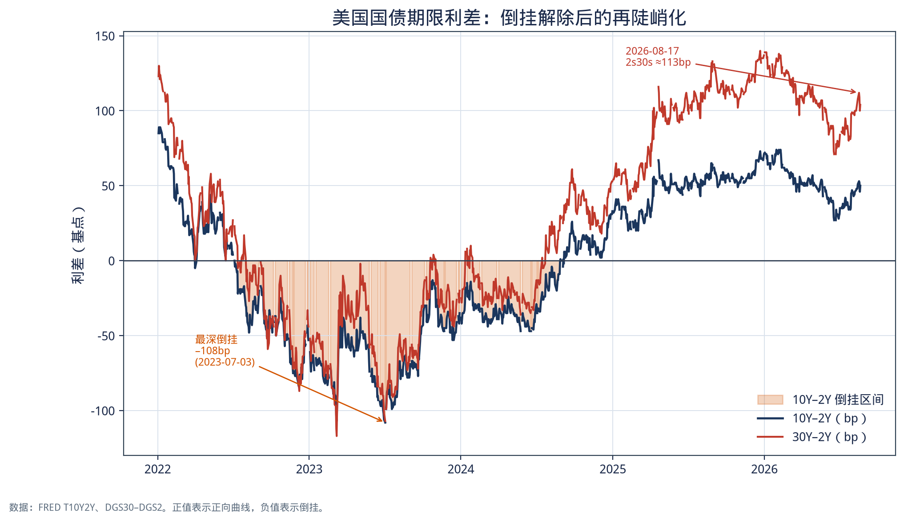

**图4　美国10Y–2Y与30Y–2Y利差：倒挂解除后的再陡峭化**

到2026年1月2日，2年期一度低至 **3.47%**，10s2s 约 **72bp**，30s2s 约 **139bp**。若只看斜率，当时曲线已经相当“正常”。真正的问题在后面：短端并没有继续下行，长端却继续走高。

### 4.2 2026年的水平：短端锚定，长端创十余年新高

截至2026年8月20日（H.15 / FRED）：

| 指标 | 数值 | 一年前（约2025-08-21） | 2026年初（2026-01-02） |
| --- | ---: | ---: | ---: |
| 有效联邦基金利率 | 3.63% | 4.33% | — |
| 联邦基金目标区间 | 3.50%–3.75% | 更高区间后的降息周期尾声 | 已处于当前区间附近 |
| 2年期国债 | 4.19% | 3.79% | 3.47% |
| 10年期国债 | 4.69% | 4.33% | 4.19% |
| 30年期国债 | 5.23% | 4.92% | 4.86% |
| 10Y–2Y | +50bp | +54bp | +72bp |
| 30Y–2Y | +104bp | +113bp | +139bp |
| 10年期TIPS实际利率 | 2.35% | 1.94% | 1.94% |
| 30年期TIPS实际利率 | 2.95% | 2.65% | 2.63% |
| 10年期盈亏平衡通胀 | 2.34% | — | 2.25% |

8月21日财政部平价曲线进一步显示：1个月 3.80%、2年 4.24%、10年 4.74%、30年 5.27%。短端几乎贴着政策利率走廊上沿，长端则明显“脱锚”。

需要同时承认一个容易被忽略的事实：**2026年年初至今，美国曲线整体更接近熊平而非熊陡。** 从1月2日到8月20日，2年期上行约72bp，10年期上行约50bp，30年期上行约37bp，斜率其实是收窄的。原因是年初市场一度定价更多宽松，随后就业与通胀的粘性、以及FOMC内部的鹰派反对票，把短端重新抬了上去。熊陡是**嵌在这段熊平大趋势里的局部主导叙事**，集中爆发在7月底到8月中旬。分析时必须区分“年初以来的水平变化”和“最近一次形状变化”。

### 4.3 2026年7–8月：一次教科书式熊陡

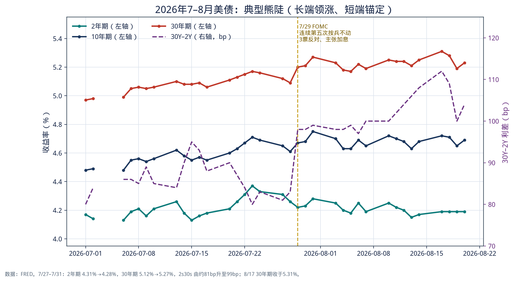

**图5　FOMC按兵不动之后，长端独自上行**

关键交易日的变动如下（FRED）：

| 日期 | 2年期 | 10年期 | 30年期 | 30Y–2Y |
| --- | ---: | ---: | ---: | ---: |
| 2026-07-27 | 4.31% | 4.65% | 5.12% | 81bp |
| 2026-07-29（FOMC） | 4.22% | 4.67% | 5.20% | 98bp |
| 2026-07-31 | 4.28% | 4.75% | 5.27% | 99bp |
| 2026-08-17 | 4.19% | 4.72% | 5.31% | 112bp |
| 2026-08-20 | 4.19% | 4.69% | 5.23% | 104bp |

7月27日至7月31日五个交易日内，2年期几乎不动，30年期上行15bp，2s30s 走阔约18bp。8月17日，30年期再创本轮高点，2s30s 扩大到约113bp，为当年4月以来最宽。与此同时，7月非农就业减少2.3万人、零售销售下降0.6%、CPI同比回落至3.4%、核心CPI至2.5%。按传统宏观逻辑，这些数据应支撑长债上涨（收益率下行）。现实是长债继续下跌。这正是“债券市场从美联储手中收回长端定价权”的含义。

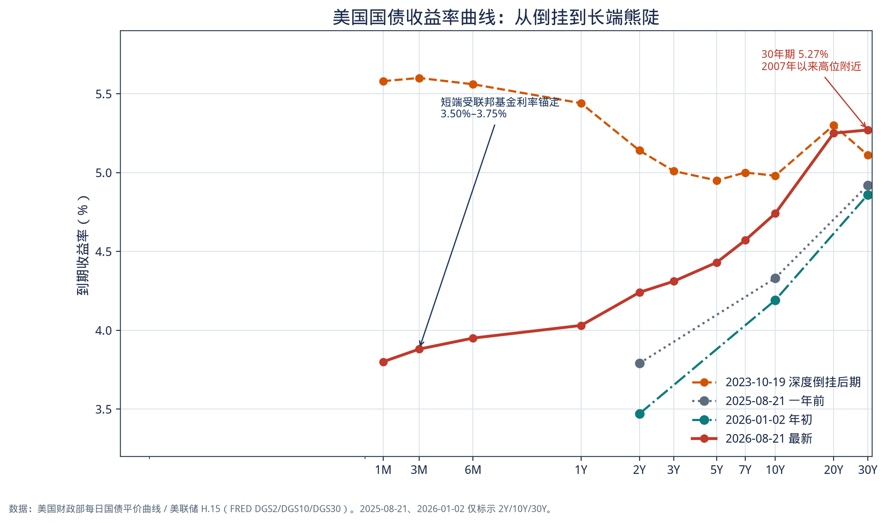

**图2　美国国债曲线：2023年10月倒挂后期 vs 2026年8月向上倾斜**

把2023年10月19日的曲线与2026年8月21日叠加，可以看到：短端从5.5%附近降到3.8%–4.0%，长端却仍在5.2%–5.3%。这不是简单的“降息周期结束”，而是曲线的**扭转重构**：政策利率下来了，长端融资成本没有下来。

### 4.4 机制一：期限溢价，而不是加息预期

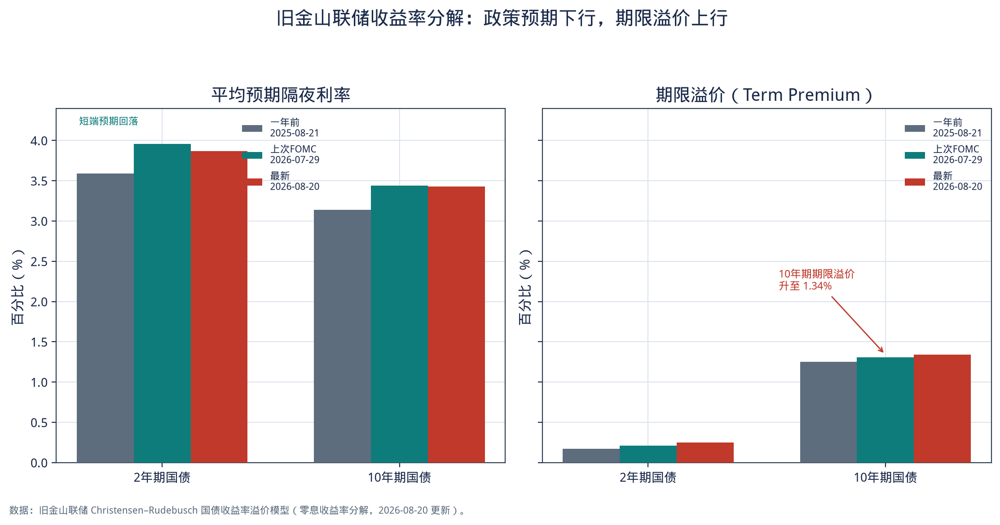

**图6　10年期国债：预期隔夜利率略降，期限溢价升至1.34%**

旧金山联储 Christensen–Rudebusch 模型把国债拆成“平均预期隔夜利率 + 期限溢价”。2026年8月20日：

| | 2年期 | 10年期 |
| --- | ---: | ---: |
| 观察收益率（模型口径） | 4.12% | 4.77% |
| 平均预期隔夜利率 | 3.87% | 3.43% |
| 期限溢价 | 0.25% | 1.34% |

对比7月29日FOMC当日：10年期预期隔夜利率 3.44% → 3.43%，期限溢价 1.31% → 1.34%。一年前（2025-08-21）10年期期限溢价为1.25%。也就是说，从上次议息到最新数据，市场对未来政策利率的平均预期还略有下降，把10年期推高的是风险补偿。2年期同样如此：预期隔夜利率从3.96%降至3.87%，自身期限溢价从0.21%升至0.25%。

这与期货隐含的政策路径一致：7月会议后市场一度给9月加息较高概率，随后就业与通胀数据转弱，加息概率回落。短端跟着概率走，长端没有跟着走回来。

### 4.5 机制二：实际利率，而不是通胀补偿

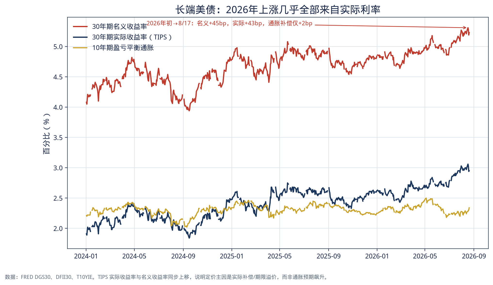

**图7　2026年长端美债上涨几乎全部来自实际利率**

财政部名义曲线与TIPS实际曲线给出更干净的分解。2026年1月2日至8月17日：

| 30年期 | 2026-01-02 | 2026-08-17 | 变动 |
| --- | ---: | ---: | ---: |
| 名义收益率 | 4.86% | 5.31% | **+45bp** |
| TIPS实际收益率 | 2.63% | 3.06% | **+43bp** |
| 隐含通胀补偿 | 2.23% | 2.25% | **+2bp** |

10年期盈亏平衡通胀8月20日为2.34%，较年初2.25%仅升约9bp，完全无法解释长端45bp的名义升幅。结论很硬：**投资者并不是突然相信未来30年通胀会显著更高，而是要求为锁定30年资金索取更高的实际回报。**

### 4.6 机制三：财政供给与“谁来买长债”

熊陡要持续，必须有持续的供给或持续的需求撤出。2026年的美国同时具备两者的影子：

- 国会预算办公室将2026财年赤字预期上修至约 **2.1万亿美元**，较2月估计高出约2000亿美元。
- 前10个月净利息支出约 **9630亿美元**，同比增加1170亿美元（约14%）。短端利率下降本应节省利息，但债务存量扩大和长端利率上升把节省抵消了。财政本身已经在记录债券市场的曲线分裂。
- 三季度财政部预计净发行由私人部门吸收的可交易国债约7390亿美元，高于5月预测。8月季度再融资仍将30年期拍卖规模维持在250亿美元，13日的30年期招标收益率 **5.216%**，投标倍数2.39，需求“够用但更贵”。
- 传统长端买家——养老金、保险、部分外国官方机构——对美债久期的边际需求弱于十年前。当美联储不再是最大的价格不敏感买家时，边际价格由对利率更敏感的私人资金决定。

因此，2026年7–8月的熊陡不宜理解为“市场突然看好美国增长”。更准确的表述是：在政策利率被按住的同时，市场提高了对美国长期财政路径的风险补偿。增长数据走弱没有扭转这一补偿，说明长端已经部分“财政主导化”——不是说美联储无足轻重，而是说仅靠“增长放缓→降息”这条旧链条，不足以压低30年期收益率。

### 4.7 宏观背景：不是过热，也还不是衰退定价

与曲线同步的实体数据是分裂的：

- 2026年二季度GDP约1.5%，一季度约2.1%，增速下台阶；
- 7月失业率4.1%，就业出现负增长；
- CPI同比3.4%，PCE（6月）3.7%，仍高于2%目标；PPI同比偏高；
- 30年期固定按揭利率8月中约6.67%，跟随的是长端而非联邦基金利率。

这组数据更接近**滞胀风险的弱版本**：增长放缓，但通胀尚未回到足以让美联储大幅降息的水平；同时财政扩张阻止长端成为避险资产。于是出现一种别扭的均衡——短端可以因数据走弱而停止定价加息，长端却因供给与信誉补偿而维持高位。对股票而言，这解释了为何有时出现“长端上行、风险资产未必立刻崩”：如果短端不再加息，流动性恐惧下降，资金可以在板块之间轮动。对利率敏感的长久期资产则没有这种幸运。

---

## 5. 中国：低利率环境中的结构分化

### 5.1 政策利率停在低位，债券收益率停在更低的位置

截至2026年8月21日前后，中国利率体系大致如下：

| 工具 / 品种 | 水平 | 状态 |
| --- | ---: | --- |
| 7天逆回购操作利率 | 1.40% | 2025年5月下调后连续约15个月未变 |
| 1年期LPR | 3.00% | 同期连续15个月未调 |
| 5年期以上LPR | 3.50% | 同上 |
| 中债国债1年 | 约1.20% | 低于政策利率 |
| 中债国债2年 | 约1.24% | 同比下行约16bp（市场报价口径） |
| 中债国债10年 | 约1.68% | 接近2025年7月以来低点；历史最低约1.596%（2025-02-06） |
| 国债30年 | 约2.19% | 同比仍上行约11bp |
| CPI同比（2026年7月） | 0.5% | 显著低于美国 |
| 城镇调查失业率（7月） | 5.2% | 较上月回升 |

8月LPR继续持平，符合定价基础未变的预期：LPR由7天逆回购加点形成，政策利率不动，报价行在净息差已低至约1.40%的约束下也缺乏主动压缩加点的动力。央行在2026年二季度货币政策执行报告和8月下半年工作会议中，继续强调**实施好适度宽松的货币政策**，并提到把握力度、节奏和时机，加强逆周期调节。市场将其解读为：方向仍宽，但总量降息降准需要更明确的增长下行催化。

资金面上，8月中出现两个细节：一是公开市场曾连续多日7天逆回购零投放，引发短端情绪波动；二是央行在税期首次开展月中隔夜逆回购，并等量续作买断式逆回购。这体现当前操作哲学——**精准呵护、避免大水漫灌**。对债券市场的含义是：短端难现2015或2020年那种极度宽松，因此“牛陡之后无条件切换为牛平”的历史经验不能直接套用。

### 5.2 曲线形态：整体低位、斜率为正、超长端更陡

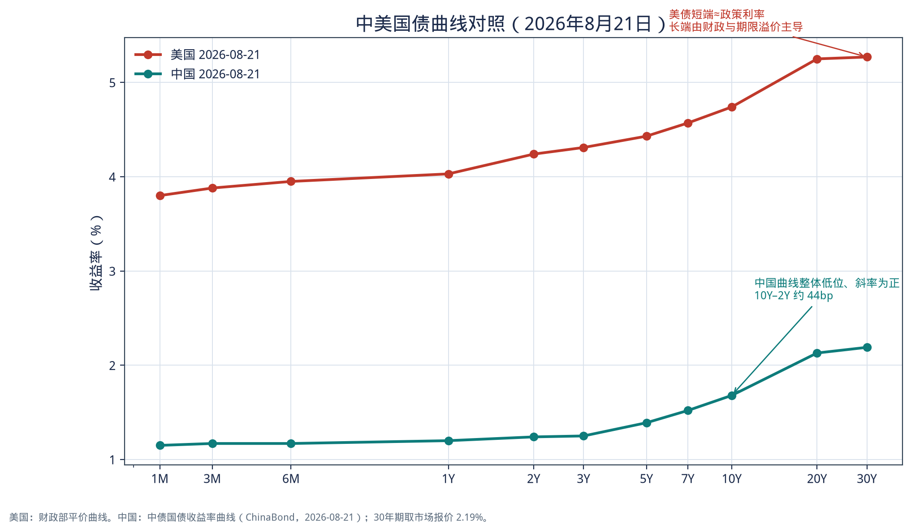

**图9　2026年8月21日中美国债曲线**

中国当前曲线是一条位于低位的正向曲线：隔夜至1年约1.0%–1.2%，2–3年约1.24%–1.25%，10年约1.68%，20–30年约2.13%–2.19%。10Y–2Y 约40–44个基点，远谈不上倒挂，也谈不上海外意义上的“陡峭牛市”。与美国的差别首先是水平：美国2年期已经高于中国30年期。

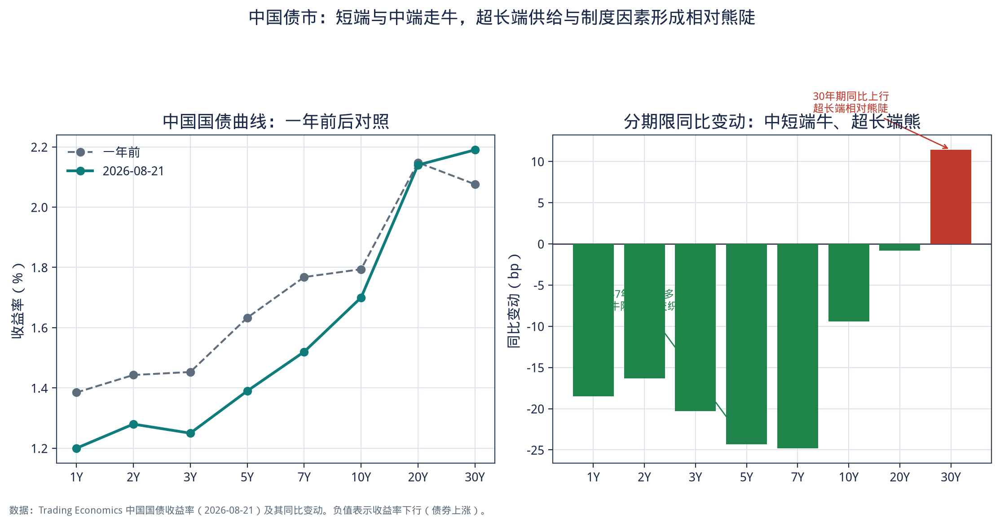

**图10　中国国债分期限同比：3–7年下行最多，30年期上行**

用2026年8月21日市场报价的同比变动看结构：

| 期限 | 最新约 | 同比 |
| --- | ---: | ---: |
| 1年 | 1.20% | –18.5bp |
| 2年 | 1.28% | –16.3bp |
| 3年 | 1.25% | –20.3bp |
| 5年 | 1.39% | –24.3bp |
| 7年 | 1.52% | –24.8bp |
| 10年 | 1.70% | –9.4bp |
| 20年 | 2.14% | –0.8bp |
| 30年 | 2.19% | **+11.4bp** |

这是理解中国“陡峭化”时最容易混淆的一张表。

- 对 **2s10s** 而言：2年期下行多于10年期，利差走阔，且收益率整体下行 → **牛陡**。
- 对 **7s10s、10s30s** 而言：中端下行、超长端持稳甚至上行 → 曲线在10年以外变陡，且超长端带有熊的成分 → **相对熊陡**。
- 对绝对水平而言，10年期仍接近一年低点，债券市场的“牛”并没有结束，只是牛的部位从超长端转移到了3–7年。

国内卖方研究在2025年底至2026年中的典型表述——“短端易落、长端难下”——与这张表一致。2026年6–7月一度出现较典型的牛陡后，市场争论下一阶段会否转为牛平。历史统计（2006年以来约10段牛陡）显示：随后20个交易日内转为牛平的次数较多，但拉长到60个交易日，牛平不再占优，熊平甚至重新占上风。转换的必要条件是基本面预期不再改善。若财政发力或风险偏好回升被市场确认为趋势，牛陡之后完全可能接熊平或熊陡，而不是“顺理成章的牛平”。

### 5.3 2024–2026：从快速牛市到低位震荡

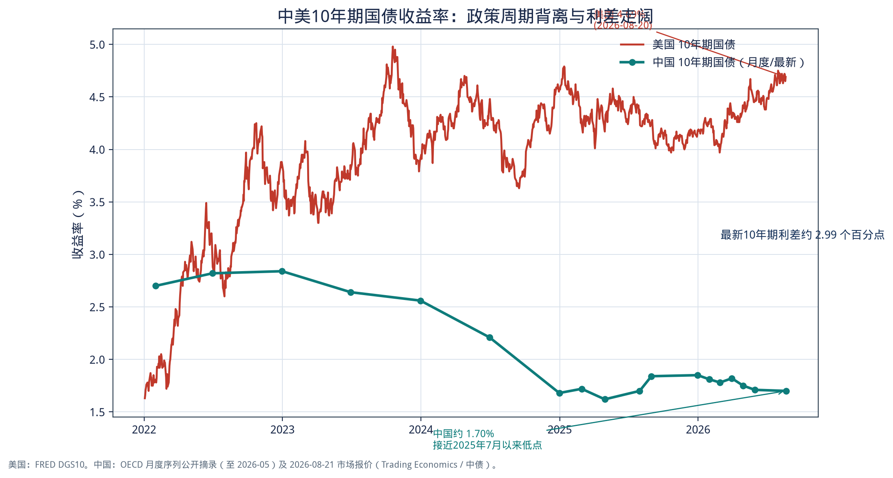

**图8　中美10年期国债收益率（2022年以来）**

中国10年期国债的月度轨迹（OECD公开摘录及最新报价）大致是：

- 2023年末约 **2.56%**；
- 2024年持续下行，2024年末已至约 **1.68%**（当年11–12月出现一轮快速牛市）；
- 2025年2月6日中债口径录得约 **1.596%** 的历史低点，此后在1.6%–1.9%箱体震荡；
- 2025年三季度因风险偏好回升、供给与制度因素，长端一度调整，曲线由熊平转熊陡；
- 2026年5月末约1.71%，8月下旬回到约1.68%–1.70%。

这轮下行的宏观土壤是清楚的：房地产长周期调整、信贷需求不足、CPI接近零、实际利率偏高。债券成为稀缺的“还在提供票息的类现金资产”，银行与保险的配置行为放大了行情。也正因为绝对收益率已经很低，2025年之后的主要矛盾从“方向”转向“结构”：谁还能再下、谁先成为供给冲击的出口。超长端往往是那个出口——保险有负债久期匹配需求，但也对资本占用、会计波动和税收制度更敏感；交易盘则更愿意在3–7年获取票息和资本利得。

### 5.4 货币政策传导：宽货币尚未完全变成宽信用

中国与美国在2026年有一个表面上的相似点：政策利率都在“按兵不动”。含义完全不同。美联储是在通胀仍高于目标、内部出现加息反对票的情况下暂停；人民银行是在通胀过低、增长动能转弱的情况下，选择以结构性工具和流动性微调代替新的降息。结果是：

1. **短端利率已经低于政策利率。** 中债短端约1.1%–1.2%，DR001多数时间低于1.40%。这本身接近一种“事实上的宽松”，只是没有体现为LPR下调。
2. **信贷与房价对利率更不敏感。** 当需求曲线平坦时，多降10bp政策利率，也不必然带来信用扩张。这削弱了“降息 → 增长回升 → 熊市”的旧反馈，使债市可以在低位停留更久。
3. **财政与准财政供给成为长端的上限。** 国债、地方债、政策性金融债的供给节奏，会周期性地把超长端顶起来，形成熊陡或熊平插曲，即使央行没有收紧。

因此，中国2026年8月的“偏陡”，不宜对照美国去解读成财政信誉溢价。它更接近：**政策维持宽松承诺 + 基本面偏弱把中短端按住，供给与风险偏好把超长端按住不下。** 这是低利率环境下的结构牛陡/结构熊陡并存。

---

## 6. 中美对照：同一套曲线语言，两套宏观故事

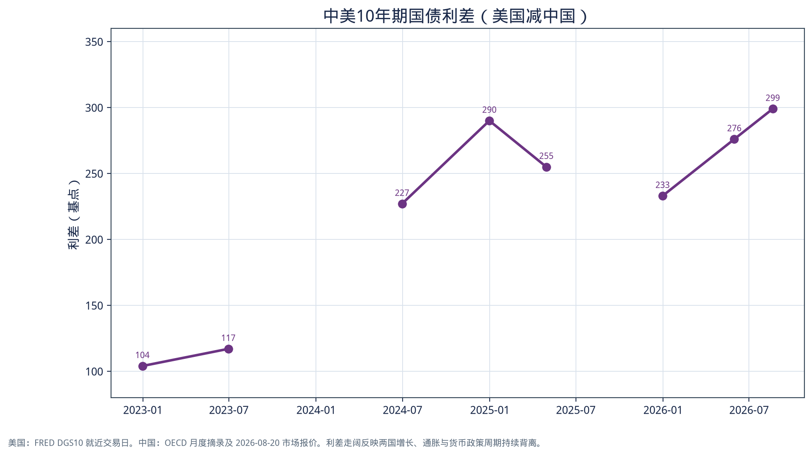

**图12　中美10年期国债利差（美国减中国）仍在约300bp**

用同一套“牛熊陡平”语言，可以把两国2026年8月的状态并排如下。

| 维度 | 美国 | 中国 |
| --- | --- | --- |
| 政策利率 | 3.50%–3.75%，内部偏鹰 | 7天逆回购1.40%，基调适度宽松 |
| 通胀 | CPI 3.4%，目标2%尚未回到 | CPI 0.5%，通缩压力未消 |
| 增长 | 放缓但仍正增长，就业转弱 | 动能偏弱，刺激预期反复 |
| 10年期 | 约4.7% | 约1.68%–1.70% |
| 30年期 | 5.2%–5.3%，2007年以来高位 | 约2.19%，同比小幅上行 |
| 主导形态（近月） | **熊陡**（长端领涨） | **中短端牛陡 + 超长端相对熊陡** |
| 主导因子 | 期限溢价、财政供给、实际利率 | 配置需求、低通胀、超长端供给 |
| 央行对长端 | 影响力明显下降 | 仍能通过流动性与预期管理影响，但无法完全按住超长端 |
| 曲线信号 | 不是典型复苏牛陡 | 不是加息熊平，也不是流畅牛平 |

中美10年期利差从2023年末约130bp量级，扩大到2026年8月约 **300bp**。这一利差包含三层不可混为一谈的内容：

1. **通胀差。** 美国名义利率需要覆盖3%上下的通胀，中国只需要覆盖接近零的通胀。即便实际利率相近，名义利差也会很大。事实上当前美国10年期实际利率约2.35%，中国10年期减CPI约1.2%，实际利差小于名义利差。
2. **周期差。** 美国仍在限制性利率区域附近徘徊，中国已在宽松区域停留较久。
3. **风险补偿差。** 美国长端多出来的，很大一部分是财政与供给溢价；中国长端少下来的，很大一部分是“缺资产”带来的配置溢价。

对人民币资产而言，300bp的国债利差会通过套息、美元流动性与资本流动产生影响，但不会线性决定汇率。2026年的经验仍然是：利差是背景，风险偏好和相对增长预期才是汇率的短周期驱动。对美元资产而言，中国利率再低，也替代不了美债作为全球贴现率锚的地位——所以美国长端的熊陡会进入全球资产的分母，而中国牛市更多停留在国内配置圈。

一个有用的对照是2003–2007年的美国陡峭化与当前的差异。当年陡峭化发生在政策利率从1%回升之前或之初，长端因增长和通胀预期而升，但起点是低赤字、强外国官方需求。2026年的美国熊陡发生在政策利率已经限制性、赤字超过2万亿美元、官方买家退坡之后。形状相似，信息含量不同。

---

## 7. 对配置、金融条件与政策的含义

### 7.1 对债券自身

**美国：** 在熊陡延续的假设下，损失集中在20–30年。8月中TIPS 30年期实际利率超过3%，意味着“买入并持有到期”的实际补偿已经回到相当有吸引力的历史分位，但这与“短期价格还会跌”并不矛盾。若配置必须参与美债，更稳妥的是把久期放在曲线中段（5–10年）：既保留高于现金的收益率，又避免30年端对期限溢价最敏感的凸性风险。短端（2年以内）更接近现金替代，其主要风险是FOMC若跟随三名反对委员真正加息，会出现一轮熊平。

**中国：** 票息已经薄，资本利得依赖降息或资金面超预期宽松。3–7年是过去一年下行最多的区段，性价比取决于两个变量：DR007能否稳定低于政策利率，以及是否出现新的降准降息。超长端更适合负债久期匹配的配置盘做波段，而不是交易盘“一路做多到牛平”。历史经验也不支持“牛陡之后必然牛平”。

### 7.2 对银行、地产与风险资产

熊陡对商业银行净息差通常偏正面：负债端锚定短端，资产端新发放贷款和证券收益率跟随长端。美国区域银行股在陡峭化阶段往往相对占优。但前提是信贷损失不恶化。2026年就业已经转弱，若衰退风险上升，净息差改善会被拨备抵消。

对中国银行，情况更复杂：资产收益率随LPR和贷款需求走低，负债成本下降受制于防止资金空转和净息差底线。曲线变陡如果来自超长利率债调整，对银行债券账户是利空，对息差帮助有限。

房地产和公用事业在两国都更吃长端。美国30年按揭约6.7%，对应的是5%以上的长债，而不是3.6%的联邦基金。中国5年期以上LPR仍在3.50%，按揭利率的政策锚定强于美债市场，地产的约束更多是需求与预期，而不是曲线形态本身。

### 7.3 对货币政策

美联储面临的困境是：**短端工具无法廉价地压低长端。** 若因就业转弱而降息，可能被市场读成财政主导下的“政策屈服”，期限溢价进一步上升，出现“降息但长债不涨”甚至熊陡加深。若因通胀粘性而加息，短端上行、曲线熊平，金融条件全面收紧，资产价格和财政利息支出同时承压。2026年7月3张加息反对票说明委员会内部更担心后者；债券市场用长端卖盘说明它更担心前者的财政版本。

人民银行面临的困境是对称的：**短端已经很松，再松的边际效果下降，且需防止资金空转和汇率压力。** 报告提出的“适时调整货币政策工具”，更可能体现为降准、结构性工具扩容或小幅降息，而不是把7天逆回购一次性打到显著更低。对债市，这意味着牛陡可以有，但空间取决于基本面是否继续不及预期，而不是政策已经给出明确的“快牛”信号。

### 7.4 对全球金融条件

美国长端是全球贴现率。30年期从4.9%升到5.3%，会提高美元信用、新兴市场主权债和成长股的折现率。中国利率再低，也主要通过国内银行体系的资产再配置起作用，外溢小于美债。2026年真正具有全球宏观意义的曲线事件，是美债熊陡而不是中国牛陡。

---

## 8. 情景与观察指标

以下情景用于跟踪，而不是预测点位。

### 8.1 美国

**情景A：熊陡延续（基准偏多）。** 条件是赤字与净发行维持高位、通胀停在3%附近、FOMC继续按兵不动。观察：30年期能否站稳5.20%上方；10年期期限溢价是否继续高于1.30%；30年期拍卖是否出现明显尾差。若同时出现就业继续收缩，将形成“数据差、长债更差”的背离，确认财政溢价主导。

**情景B：转为熊平。** 条件是FOMC重新加息或市场显著上修政策路径。2年期向4.5%以上移动，30s2s收窄。这对现金有利，对所有久期不利，对股票的冲击通常大于有序熊陡。

**情景C：转为牛平或牛陡。** 条件是增长与通胀同时下破，市场定价的不是一次保险性降息，而是完整的宽松周期。短端下行快于长端则为牛陡；若衰退确认、长端避险需求压过供给，则可能牛平。2026年至今尚未出现这一组合。

近月必须跟踪的日程包括：9月11日CPI、9月15–16日FOMC，以及财政部后续季度再融资是否上调长债发行规模。

### 8.2 中国

**情景A：震荡偏多、中短端延续牛陡/牛平（基准）。** 条件是7、8月数据继续偏弱，央行维持流动性合理充裕，全国人大常委会及后续政策以托底为主、但不立即推出强刺激。10年期围绕1.65%–1.75%波动，3–7年相对占优。

**情景B：牛平。** 需要基本面预期不再改善、资金面稳定、机构把配置从中短端延伸到10年及以内。历史概率在一个月内不低，在一个季度内下降。

**情景C：再出熊陡。** 触发往往是股市风险偏好升温、超长期供给放量、或央行有意校正“利率过低”预期。2025年三季度已演练过一次。30年期对这一情景最敏感。

观察指标：DR001/DR007与7天逆回购的偏离、LPR与MLF是否松动、10年期与1年期利差、30–10年利差、以及财政发行计划。

---

## 9. 结论

债券市场的语言里，“陡”只描述形状，“牛/熊”才描述盈亏。把两者拆开，2026年中美债市的表象相似、本质相反。

美国刚经历一轮由长端主导的**熊陡**：美联储把短端按在3.50%–3.75%，市场把30年期推到5.3%。驱动不是复苏乐观，而是期限溢价和实际利率。旧金山联储模型、TIPS曲线和财政数据指向同一个故事——投资者为持有美国长久期要求更高补偿，即使就业与零售已经走弱。曲线从2023年的深度倒挂中走出来了，但走出来的方式并不是历史上那种衰退后的牛陡。

中国运行在另一套约束里：政策利率停在低位、通胀接近零、10年期国债回到约1.68%。同比看，中短端走牛、超长端走熊，曲线在10年以内偏牛陡、在10年以外偏结构熊陡。这反映的是缺资产与弱需求，而不是财政信誉溢价。央行仍承诺适度宽松，但选择“以静制动”，把总量降息留给更明确的下行风险。牛陡之后会否牛平，取决于基本面预期有没有方向性变化，而不是曲线形态本身的惯性。

对分析的启示有三条。第一，**不要用斜率代替机制。** 同样+100bp的2s30s，可能是降息牛陡，也可能是供给熊陡。第二，**央行的地图只覆盖曲线的左半边。** 美联储尤其如此。第三，**中美利差的扩大是周期错位的结果，不宜单独外推。** 它会继续影响资本流动和美元资产的相对吸引力，但真正决定下一阶段全球金融条件的，仍是美国长端能否在5%上方站稳，以及中国会否把宽松从资金面推进到信用面。

---

## 10. 数据附录与图表目录

### 10.1 图表目录

| 编号 | 文件 | 内容 |
| --- | --- | --- |
| 图1 | `charts/fig01_four_regimes.png` | 牛陡、熊陡、牛平、熊平示意图 |
| 图2 | `charts/fig02_us_yield_curve_snapshots.png` | 美国国债曲线多时点对照 |
| 图3 | `charts/fig03_us_yields_2022_2026.png` | 美债2Y/10Y/30Y时间序列 |
| 图4 | `charts/fig04_us_term_spreads.png` | 10s2s 与 30s2s |
| 图5 | `charts/fig05_july_aug_bear_steepener.png` | 2026年7–8月熊陡特写 |
| 图6 | `charts/fig06_term_premium_decomposition.png` | 旧金山联储期限溢价分解 |
| 图7 | `charts/fig07_real_vs_nominal_long_end.png` | 名义利率、实际利率与盈亏平衡通胀 |
| 图8 | `charts/fig08_cn_us_10y.png` | 中美10年期收益率 |
| 图9 | `charts/fig09_cn_us_current_curves.png` | 中美当前全曲线 |
| 图10 | `charts/fig10_china_yoy_curve.png` | 中国分期限同比变动 |
| 图11 | `charts/fig11_policy_vs_long_end.png` | 政策利率与长端定价对照 |
| 图12 | `charts/fig12_us_china_10y_spread.png` | 中美10年期利差 |

图表可由 `scripts/generate_charts.py` 复现。原始美债序列见 `data/fred_ust_yields.csv`、`data/fred_tips_breakeven.csv`。

### 10.2 主要数据来源

- 美国财政部 Daily Treasury Par Yield Curve Rates（2026年8月及历史时点）。
- 美联储 H.15 Selected Interest Rates；FRED：DGS2、DGS10、DGS30、T10Y2Y、T10YIE、DFII10、DFII30。
- 旧金山联邦储备银行 Treasury Yield Premiums（Christensen–Rudebusch 模型，更新至2026-08-20）。
- 中债国债收益率曲线（ChinaBond，2026-08-21）；Trading Economics 中国国债分期限报价及同比。
- 中国10年期月度序列：OECD 公开摘录（至2026-05）。
- 中国人民银行：公开市场操作利率、LPR、2026年第二季度货币政策执行报告及下半年工作会议表述。
- 美国宏观经济与财政：CBO 赤字估计、财政部季度再融资与拍卖结果、劳动力市场与CPI/PCE 媒体与研究机构汇总（截至2026年8月中下旬）。

### 10.3 复现

```bash
python3 -m pip install matplotlib pandas numpy
python3 bond-market-report/scripts/generate_charts.py
```

---

*完*
