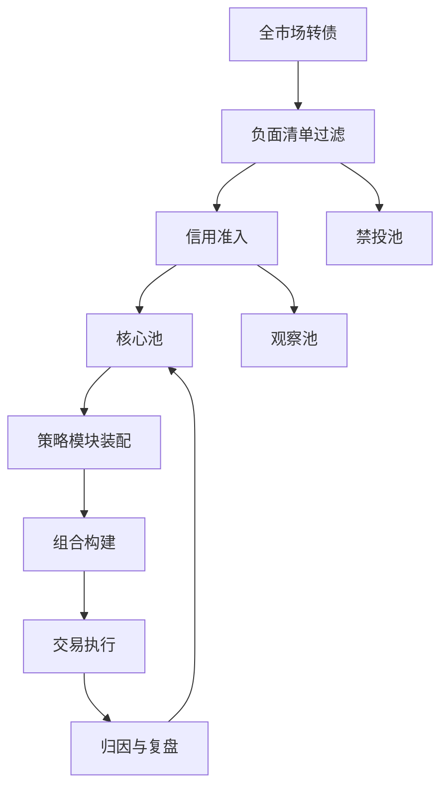

# 04 投研策略体系

权益能力偏弱时，转债投研的原则是：**信用排雷用固收已有能力，选券和组合用规则，正股观点只做否决权，不做主引擎。**

## 1. 投研架构：三层池 + 四个策略模块



### 1.1 三层池

| 池 | 定义 | 谁维护 | 用途 |
| --- | --- | --- | --- |
| 核心池 | 满足信用、流动性、条款、风格约束，可直接买入 | 信用研究 + 转债投资经理 | 组合 80% 以上来自这里 |
| 观察池 | 信用或条款有疑问，或风格过股性，暂不作为底仓 | 信用研究 | 只跟踪，买入须投委会或特别授权 |
| 禁投池 | 评级、ST、余额过小、重大违法、已公告强赎未处理、主体信用事件 | 风控为主 | 系统硬拦截 |

入核心池最低门槛（起步阶段，可按公司信评制度上调）：

1. 主体或债项评级不低于 **AA+**（银行转债按银行授信与资本补充制度执行）。
2. 发行人须能落入现有信用研究覆盖，或完成等同于信用债入库的尽调。
3. 剩余规模建议不低于 **5 亿元**（具体以公司流动性管理办法为准，宁高勿低）。
4. 剩余期限原则上 > 1 年；进入回售期的要单独标注。
5. 非 ST、非退市风险警示、非交易所风险警示债券。
6. 未处于“已公告强赎且临近停止交易”。

### 1.2 四个策略模块（先装配，后创新）

把策略写成可开关的模块，产品只选择模块组合，投资经理不能在模块外“即兴”加仓。

| 模块 | 目标 | 主要因子 | 起步权重建议 | 需要的权益能力 |
| --- | --- | --- | --- | --- |
| M1 债性票息 | 类信用债增强 | YTM、纯债溢价、评级、剩余期限 | 高 | 低 |
| M2 规则化双低/低价 | 估值性价比 | 价格、转股溢价、百元溢价、分散 | 中 | 低（规则） |
| M3 正股质量约束 | 避免“便宜的差公司” | 正股盈利、分红、杠杆、是否覆盖 | 作为过滤器 | 中（可用卖方+内部信用） |
| M4 条款风险管理 | 不亏在条款上 | 强赎、回售、下修、停牌 | 必开 | 低（流程） |

**M5 下修博弈、M6 打新/抢权、M7 偏股弹性** 列入研究储备，不作为起步产品的默认模块。

## 2. 模块细则

### M1 债性票息（主力）

**选券：** 价格不高、纯债溢价低或 YTM 对同评级信用债有补偿、正股即使不涨也亏得有限。

**组合角色：** 转债仓位的底仓，解释给客户时最接近“固收增强”。

**买入纪律：**

- 优先银行、公用事业、高分红、资产负债可理解的发行人。
- 信用结论必须与该公司信用债入库结论一致；转债不能成为“信用债买不进去就买转债”的后门。
- 不单纯因为价格低于 100 就买。价格低可能是信用折价。

**卖出纪律：**

- 信用下调、财务指标触发观察名单。
- 价格上涨后风格变成偏股，且不再符合本模块，调到 M2 或减仓。
- YTM 优势消失且溢价过贵。

### M2 规则化双低 / 低价（增强）

经典公式：

```text
双低值 = 转债价格 + 转股溢价率 × 100
```

低价策略更侧重绝对价格和债底，适合低波绝对收益；双低同时要溢价，弹性更高。

**理财资金改造后的流程（不要直接套散户 20 只等权）：**

1. 在核心池内计算双低值 / 低价分位。
2. 剔除：已公告强赎、余额过小、日成交不足、评级不达标、正股质量否决。
3. 按双低值升序取前 N 只，N 由容量决定，常见 10–20，单只内部限额 3%–5%。
4. 等权或按成交额/剩余规模加权，避免把组合压在小盘券上。
5. 轮动频率：每月或每两周；阈值轮动（跌出前 N+k 才替换）优于高频。
6. 记录每次轮动的换手、冲击成本、剔除原因。

**当前市场的提醒：** 转股溢价中枢上移后，机械双低会买到“价格不低、溢价相对低”的偏股券。必须叠加价格上限（起步建议核心仓价格不超过 130）和 M3 质量过滤。

### M3 正股质量约束（否决权，不是选股引擎）

权益团队不成熟时，不要求出具目标价，只要求能做四项否决：

1. 正股是否有明显财务造假、监管处罚、控股股东质押危机。
2. 盈利是否持续恶化到可能损害债底（经营性现金流、有息负债、到期债务）。
3. 是否高分红、商业模式可理解——这是银行理财最容易覆盖的一类正股。
4. 行业是否属于公司信用研究已覆盖的行业。

过不了否决的券，即使双低排名第一也不进组合。  
这一步的目的是防止规则策略在信用和治理上“捡烟蒂”。

### M4 条款风险管理（必开）

每日条款日历至少覆盖核心池和持仓：

| 事件 | 触发后动作 |
| --- | --- |
| 强赎计数进入高风险（如已满 10/15 日） | 列入重点；制定减仓或转股方案 |
| 公告强赎 | T+0 进入处理流程，禁止“再看两天” |
| 进入回售期且价格显著低于回售价 | 评估行权；注意流动性 |
| 下修预告/董事会提议 | 更新估值；起步产品不为此主动加杠杆 |
| 停牌、异常波动、交易所核查 | 按流动性折价和集中度处理 |
| 最后交易日“Z”标识 | 视同必须清仓或转股 |

强赎是转债最常见的操作性亏损来源：不及时卖出或转股，会被按面值附近赎回，而市价可能在 130 以上。运营、交易、投资经理要有同一张倒计时表。

## 3. 组合构建：产品风险预算决定策略配比

转债不是一个策略，是一组策略。产品设计阶段就要规定模块配比，投资经理在配比内操作。

| 产品形态 | M1 | M2 | M3 | M4 | 内部转债仓位 |
| --- | --- | --- | --- | --- | --- |
| 1.0 稳健固收+转债 | 70%–100% | 0–30% | 否决 | 全覆盖 | 0–10% |
| 1.5 增强 | 50%–80% | 20%–50% | 否决 | 全覆盖 | 0–15%，观察后至 20% |
| 2.0 转债主题 | 30%–60% | 40%–70% | 否决+行业约束 | 全覆盖 | 合同上限内，风控按波动资产 |
| 以后：含权混合 | 视股票仓位下调转债 | 可增加偏股 | 需要正股研究 | 全覆盖 | 另册 |

仓位决策看三件事，用 [T06](templates/T06-策略仓位决策表.md) 月度更新：

1. **市场状态**：债性 / 平衡 / 股性 / 双杀。
2. **产品剩余风险预算**：年内已用回撤、距离止损线。
3. **流动性**：开放期、大额申赎、转债市场成交。

## 4. 个券研究最小闭环

不要求公募转债基金那样的深度个股报告。要求每只拟买入券有一页纸，见 [T02](templates/T02-个券研究备忘录.md)，固定七块：

1. 信用结论（能否当信用债持有到期）。
2. 债性指标（债底、YTM、纯债溢价）。
3. 股性指标（平价、转股溢价、价格带、风格标签）。
4. 条款状态（强赎/下修/回售计数与日期）。
5. 流动性（余额、成交、自己能占多少）。
6. 正股否决结论（通过 / 不通过 / 信息不足则不通过）。
7. 买入理由属于哪个模块，退出条件是什么。

没有退出条件的券，不允许进组合。

## 5. 研究生产节奏

| 频率 | 产出 | 负责人 |
| --- | --- | --- |
| 每日 | 持仓与核心池条款日历、价格异动、评级与公告 | 投资经理 + 交易/运营 |
| 每周 | 风格分布、仓位、前十大、盈亏归因（利率/信用/转债估值/正股） | 投资经理 |
| 每月 | 池更新、模块有效性、仓位建议、产品风险预算消耗 | 投研例会 |
| 每季 | 策略有效性检验、是否调整价格/溢价阈值、是否向投委会申请上调限额 | 投委会 |
| 事件驱动 | 评级调整、暴雷、强赎、下修、监管口径变化 | 当日启动 |

## 6. 数据与系统最低配置

没有系统也能起步，但不能长期靠 Excel 个人维护。最低清单：

- 行情与指标：转债价格、正股、转股价、溢价率、债底、评级、余额、成交（Wind / iFind 等）。
- 公告：强赎、回售、下修、停牌，最好自动推送到交易和运营。
- 池与限额：核心池名单接入风控拦截。
- 估值：收盘价自动导入估值系统，停牌有替代估值流程。
- 归因：至少能拆出转债桶的涨跌贡献，避免“产品亏了却说不清是债还是转债”。

## 7. 禁止清单（投研）

1. 核心池外下单。
2. 为抬收益把组合风格从债性迁到高价偏股，却不申请调整产品风险等级和销售话术。
3. 用转债规避信用债入库纪律。
4. 单日频繁交易同一小盘券。
5. 已公告强赎仍买入。
6. 把卖方“下修博弈推荐”直接变成组合主仓。
7. 无书面退出条件的“看好就拿着”。

## 8. 对权益短板的补法（12 个月内）

不先招完整行业组，按这个顺序补：

1. **信用研究员扩展覆盖到转债发行人**（财务、治理、到期债务），这是债底是否真实的前提。
2. **一名转债投资经理或固收投资经理兼任**，负责模块装配和条款。
3. **量化/数据岗兼职** 维护双低、溢价中枢、轮动回测，防止规则腐烂。
4. **借用母行或卖方的正股简评** 做 M3 否决，同时记录哪些否决后来被证明有效。
5. 等 1.0 产品跑完两个周期，再评估是否需要专职行业研究员。
