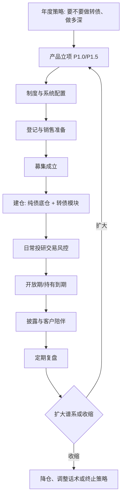

# 06 端到端工作流程

这一页把前面的制度、投研、产品设计串成日常作业。目标是任何人接手岗位时，知道前一步从哪来、后一步交给谁、什么情况下必须停。

## 1. 总流程



## 2. 阶段职责（RACI 简化）

R = 执行，A = 拍板，C = 会签，I = 知情。

| 环节 | 产品 | 投资 | 研究 | 交易 | 风控 | 合规 | 运营估值 | 渠道 |
| --- | --- | --- | --- | --- | --- | --- | --- | --- |
| 战略与限额 | C | C | C | I | A | C | I | I |
| 产品立项 | R | C | C | I | C | C | C | C |
| 风险评级 | C | I | I | I | A | C | I | I |
| 池维护 | I | A | R | I | C | I | I | I |
| 下单 | I | A | I | R | C | I | I | I |
| 强赎处理 | I | A | C | R | C | I | R | I |
| 估值净值 | I | I | I | I | C | I | A | I |
| 销售话术 | C | C | I | I | C | A | I | R |
| 定期披露 | C | C | I | I | C | C | R | I |

争议升级路径：投资与风控不一致 → 当日不得加仓 → 投委会或授权有权人决定。强赎、信用事件、分类可能被破坏时，风控有一票否决。

## 3. 阶段 0：制度与系统（首只产品前必须完成）

**退出标准：** 没有这些，不批准募集。

1. 《可转债及可交换债投资管理办法》生效，含池、限额、转股、强赎。
2. 风控系统能拦截：禁投池、单券限额、转债合计限额、现金管理类产品误配。
3. 估值系统能取转债收盘价，停牌有替代流程。
4. 交易系统能报交易所转债，识别涨跌幅和无效申报。
5. 条款日历有负责人，备份人不在时有 AB 角。
6. 产品分类监测：转股后股票占比自动预警。

## 4. 阶段 1：立项到成立

### 4.1 立项

产品经理发起 [T01](templates/T01-产品立项说明书.md)，必须附：

- 目标客群与竞品（本公司纯债、同业固收+转债）。
- 策略模块（默认 M1 + M4，M2 是否开启）。
- 风险预算数字与情景。
- 基准、费率、开放结构。
- 系统改造点。

投委会用 [T03](templates/T03-投委会审议材料.md) 审议。未通过不得进入登记。

### 4.2 文本、评级、登记

1. 法律合规审核销售文件。
2. 风险评级委员会给出 R 等级。
3. 登记系统报送，取得编码。
4. 托管协议确认转债为可投品种及估值方法。
5. 渠道培训完成，考试或签到留痕（至少核心销售人员）。

### 4.3 募集

- 按适当性销售，不得向风险等级不匹配客户促销。
- 成立条件（规模下限、人数）写在说明书；不成立的返还安排预先可执行。
- 成立后 5 日内发成立公告。

## 5. 阶段 2：建仓

建仓顺序：

1. 先把流动性资产和纯债底仓放到能解释基准大部分的位置。
2. 再按 M1 买入债性转债，分散到足够只数。
3. 若产品允许 M2，等底仓稳定、风控试运行无误后再开启。
4. 建仓期避免在转债异常波动日集中买入小券。

建仓期每日向风控报送：转债仓位、风格分布、是否触发限额。

## 6. 阶段 3：日常运转（交易日）

### 开盘前

- 运营：昨夜公告（强赎、下修、停牌、评级）、Z 标识、今日是否停止交易。
- 投资：是否有必须处理的条款事件。
- 交易：可成交额度、持仓可用。

### 盘中

- 投资经理按模块下单，交易员检查池和限额后执行。
- 风控实时或准实时看转债合计、单券、偏股型占比。
- 异常波动、临停：暂停该券交易，评估流动性折价。

### 收盘后

- 估值取价，净值计算。
- 填写或系统生成 [T04](templates/T04-日常风控检查清单.md)。
- 更新条款计数。
- 若开放日，准备净值披露。

### 每周

- 归因：利率、信用利差、转债估值、正股、条款事件、费用。
- 检查销售端有无不当宣传（合规抽检）。

### 每月

- 更新 [T06](templates/T06-策略仓位决策表.md)。
- 核心池调整。
- 风险预算消耗评估；超预警则降仓，而不是先改基准。

## 7. 条款事件专项流程（必须演练）

### 7.1 强赎

```text
计数进入关注 → 投资书面预案（减仓/转股/保留至公告）
→ 公告强赎 → T+0 交易与运营锁定处理窗口
→ 停止交易日前必须完成
→ 若转股：股票卖出时点按合同，防止固收类产品持股超限
→ 复盘：是否损失强赎溢价、是否影响净值超预算
```

演练频率：每季度一次桌面演练，即使当期没有持仓强赎。

### 7.2 信用事件

评级下调、违约传闻、监管处罚、控股股东风险：

1. 当日调入观察池或禁投池。
2. 评估债底是否还成立。
3. 能出的仓位考虑流动性折价后执行，不允许“等反弹”。
4. 需要披露重大事项的，2 日内公告。

### 7.3 转股与分类保护

- 主动转股须有书面理由（通常只为处理强赎）。
- 被动转股后，运营监控权益占比。
- 触发合同投资比例调整条款时，优先卖股票，而不是改产品类型。

## 8. 阶段 4：开放、申赎与流动性

- 开放日前评估：转债仓位、变现天数、纯债流动性储备。
- 大额赎回：先卖流动性最好的利率债/存单，转债按冲击成本从大到小卖，避免被动留下一堆小券。
- 申购过大：不要被迫在当天把转债仓位拉到中枢，允许现金缓冲。
- 巨额赎回触发合同条款时，按合同延期或比例确认，并披露。

## 9. 阶段 5：披露与客户陪伴

| 事项 | 时点 | 要点 |
| --- | --- | --- |
| 开放日净值 | 开放日后 2 日内 | 不解释成预期收益率 |
| 定期报告 | 季/半年/年 | 列示资产种类、比例、前十大；转债要能看出来 |
| 重大事项 | 2 日内 | 强赎集中影响、评级事件、投资范围变更 |
| 风险等级调整 | 重评后及时告知销售机构 | 代销按孰高 |
| 客户账单 | 公募至少每月 | 份额、净值、交易 |

渠道沟通口径（固定）：

- 近期净值回撤：先拆纯债和转债贡献，再讲是否仍在风险预算内。
- 客户问“是不是买了股票”：未转股前是债券；波动来自转债内嵌期权和转债市场定价。
- 客户问“能不能保证不亏”：不能。这是净值型产品。
- 客户比较纯债产品：本产品用转债换取增强和额外波动，适合能接受 R2/R3 回撤的客户。

## 10. 阶段 6：复盘与谱系迭代

每完成一个持有/开放周期，投委会必答：

1. 回撤和负收益天数是否在立项预算内？
2. 增强是否来自 M1/M2，还是靠风格漂移？
3. 有无操作事故（强赎、错价、超限）？
4. 客户赎回是不是由转债波动引起？
5. 渠道话术有没有偏离说明书？

只有 1–5 都可接受，才讨论 P1.5 或提高内部限额。  
任一答案是否定的，先修 P1.0，不开新产品。

## 11. 日历视图（首只产品）

| 时间 | 工作 |
| --- | --- |
| T-8 周 | 制度、限额、系统改造立项 |
| T-6 周 | 核心池初建、策略手册定稿、T01 上会 |
| T-4 周 | 销售文件、评级、托管确认 |
| T-10 日 | 公募登记 |
| T-2 周 | 渠道培训、适当性配置 |
| T0 | 发售 |
| 成立日 | 建仓计划生效 |
| 成立 +4 周 | 风控与估值试运行复盘 |
| 第一个开放/持有周期结束 | 谱系是否扩展的决策点 |
