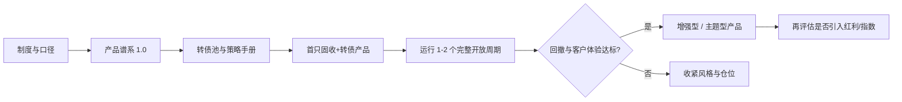

# 理财子公司可转债业务工作手册

> 定位：权益投研能力尚在建设期时，以可转债为过渡资产，搭建可复制的投研策略与产品设计体系。  
> 适用对象：产品、投研、交易、风控、合规、运营、渠道销售。  
> 使用原则：外规按债权资产口径管理产品分类，内控按波动资产口径管理风险预算。

本手册把可转债业务拆成八个模块和六张落地模板。建议按“先定制度与产品谱系，再上投研与交易，最后扩仓与进阶”的顺序落地，而不是先做一只高弹性转债产品再补流程。

## 为什么从可转债切入

理财子的客户要绝对收益和可控回撤，团队优势在信用研究、久期和票息，短板在个股定价与权益回撤管理。可转债正好落在两者之间：

- **债底**接信用研究能力：票息、到期赎回、评级、发行人偿付，可用现有固收投研覆盖。
- **期权**提供有限弹性：正股上涨时转债有凸性，下跌时债底提供缓冲，比直接买股票更适合稳健客群。
- **外规友好**：在会计属性为债权时，可转债通常计入固定收益类产品的债权资产，便于先做固收类产品，而不是直接上混合类/权益类。
- **能力可迁移**：信用排雷、条款跟踪、量化筛选、仓位纪律，是后续做红利、指数和主动权益的训练场。

不适合把可转债当成“小股票”来炒，也不适合在现金管理类产品中配置。

## 文档地图

| 序号 | 文档 | 解决什么问题 |
| --- | --- | --- |
| 01 | [战略定位](01-战略定位.md) | 为什么做、先做什么、不做什么 |
| 02 | [监管与分类口径](02-监管与分类口径.md) | 产品分类、内外规差异、禁止事项 |
| 03 | [市场与品种认知](03-市场与品种认知.md) | 条款、定价指标、风格划分 |
| 04 | [投研策略体系](04-投研策略体系.md) | 池—券—组合，规则化策略与禁区 |
| 05 | [产品设计体系](05-产品设计体系.md) | 产品谱系、要素、适当性、基准 |
| 06 | [端到端工作流程](06-端到端工作流程.md) | 从立项到存续的完整作业链 |
| 07 | [风控合规与估值运营](07-风控合规与估值运营.md) | 风险预算、估值、信披、强赎处理 |
| 08 | [组织与能力建设](08-组织与能力建设.md) | 编制、系统、考核、进阶路径 |
| 附录 | [资料索引](appendix-sources.md) | 监管、自律、行业实践来源 |

## 落地模板

| 模板 | 用途 |
| --- | --- |
| [T01 产品立项说明书](templates/T01-产品立项说明书.md) | 新产品内部立项 |
| [T02 个券研究备忘录](templates/T02-个券研究备忘录.md) | 入池/买入前一页纸 |
| [T03 投委会审议材料](templates/T03-投委会审议材料.md) | 策略、仓位、新产品上会 |
| [T04 日常风控检查清单](templates/T04-日常风控检查清单.md) | 交易日盯市 |
| [T05 产品要素对照表](templates/T05-产品要素对照表.md) | 说明书条款一致性检查 |
| [T06 策略仓位决策表](templates/T06-策略仓位决策表.md) | 月度/重大市场情形下的仓位决策 |

## 落地顺序（建议）

**阶段 1（制度与首发）**：完成口径、池、风控限额、首只 R2 固收+转债产品。不直接投资股票，转债上限 0–10%。  
**阶段 2（增强与复用）**：把策略模块化，推出持有期 30 天至 1 年的增强产品，转债上限 0–20%，内部风险预算仍按波动资产计量。  
**阶段 3（能力外溢）**：在转债流程跑顺后，再讨论红利、指数、少量主动权益，而不是并行铺开。

## 三条硬约束

1. **现金管理类产品不得投资可转债、可交换债。**
2. **外规分类与内控风险预算必须拆开记账**：合同里可转债可以算债权，风控台账必须按价格波动、Delta 等价权益、集中度和强赎风险单独限额。
3. **禁止用收盘价调整、平滑估值、自建模型“以丰补歉”来掩盖转债波动。** 波动要用策略、持有期和客户预期管理，不能用估值技巧管理。

## 维护

- 监管口径、交易所规则、协会适当性规范变化后，优先更新 `02`、`05`、`07`。
- 市场估值中枢、风格有效性变化后，优先更新 `04` 与 `T06`。
- 每只新产品上线前，用 `T01` + `T05` 做一次对照，避免说明书、风控系统和销售话术三套口径。
