# 电动汽车电池市场：主要参与者、技术趋势与供应链挑战

**投资决策研究框架**  
**日期：** 2026年8月24日  
**数据截止：** 2026年8月（国际能源署《全球电动汽车展望2026》、SNE Research 2025全年及2026年1–5月装机、BloombergNEF 2025年锂离子电池价格调查）

---

## 摘要

电动汽车电池已经不再是整车成本里的一个零件，而是决定车价、续航、充电速度、能否进入欧美市场、以及储能项目能否算得过来账的核心资产。2025年全球动力电池装机约 **1.2 TWh**（IEA），SNE Research 口径为 **1,187 GWh**，同比约 **+30% / +31.7%**；锂离子电池包均价降至约 **108 美元/kWh**，纯电车电池包约 **99 美元/kWh**。需求仍在增长，但赚钱的位置已经急剧收窄。

本报告回答三个会直接影响投资决策的问题：**谁在控制这个市场、技术路线往哪走、供应链哪里会卡住。** 核心判断如下。

1. **市场结构是“中国双寡头 + 韩日守高端 + 二线分流”，不是百花齐放。** 2025年宁德时代（CATL）占全球动力电池装机 **39.2%**，比亚迪 **16.4%**，两家合计 **55.6%**；中国企业整体接近 **75%**（IEA）或约 **70%**（SNE）。2026年1–5月，宁德时代份额升至 **40.2%**，比亚迪回落至 **14.4%**，中国企业合计约 **72.6%**。韩日厂商仍掌握北美圆柱/软包与部分高端三元，但整体份额三年里被压缩近一半。
2. **磷酸铁锂（LFP）已超过全球动力电池一半，三元正在变成“高续航/高性能的利基”。** 2025年 LFP 全球装机占比超过 **55%**，中国约 **79%–81%**；LFP 电池包均价约 **81 美元/kWh**，三元约 **128 美元/kWh**。钠离子进入规模化前夜，全固态仍主要是高端样机与 2027–2030 年窗口，不应当作当前估值的分子。
3. **真正的供应链风险不在“缺矿”，而在中游高度集中、政策把市场切碎、以及低利润让多元化投不下去。** 中国占全球电芯名义产能 **80%** 以上，LFP 正极几乎全部、石墨负极与回收产能也高度集中。欧美建厂成本仍比中国高约 **50%**。锂价 2026 年初同比翻倍、钴价因刚果出口限制翻倍，但电池价格仍在下降——说明定价权在过剩的电芯与材料产能，不在矿端。
4. **投资上要按价值链拆开，而不是买“电动车叙事”。** 一线电芯龙头与绑定车企/储能订单的低成本 LFP 产能，比“再建一座欧美超级工厂”更接近可配置资产；锂、镍有周期弹性但波动极大；欧美独立电芯初创与独立回收商在 2025–2026 年已经出现一轮出清（Northvolt、Li-Cycle、Ascend Elements）。政策（美国税收抵免与 FEOC、欧盟电池法、中国出口管制）会继续改写谁能赚钱。

> 本报告仅供研究讨论，不构成投资建议。引用数据来自公开机构与行业研究，部分二手汇总可能存在口径差异。

---

## 目录

1. [投资命题：需求确定，回报不确定](#1-投资命题需求确定回报不确定)
2. [市场全景：规模、价格、区域](#2-市场全景规模价格区域)
3. [主要参与者：谁能影响定价与订单](#3-主要参与者谁能影响定价与订单)
4. [技术趋势：化学体系、结构、下一代路线](#4-技术趋势化学体系结构下一代路线)
5. [供应链挑战：集中、政策、利润与回收时滞](#5-供应链挑战集中政策利润与回收时滞)
6. [对投资决策的含义](#6-对投资决策的含义)
7. [情景与观察指标](#7-情景与观察指标)
8. [结论](#8-结论)
9. [数据附录与资料来源](#9-数据附录与资料来源)

---

## 1. 投资命题：需求确定，回报不确定

电池需求的方向几乎没有争议。IEA 在既定政策情景（STEPS）下预计，动力电池装机将从 2025 年约 **1.2 TWh** 升至 2030 年近 **3 TWh**、2035 年近 **5 TWh**。乘用车仍是主体，但电动卡车 2025 年装机同比翻倍以上，已占全球动力电池约 **8%**；储能正在吃掉电芯过剩产能，美国 2025 年储能已占电池部署约三分之一。

争议在回报。2025 年末全球锂电名义产能已超过 **4 TWh**，大约是当年动力电池装机的三倍多。中国仍占产能 **80%** 以上。产能过剩压低价格，价格下降又把利润从材料厂和韩日电芯厂挤走，只留下少数有规模、有良率、有客户绑定的公司。与此同时，美国、欧盟用税收抵免、碳足迹、电池护照和“受关注外国实体”（FEOC）规则，把原本统一的全球市场切成几块——同一颗电芯，在中国是成本优势，在美国可能变成无法享受补贴的资产。

因此，投资决策不能停在“电动车渗透率还会上”。更有用的拆法是三层：

| 层次 | 该问的问题 | 决定回报的变量 |
| --- | --- | --- |
| 需求 | 车、卡车、储能各要多少 GWh | 政策、车价平价、充电设施、数据中心储能 |
| 供给结构 | 谁有订单、谁有良率、谁有材料 | 份额、利用率、垂直整合、海外工厂 |
| 规则 | 这批产能卖到哪个市场、用哪套化学体系 | 关税、本地含量、碳足迹、出口管制 |

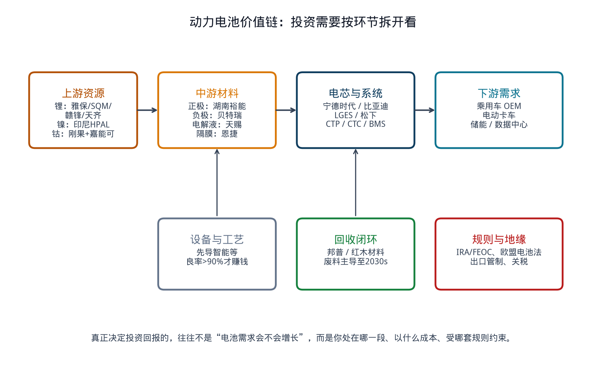

**图11　动力电池价值链：投资需要按环节拆开看**

---

## 2. 市场全景：规模、价格、区域

### 2.1 装机：电动车仍是主引擎，储能在抢增量

2025 年电动车仍贡献全球电池部署的 **70%** 以上（2024 年接近 80%）。IEA 口径下动力电池装机 **1.2 TWh**，约为 2020 年的七倍以上；轻型车占 **85%** 以上。增长最快的是电动卡车，主要来自中国商用车电动化。储能份额上升，使电动车在电池总需求中的占比略降——这对电芯厂是“缓冲垫”，对矿端则是新的需求源。

Wood Mackenzie 在 2026 年中期评论中指出：上半年原材料成本上行并未挡住电动车与电池增长；亚洲厂商（宁德时代、比亚迪、LG 新能源）继续整合电芯制造；储能出货与电动车几乎同等贡献增量，人工智能数据中心是重要拉动。

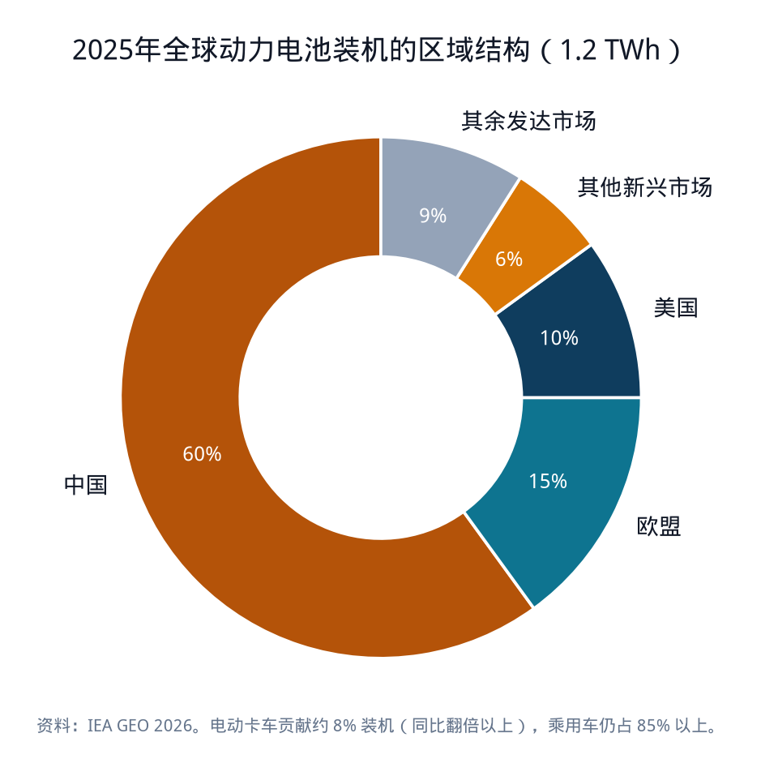

**图8　2025年全球动力电池装机的区域结构**

区域上，2025 年中国占动力电池装机约 **60%**，欧盟近 **15%**，美国约 **10%** 且几乎停滞，中国以外新兴市场约 **6%**。平均带电量也在分化：美国纯电车约 **90 kWh**，欧盟约 **70 kWh**，中国低于 **60 kWh**。这意味着美国单车电池成本更高，对补贴和车型结构更敏感；中国则用更小电池、更低成本打开量。

车型结构正在改变电池需求的“形状”。中国插电混动电池平均容量 2025 年超过 **25 kWh**（同比约 +10%），欧盟超过 **20 kWh**（同比约 +15%）。插混不是“过渡产品消失”，而是在部分市场用更大电池继续消耗电芯。

### 2.2 价格：全球在降，区域价差在扩

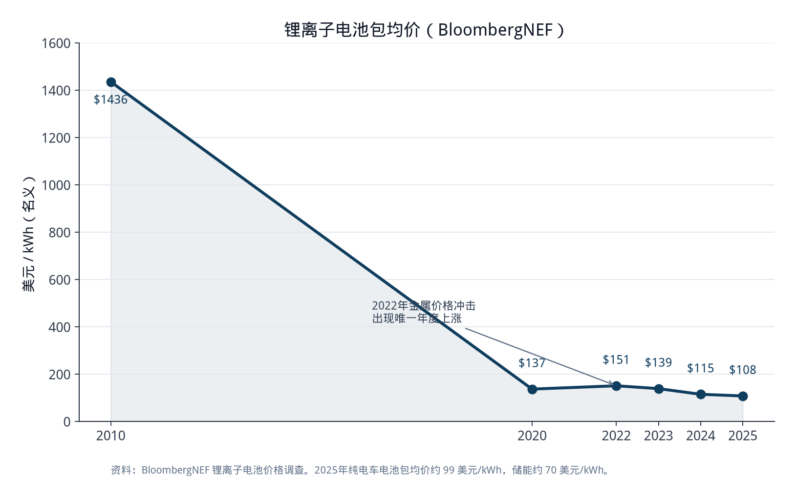

**图3　锂离子电池包均价（BloombergNEF）**

BloombergNEF 2025 年调查：全球电池包均价 **108 美元/kWh**，同比下降约 **8%**，较 2010 年约 **1,436 美元/kWh** 下降约 **93%**。纯电车电池包连续第二年低于 100 美元/kWh（约 **99**）；储能降至约 **70 美元/kWh**，成为最便宜的应用段。LFP 全应用均价约 **81 美元/kWh**，三元约 **128 美元/kWh**。

关键异常是：**锂和钴 2025 年明显上涨，电池价格仍在下降。** IEA 指出，2026 年初锂价同比翻倍以上，但仍比 2022 年高峰低约 70%；钴价因刚果（金）2025 年出口禁令后转配额而翻倍。电池价格继续下行，靠的是制造效率、化学体系切换到 LFP，以及全球产能过剩。对投资者，这意味着短期矿价反弹不一定能传导为电芯厂提价；中期若材料厂持续亏损后合并，价格才可能从成本端抬升。

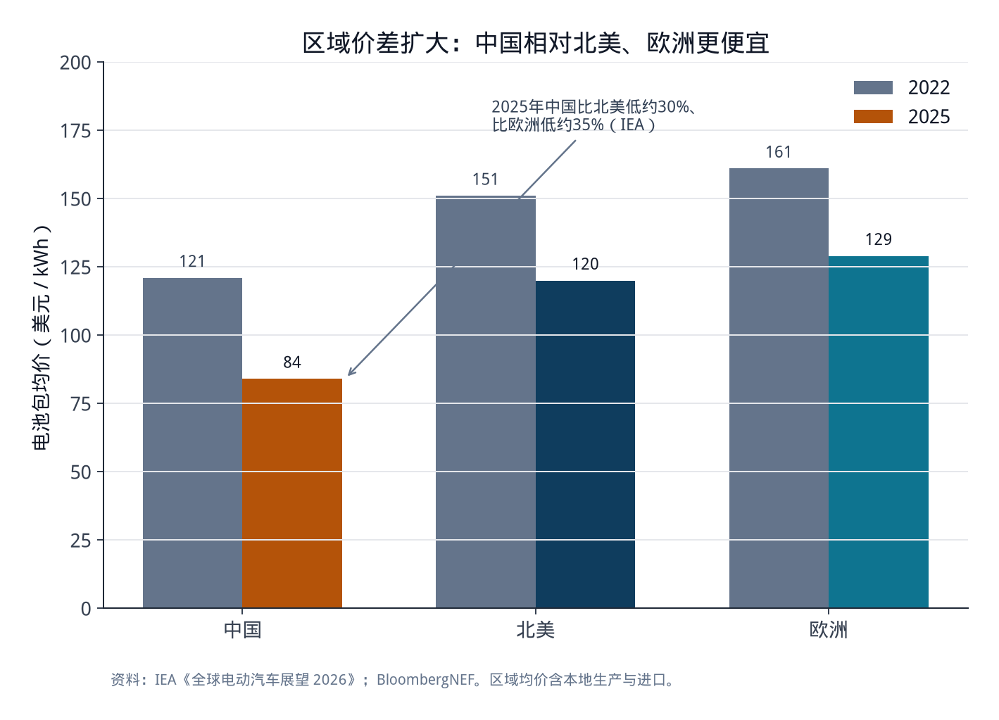

**图4　区域价差扩大：中国相对北美、欧洲更便宜**

IEA：2025 年中国电池包价格比北美低约 **30%**、比欧洲低约 **35%**（2022 年分别为约 20% 和 25%）。不考虑公共补贴，欧美电池生产成本仍可比中国高约 **50%**。价差扩大解释了为什么“全球均价跌破 110 美元”并不能让欧美电动车自动平价——关税、本地制造成本和供应链深度，把中国的成本地板挡在边境之外。

### 2.3 产能：名义数字很大，能卖出去的少

全球锂电名义产能 2025 年底超过 **4 TWh**，同比约 +30%；欧盟和美国产能增速约 50%，快于中国的约 25%，但基数完全不在一个量级。中国仍占全球产出 **80%** 以上。IEA 强调：新工厂从投产到接近名义产能往往要 **5 年以上**。北美总部企业若剔除与亚洲企业的合资，2025 年只生产了美国市场电动车装机的约 **3%**——名义产能和真实交付不是一回事。

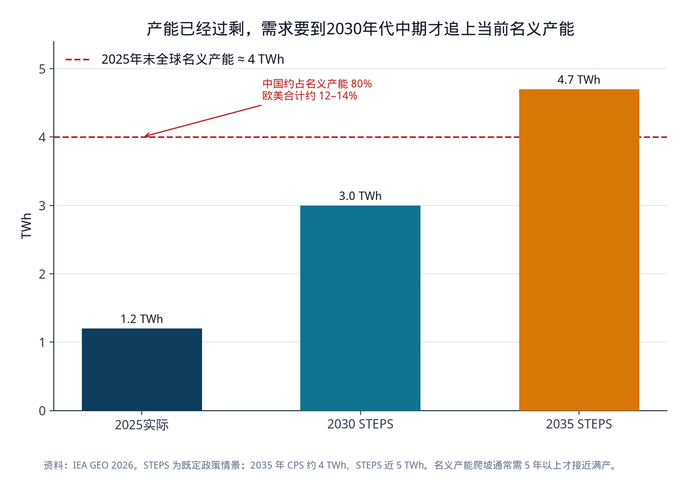

**图7　产能已经过剩，需求要到2030年代中期才追上当前名义产能**

对投资的直接含义：再投资一座“规划 50 GWh”的工厂，估值不应当按满产折现。要看爬坡曲线、客户绑定、以及所在市场的政策是否还在。

---

## 3. 主要参与者：谁能影响定价与订单

### 3.1 电芯层：双寡头已经形成，二线在抢第二供应商位置

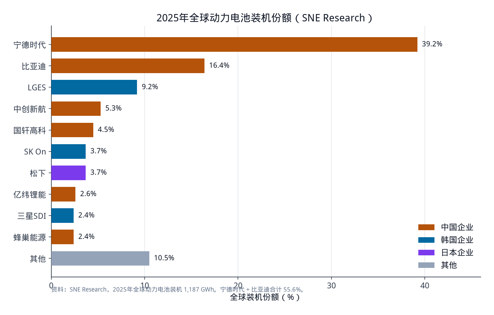

**图1　2025年全球动力电池装机份额（SNE Research）**

2025 年全球动力电池装机 **1,187 GWh**（SNE），前十名如下。

| 排名 | 企业 | 总部 | 2025份额 | 2025装机 | 2026年1–5月份额 |
| --- | --- | --- | ---: | ---: | ---: |
| 1 | 宁德时代 CATL | 中国 | 39.2% | 464.7 GWh | 40.2% |
| 2 | 比亚迪 BYD | 中国 | 16.4% | 194.8 GWh | 14.4% |
| 3 | LG新能源 LGES | 韩国 | 9.2% | 108.8 GWh | 8.7% |
| 4 | 中创新航 CALB | 中国 | 5.3% | 62.8 GWh | 5.1% |
| 5 | 国轩高科 | 中国 | 4.5% | 53.5 GWh | 4.6% |
| 6 | SK On | 韩国 | 3.7% | 44.5 GWh | 3.4% |
| 7 | 松下 Panasonic | 日本 | 3.7% | 44.2 GWh | 3.2% |
| 8 | 亿纬锂能 EVE | 中国 | 2.6% | 31.3 GWh | 3.3% |
| 9 | 三星SDI | 韩国 | 2.4% | 28.9 GWh | — |
| 10 | 蜂巢能源 SVOLT | 中国 | 2.4% | 28.5 GWh | 2.6% |

注：2026年1–5月第十名为欣旺达（2.4%）；三星SDI滑出前十。资料：SNE Research。

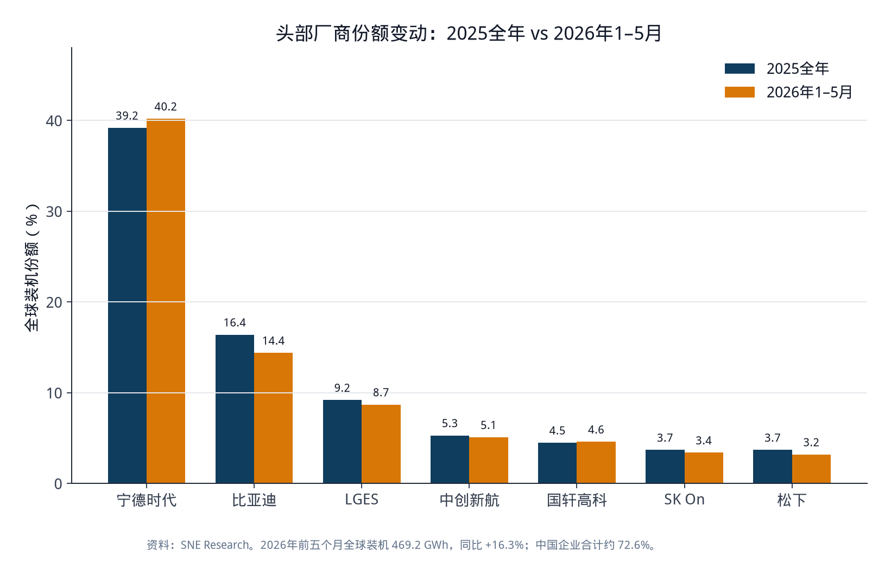

**图2　头部厂商份额变动：2025全年 vs 2026年1–5月**

**宁德时代**是目前唯一份额超过 30% 的供应商，也是利润结构最好的电芯商。IEA：其营业利润率 2020–2024 年在 **10%–15%**，2025 年约 **18%**；海外收入 2025 年中期已近 **35%**。它同时做动力和储能、LFP 和三元、并布局钠离子，客户覆盖宝马、奔驰、Stellantis 以及大量中国车企。德国工厂已在产，匈牙利德布勒森与西班牙萨拉戈萨（与 Stellantis）是其把“中国成本 + 欧洲落地”做成可出口模板的关键资产。对投资者，宁德时代的风险不是“有没有需求”，而是估值已反映龙头溢价、海外政治风险、以及客户为了议价正在引入第二供应商。

**比亚迪**是垂直整合的整车商兼第二大电芯商。SNE 的 16.4% 主要是装到车上的量；自用电芯不会全部出现在第三方装机里。刀片电池把 LFP 做成结构件，降低了“铁锂能量密度不够”的短板。2026 年前五月份额下滑到 14.4%、装机几乎零增长，说明其电芯增长更绑定自身车型周期，外供弹性弱于宁德时代。投资含义：买比亚迪是在买“车 + 电池”的综合体，电池只是护城河的一层，不是独立的电芯 beta。

**LG新能源、SK On、三星SDI、松下**构成韩日阵营。2022 年韩国三家合计还超过全球份额 30%，2025 年约 **15%**。LGES 仍是非华系第一，北美工厂和 46 系圆柱是其差异化；但 IEA 明确写到：2024–2025 年若无美国生产税收抵免，LGES 的 EBIT 将为负（2025 年约 **-2 亿美元**）。SK On 近年反复亏损，与福特的合资受电动车计划收缩冲击。松下深度绑定特斯拉，美国份额仍超 40%（就“美国生产的电动车所用电池”而言），但体积远小于宁德时代；IEA 称其电池业务 2025 年利润率约 **14%**。投资含义：韩日电芯是“政策敏感资产”——美国补贴收紧、车企砍单、LFP 切换慢，都会直接打到利润。

**二线中国厂商**（中创新航、国轩高科、亿纬锂能、蜂巢、欣旺达）正在成为全球车企的“第二供应商”。问界（华为合作品牌）2026 年 6 月引入国轩、中创新航；理想与欣旺达合资、自研 PACK 外包电芯；小鹏、小米、零跑也在分散采购。对海外投资者，这些公司提供了“不把所有中国电池风险押在宁德时代一只股票上”的选项，但议价权、出海合规和产能利用率分化很大。亿纬 2026 年上半年几乎是唯一大规模扩产公告（规划约 230 GWh LFP），说明二线的生存策略是跟 LFP 和储能走，而不是跟三元死磕。

**欧美纯电芯玩家**已经经历一轮出清。Northvolt 2025 年 3 月在瑞典破产，2026 年 2 月由美国锂硫初创 Lyten 接手其瑞典资产；ACC 等项目推迟或收缩。特斯拉自研 4680 仍在爬坡，但绝大多数装机仍来自松下、LGES 和宁德时代。IEA 的数字很残酷：北美总部企业在美国的真实产量份额约 3%。投资含义：把“西方电芯冠军”当作主题去炒，赔率在 2025–2026 年已经被市场证伪过一次；若再配置，需要看到稳定良率、锁定的 OEM 长单和可运转的中游材料，而不是新闻稿产能。

### 3.2 材料层：正极决定成本，石墨是隐蔽瓶颈

电芯厂的成本结构里，正极活性材料（CAM）是最大单项：三元电芯约 **40%–50%**，LFP 约 **25%–30%**（IEA，中国 2024 年平均）。但 2023 年以来，多数 CAM 厂在亏损扩产。IEA 点名：LFP 材料商中，全球最大供应商**湖南裕能**是少数仍能盈利的；其余磷酸铁锂材料厂持续亏损，存在出清或集中度上升的可能——无论哪种，都会把电池成本从底部托起来。

湖南裕能 2020–2025 年连续六年磷酸盐正极出货全球第一，2025 年全球份额约 **28.2%**，出货约 **113.7 万吨**（+60%），并覆盖全球动力电池前十中的九家。万润新能源、德方纳米、龙蟠等跟随。三元正极侧，容百、L&F、EcoPro、POSCO Future-M、尤米科尔（Umicore）仍是日韩欧的主力；韩国厂商 2026 年在加速补 LFP，以免彻底错过铁锂浪潮。

负极方面，**贝特瑞** 2025 年出货约 **59.5 万吨**，位居全球前列；璞泰来选择控制低价订单、同时做隔膜和涂布设备。电解液龙头**天赐材料**、隔膜龙头**恩捷股份**同样高度集中于中国。石墨负极被 IEA 列为与 LFP 正极、三元前驱体并列的“最暴露环节”。硅碳负极出货仍小（贝特瑞约数千吨级），但是高端快充的材料赌注。

对投资：材料股的弹性来自锂价和开工率，不来自长期“卖铲子”的稳定收费。当前价格战把铲子做成了消耗品。能看的是：（1）是否已是细分龙头且客户覆盖完整；（2）有没有前驱体/回收一体化；（3）非中国产能（芬兰、印尼、摩洛哥、北美）有没有真的达产。

### 3.3 上游资源：锂有周期，镍看印尼政策，钴的权重在下降

| 资源 | 关键供给地 | 关键企业 | 2025–2026 年的投资要点 |
| --- | --- | --- | --- |
| 锂 | 澳矿、智利/阿根廷卤水、中国盐湖与云母 | 雅保、SQM、赣锋、天齐、Pilbara | 2026 年初价格同比翻倍，宁德时代江西宜春锂矿停产等扰动放大波动；长期合约和垂直整合会钝化现货传导 |
| 镍 | 印尼约占全球矿产 60% 以上 | 华友、青山体系、淡水河谷等 | 2026 年印尼 RKAB 配额改为年度审批，目标约 2.60–2.70 亿湿吨，低于 2025 年约 3.79 亿；配额执行力度是镍价主变量 |
| 钴 | 刚果（金）约占全球近三分之二 | 嘉能可等 | 2025 年出口禁令后转配额，价格翻倍；但高镍三元含钴量已低，LFP 不含钴，对电池总成本影响远小于过去 |
| 石墨 | 中国加工主导 | 贝特瑞等；西方有 Syrah 等替代尝试 | 出口管制与关税使“非中国球化石墨”溢价上升，但是产能替代慢 |

LFP 份额上升，正在把电池金属的需求结构从“镍钴锂三件套”改写成“锂 + 铁 + 磷 + 石墨”。对仍持有大量高镍产能或钴资源的投资者，这是需求侧的结构性打折，不是短期周期。

### 3.4 车企与设备：订单方正在改规则

车企不再接受单一电池供应商。华为问界、理想、小鹏、小米、零跑分散采购；欧美车企则在“要中国成本”和“要合规积分”之间摇摆，结果是合资、技术许可、砍单同时发生。福特终止与 LGES 的大额供应协议、蓝椭圆合资减值，是 2025–2026 年最清楚的信号：电芯厂的长单并不是无条件的。

设备商（先导智能等）分享扩产资本开支，但扩产高峰过后订单会随开工率走。IEA 强调：新工厂要达到平均良率 **90%** 以上、并把产线自动化到足够低的单位人工，才能在今天的价格下盈利。设备交付不等于客户赚钱。

### 3.5 回收：中国闭环已成规模，欧美独立商正在出清

中国拥有全球 **85%** 以上的回收产能。宁德时代旗下邦普（Brunp）直接吃到生产废料和退役电池，镍钴锰回收率宣传值超过 99%、锂约 96.5%。欧美方面，Li-Cycle 2025 年破产后由嘉能可以约 **4,000 万美元** 收购；Ascend Elements 2026 年 4 月申请破产。Redwood Materials 仍是美国最被关注的一体化尝试。欧盟电池法把生产者责任和再生材料比例写成硬约束（2031 年起钴、锂、镍再生含量门槛），但 IEA 提醒：今天的回收仍主要吃**生产废料**；大规模退役潮要到 **2030 年代中期**。LFP 和钠离子金属价值更低，回收商若只靠卖金属将很难独立盈利，代工（tolling）模式会更重要。

---

## 4. 技术趋势：化学体系、结构、下一代路线

### 4.1 LFP 成为默认选项，三元退守高端

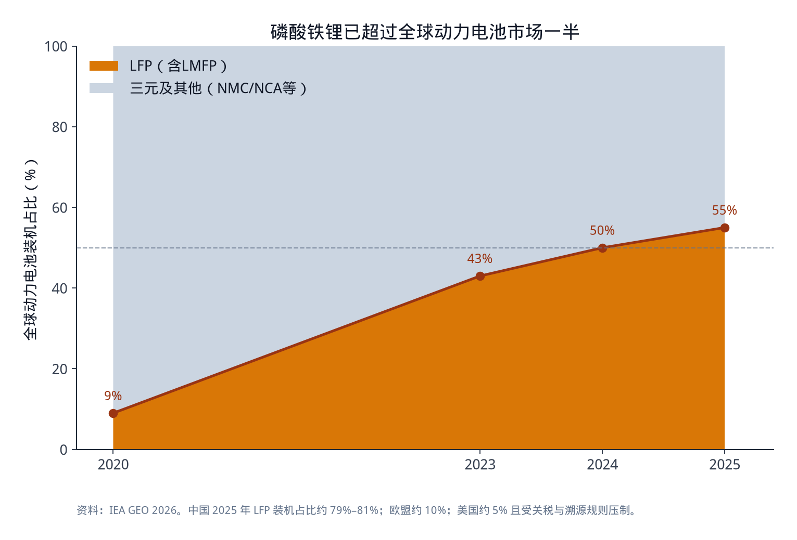

**图5　磷酸铁锂已超过全球动力电池市场一半**

LFP 全球动力电池占比：2020 年不足 10%，2023 年约 43%，2024 年近 50%，2025 年超过 **55%**。中国 2025 年 LFP 占国内动力电池装机约 **79%–81%**。欧盟约 **10%**，且几乎全部来自中国进口电芯或随车进口。美国 LFP 份额 2025 年几乎腰斩——不是技术不行，是关税和补贴溯源把最便宜的铁锂挡在门外。

LFP 的投资含义不止“更便宜”：

- **去钴去镍**，把上游风险从三种金属收窄到锂和石墨。
- **循环寿命和热稳定性**更好，天然适合储能和网约车/商用。
- **供应链几乎锁在中国。** 在中国以外做 LFP，目前仍要买中国的正极、前驱体和工艺。韩国、日本在补课，印尼在建产能，但这是以年计的工程，不是以季度计的主题。
- **磷酸锰铁锂（LMFP）** 被 IEA 并入 LFP 统计，是铁锂提高电压、贴近三元能量密度的渐进路线，比全固态更可能在 2026–2028 年贡献真实装机。

三元（NMC/NCA）仍占中国以外市场的约 **80%**（IEA，2025 年非中国动力电池）。长续航豪华车、部分重卡和对低温性能有苛刻要求的场景，三元暂时还有位置。但 PACK 级能量密度差距已被 CTP/CTC 和铁锂能量密度提升压缩到大约 5%–20%。把三元当作“会重新夺回主流”的投资假设，需要明确的技术或政策反转，而不是惯性。

### 4.2 结构创新：CTP / CTC 让铁锂“够用”，也让回收更难

棱柱电芯已占全球动力与多数储能电池 **60%** 以上，是中国厂商的主流；圆柱仍因特斯拉–松下在美国有存在感；软包是韩国手机时代留下的遗产。CTP（电芯到包）取消模组，CTC/CTB（电芯到底盘/车身）进一步把电池做成结构件。中国乘用车新设计中 CTP 已过半。好处是体积利用率和续航；代价是维修、保险和退役拆解更贵。IEA 明确提到：CTP/CTC 给回收带来额外复杂性。

快充是 2026 年电芯厂比拼的公开赛道。宁德时代神行家族、比亚迪刀片迭代，都把“充电十分钟/五分钟”做成产品卖点。快充会拉动硅负极、电解液添加剂、冷却结构和高压平台，但也会提高对材料一致性和热管理的要求。对投资，快充是龙头的护城河强化，不是新势力可以轻易弯道超车的缺口。

### 4.3 钠离子：对冲锂价，不是替代铁锂

第一款钠离子乘用车 2023 年底才在中国出现。2026 年宁德时代、比亚迪等已进入放量准备。钠离子低温性能显著好于铁锂（IEA：最新一代在 **-40°C** 仍可保持约 90% 容量），且不消耗锂。能量密度上限目前约 **175 Wh/kg**，对比铁锂约 **205**、三元约 **265**。IEA 估算：平均 SUV 用钠离子续航大约 **350 km**，锂电 **400–600 km**。

因此钠离子的合理场景是：小型车、城市物流、两轮/三轮、叉车、储能，以及与锂电混搭以补低温。全球钠离子电芯产能目前只相当于锂电的约 **1%**，到 2030 年已宣布项目也只约锂电承诺产能的 **7%**。硬碳负极供应链薄弱且集中在中国。投资上，钠离子是龙头的期权和锂价对冲，不是可以独立撑起估值的新行业——除非锂价长期维持在迫使铁锂都觉得贵的水平。

### 4.4 固态：时间表在 2027–2030，成本平价更晚

“固态”一词被过度营销。半固态（少量液体）已在中国交付，例如上汽名爵 MG4 安欣版（2025 年 12 月，清陶供芯）。全固态仍在样车和中试：丰田目标约 **2028** 年首款车，比亚迪计划 **2027** 年销售、**2030** 年量产，三星时间表相近。QuantumScape、Factorial 等美国公司仍以样件和合作车企测试为主。IEA 判断：全固态在 2030 年代上半叶之前很难进入大众市场，早期只会在高端和机器人等对能量密度极端敏感的场景。

制造端的现实是良率。公开讨论中，硫化物全固态中试良率仍远低于铁锂量产的 90% 以上。在铁锂已经 81 美元/kWh 的世界里，固态必须先证明安全与续航溢价，才能谈规模。把固态初创按“下一代宁德时代”来估值，忽略了化学体系、设备和客户认证的十年级差距。

### 4.5 储能：同一颗电芯的第二条需求曲线

储能 2025 年全球部署中 LFP 超过 **90%**。美国有超过 **50 GWh** 原计划服务电动车的产能（LGES、福特等）转向储能。数据中心备电和电网调峰正在吸收中国溢出的铁锂产能。对电芯厂，储能是利润低于车规、但能填利用率的出口；对投资，这降低了“欧美电动车砍单 = 电芯厂立刻崩”的线性逻辑，但也意味着储能价格战会继续，只有成本第一梯队能活。

---

## 5. 供应链挑战：集中、政策、利润与回收时滞

### 5.1 地理集中：最薄的冰在中游

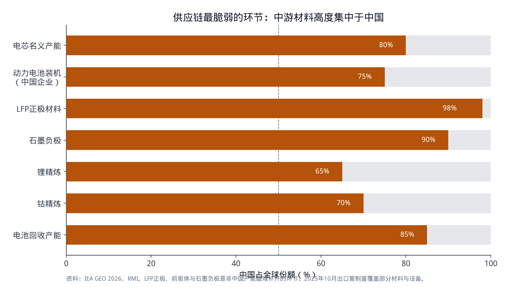

**图6　供应链最脆弱的环节：中游材料高度集中于中国**

采矿地图其实比精炼地图分散：锂在澳、智利、阿根廷、中国；镍在印尼；钴在刚果。卡住全球的是**精炼、前驱体、正极、负极、电解液、隔膜和电芯**。IEA 把 LFP 电池及材料、三元前驱体、石墨负极列为最暴露环节。中国 2023 年以来多次对电池关键物项实施出口管制；2025 年 10 月宣布、随后暂停一年的管制，覆盖范围扩大到正极及其前驱体、负极、LFP 组分、先进化学体系，以及相关生产设备和工艺。暂停不等于取消。对任何依赖中国中游、又要在欧美拿补贴的产能，这是尾部风险，不是背景噪音。

多元化正在发生，但速度慢于政治口号。韩国、日本在投 LFP；印尼同时做镍、正极和负极；摩洛哥吸引铁锂材料投资。这些项目要成为可替代中国的“第二套供应链”，需要足够大的本地需求、可融资的利润和稳定政策。目前这三样在欧美都不齐。

### 5.2 政策把市场切成三块，同一家公司的利润完全不同

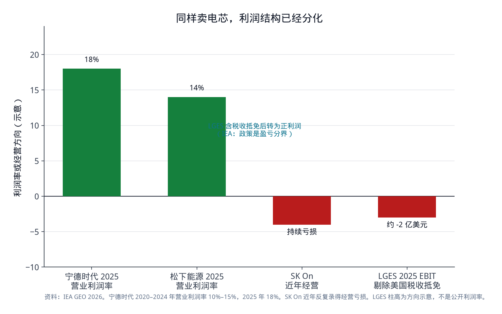

**图9　同样卖电芯，利润结构已经分化**

- **美国：** 先进制造生产税收抵免仍在，但资格趋严；电动车消费端激励在 2025 年三季度后明显削弱（IEA 称美国部署停滞）。FEOC 和关税压制中国 LFP 直接进口。结果是：韩日在美工厂高度依赖补贴才能账面盈利；车企砍单后，这些工厂转向储能。把“IRA 供应链”当成无条件增长故事已经过时。
- **欧盟：** 中国企业份额 2025 年已超过一半，几乎是 2023 年的两倍，来源是德国等地本地工厂加进口。欧盟电池法要求碳足迹声明，**2027 年 2 月**起动力电池需电池护照；再生材料比例在 2030 年代成为硬指标。碳足迹和护照会抬高合规成本，但也会把有数据、有回收渠道的龙头和欧洲本地工厂变成“入场券资产”。
- **中国：** 内卷式价格战、材料厂亏损、电芯龙头利润反而走强——这是典型的份额向头部集中。出海是利润和估值的下一个战场，也是关税与当地化投资的来源。

韩国政府已公开讨论电池产业重组。对投资，这意味着韩日电芯不能再按 2021–2022 年的“欧美本地化赢家”估值框架来买。

### 5.3 低利润本身就是供应链风险

多元化需要资本。但 CAM 厂亏损、欧美电芯初创破产、回收商出清，使“在中国以外复制一条铁锂供应链”在财务上没有吸引力。IEA 把这称为恶性循环：越需要多元化，越没有利润去多元化。对已经拥有中国成本曲线的龙头，这是护城河；对主题投资里“去风险化”“友岸外包”的故事，这是执行风险。

良率和自动化是被低估的门槛。没有电池产业工人和设备商生态的地区，连成熟企业爬坡都更慢。Northvolt 的失败不只是融资，而是在宁德时代从 100 GWh 走向 700 GWh 的同一时间，试图从零建立全价值链。

### 5.4 回收填不了 2020 年代的缺口

部署高峰从 2020 年后才开始，电池寿命约 10–15 年，退役潮在 2030 年代中期才到。在此之前，回收主要消化生产废料。中国 2025 年 8 月允许进口高品位黑粉、2026 年初降关税，可能把海外黑粉吸回中国处理。二手电动车市场扩大，会让电池在车里多工作几年，并在不同国家退役——欧洲回收商规划的原料，可能出现在非洲或东南亚的路上。LFP 金属价值低，进一步削弱“回收等于矿山”的简单算法。

投资回收，要看有没有稳定废料（与电芯厂/车企绑定）、有没有政策强制的生产者责任，以及商业模式是卖金属还是收处理费。独立、靠政府补贴堆起来的西方回收商，2025–2026 年的出清已经给过定价。

### 5.5 资源国政策：印尼镍、刚果钴、锂矿扰动

印尼镍矿配额从三年周期改为年度 RKAB，2026 年目标显著低于 2025 年实际批准量，加工厂可能抢矿、降开工。刚果钴配额把价格波动从“矿端周期”变成“行政周期”。锂端，个别大矿停产就能扰动现货，因为库存不再像 2023–2024 年那么厚。这些事件对高镍三元更痛，对铁锂主要痛在锂。对组合管理，意味着电池板块内部要对冲：电芯龙头可能在矿价上涨时吃成本，矿商吃价格；反过来，矿价暴跌时材料厂和矿商先伤，整车和储能需求可能受益。

---

## 6. 对投资决策的含义

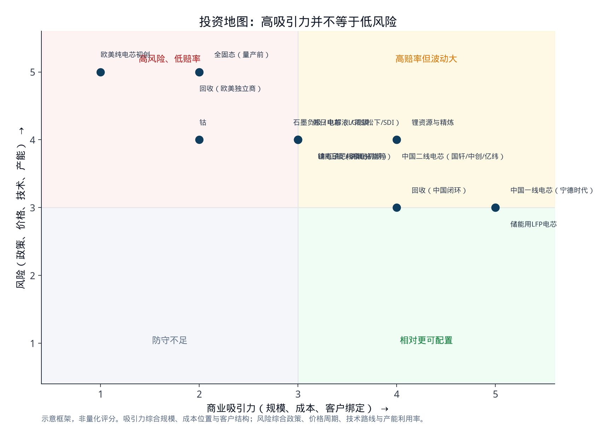

**图10　投资地图：高吸引力并不等于低风险**

下面的框架用于**配置讨论**，不是证券推荐。

### 6.1 相对更接近“可研究、可跟踪”的方向

**一线电芯龙头（尤其是宁德时代这类同时拥有规模、利润、海外工厂和多化学体系的公司）。** 全球装机增量仍在，份额仍在集中，储能提供第二需求。风险是估值、海外政治和客户分散采购。买的是“行业 Beta 里质量最高的那一段”，不是低估值反转。

**储能导向的低成本 LFP 产能。** 数据中心和电网把铁锂从“车用溢出”变成独立增长极。价格战激烈，只有成本曲线最左边的产能能维持正现金流。

**与电芯厂绑定的中国回收/材料一体化。** 不是因为 2026 年就会有海量退役电池，而是因为废料、工艺和客户关系会决定谁在 2030 年代还在。湖南裕能这类已证明能在行业亏损期保持盈利的正极龙头，比“主题正极”更值得当研究标的。

### 6.2 高弹性、但必须当作周期资产

**锂。** 2026 年的反弹说明供给并非无限弹性，盐湖和矿的资本开支在低价期被砍过。适合作为对“需求好于预期 / 供给扰动”的期权，不适合当成稳定分红资产。要区分卤水、硬岩和云母的成本曲线，以及有多少产量已经被长协锁给电芯厂。

**印尼镍与 HPAL。** 配额政治比地质储量更重要。高镍需求被铁锂分流，所以镍不再享受“电动车渗透率”的线性乘数。

**中国二线电芯。** 第二供应商逻辑真实存在，出海和技术许可是看点；但价格战、产能利用率和客户集中度会让利润率剧烈波动。需要个股级的订单与海外工厂跟踪，不能打包成“中国电池”因子。

### 6.3 需要极高风险溢价、或当作期权的方向

**欧美纯电芯初创与未绑定废料的独立回收商。** 2025–2026 年已经用破产给过定价。若再投资，应要求：已验证良率、不可撤销的 OEM 长单、中游材料不依赖单一国家、以及不把政府补贴当作利润的全部来源。

**全固态。** 技术方向成立，时间与成本不成立为当前大众市场。更合理的定位是：龙头研发管线里的期权，或对极高风险偏好资金的主题仓。把 2027–2028 年“首车”直接外推成 2030 年 10% 份额，与 IEA 和当前良率现实不符。

**钴。** 价格会因刚果政策剧烈波动，但电池配方正在减少钴用量。波动率高、趋势需求弱，更像交易品种。

**高度依赖单一政策、单一车企的韩日产能。** LGES 的美国工厂证明了补贴可以让 EBIT 翻面；反过来，补贴资格收紧或福特/通用砍单，同样可以让资产减值。松下相对特殊：利润率尚可，但增长几乎等于特斯拉北美产量。

### 6.4 跨资产的几条约束

1. **不要用全球均价 108 美元/kWh 去给欧美工厂做 DCF。** 用中国 84、北美约 120、欧洲约 129 的区域价格，并加上关税与碳足迹成本。
2. **不要用名义 GWh 做分子。** 利用率、良率、化学体系（铁锂还是三元）和是否有车规认证，决定这 GWh 能不能变成收入。
3. **车企砍单风险已被定价过一次，仍会被重复。** 电芯厂与 OEM 的合资在需求下行时是负债。
4. **化学体系切换是供应链切换。** 押注欧美铁锂本地化，等于押注正极和前驱体也能出去；只建电芯厂，中游仍在中国，地缘风险只是换了个名字。
5. **储能改变了电芯厂的需求函数，但没有改变谁有成本优势。** 溢出产能会先砸价，再出清。

---

## 7. 情景与观察指标

| 情景 | 触发条件 | 对板块的含义 |
| --- | --- | --- |
| 基准：中国龙头继续收份额 | 全球电动车销量仍增，欧美补贴不再大幅回补，铁锂份额缓升 | 宁德时代类资产享受量与份额；韩日看北美储能能否填坑；矿端温和 |
| 锂价中枢上移 | 储能超预期 + 矿山资本开支不足 + 个别大矿扰动持续 | 钠离子和铁锂加速；电芯厂毛利短期受压；锂商盈利修复 |
| 政策硬脱钩 | 中国恢复并执行中游出口管制，或美欧大幅加征电芯/材料关税 | 全球车价上升、需求受损；非中国中游资产重估；短线混乱长线集中度更高 |
| 欧美需求复苏 | 新补贴或油价/碳价推动，车企重新锁定电芯长单 | 韩日北美工厂利用率回升；但中游若仍在中国，FEOC 合规仍是约束 |
| 技术加速 | 钠离子在小型车和储能快速放量，或半固态在中国高端车铺开 | 锂需求预期下调；设备与硬碳/电解质材料出现新赢家；全固态仍慢 |

建议跟踪的高频指标（不必等下一年展望）：

- SNE / 韩国研究机构的月度装机份额，尤其是宁德时代与比亚迪的裂口、二线是否继续抢份额。
- 电池级碳酸锂和氢氧化锂现货、印尼镍矿配额新闻、刚果钴配额执行。
- 中国 LFP 正极开工率与头部材料厂毛利率——这是价格战是否见底的领先信号。
- 美国储能并网与数据中心备电招标，作为韩日在美工厂的需求替代指标。
- 欧盟电池护照准备度、碳足迹第三方核验进展（2027 年硬节点）。
- 中国商务部出口管制清单是否在暂停期满后重启。
- 主要 OEM 的电芯供应商名单变更（第二供应商导入通常领先装机份额 6–18 个月）。

---

## 8. 结论

电动汽车电池市场 2026 年的投资问题，已经从“要不要相信电动化”变成了“在一条高度集中、利润分层、规则割裂的价值链上站哪一段”。

**主要参与者**方面，宁德时代和比亚迪控制了全球一半以上的动力电池装机，中国企业整体约七成；韩日仍是北美和高端三元的守门人，但份额和利润都在被政策和铁锂浪潮改写；湖南裕能、贝特瑞、天赐、恩捷以及锂镍钴资源商构成中上游的定价节点；车企引入第二供应商、欧美独立电芯与回收商出清，正在重画谁有资格活到下一轮资本开支。

**技术趋势**方面，铁锂成为默认化学体系，CTP/CTC 和快充让铁锂在续航上“够用”；钠离子是锂价与低温的对冲，场景在小型车和储能；半固态开始交付，全固态仍是 2027–2030 年的高端期权。把技术路线押注写进估值模型时，应当给铁锂最高权重，给固态最低近期权值。

**供应链挑战**方面，风险不在全球“没有矿”，而在中游集中于中国、欧美复制成本高且利润不足以吸引资本、政策把市场切碎、回收在 2030 年代中期之前补不了矿。锂和钴的价格可以一年翻倍，电芯价格仍可因过剩继续下降——这是当前最重要的价格信号。

对投资决策，一句话概括：**买电池行业的 Beta，要买成本曲线最左边、且能把电芯卖进多个规则市场的环节；把“建一座西方超级工厂”或“固态替代锂电”当作主仓，是在与 2025–2026 年已经被证伪的假设作对。**

---

## 9. 数据附录与资料来源

### 9.1 图表目录

| 文件 | 内容 |
| --- | --- |
| `charts/fig01_market_share_2025.png` | 2025 年全球动力电池装机份额 |
| `charts/fig02_share_shift.png` | 2025 全年 vs 2026 年 1–5 月头部份额 |
| `charts/fig03_pack_price.png` | BNEF 电池包均价轨迹 |
| `charts/fig04_regional_price.png` | 中美欧区域价差 |
| `charts/fig05_chemistry.png` | LFP 占比变化 |
| `charts/fig06_concentration.png` | 供应链各环节中国份额 |
| `charts/fig07_capacity_demand.png` | 名义产能 vs IEA 需求情景 |
| `charts/fig08_regional_deployment.png` | 2025 年装机区域结构 |
| `charts/fig09_margin_split.png` | 电芯厂利润分化 |
| `charts/fig10_investment_map.png` | 投资吸引力–风险示意 |
| `charts/fig11_value_chain.png` | 价值链结构 |

复现图表：

```bash
python3 -m pip install matplotlib numpy
python3 ev-battery-market-report/scripts/generate_charts.py
```

### 9.2 主要数据口径

- 动力电池装机：SNE Research（车辆注册对应的电池用量）；IEA GEO 2026 使用“平均带电量 × 销量”的部署口径，2025 年约 1.2 TWh，与 SNE 的 1,187 GWh 接近但并非同一套样本。
- 电池价格：BloombergNEF 年度锂离子电池价格调查（体积加权，含电动车与储能）。
- 产能与利润：IEA 基于 Benchmark Mineral Intelligence 及公司财报的综合。
- 化学体系份额：IEA 基于 EV Volumes 与中国汽车动力电池产业创新联盟。

### 9.3 资料来源

1. IEA, *Global EV Outlook 2026*, “Electric vehicle batteries”. https://www.iea.org/reports/global-ev-outlook-2026/electric-vehicle-batteries
2. SNE Research，2025 年全球动力电池装机及 2026 年 1–5 月装机（经 CnEVPost、Longbridge 等转引）。
3. BloombergNEF, 2025 Lithium-Ion Battery Price Survey.
4. Wood Mackenzie, *EV & battery supply chain: 2026 half-time report*.
5. RMI, *The EV Battery Supply Chain Explained*.
6. 欧盟电池法规 (EU) 2023/1542：碳足迹、电池护照、再生材料比例。
7. 湖南裕能、贝特瑞、天赐材料、恩捷股份等公司 2025 年出货与份额的公开报道及招股/年报口径。
8. Mysteel 等对 2026 年印尼镍矿 RKAB 配额的行业跟踪。

### 9.4 免责声明

本报告基于公开信息整理，用于讨论电动汽车电池市场的结构、技术与供应链风险。不构成对任何证券、商品或衍生品的投资建议。市场数据存在口径差、转引与时滞；政策可能在短时间内改变供应链的可行边界。
