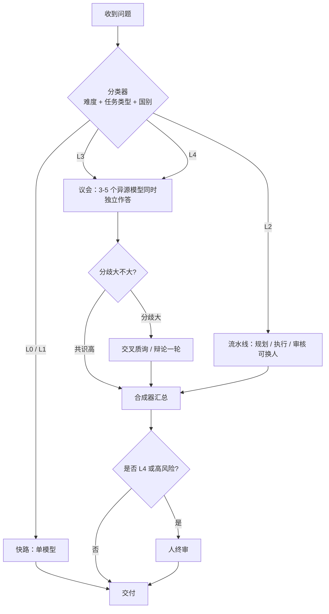

# 多国多模型协作方案

> 快照：2026 年 9 月。模型名会变，**能力轴、协作模式、何时并行**不会过时。
> 一句话原则：**问题先分类；简单的走快路，难的开议会；异源模型同时想，分歧本身就是信号。**

---

## 1. 为什么不能只用一个模型

没有“最强 AI”，只有“对这个问题最合适的组合”。原因有四条：

1. **能力轴不同。** 有的擅长写代码和长程 Agent，有的擅长科学推理，有的擅长百万字长文档，有的擅长图/音/视频，有的中文语感更好。用错模型，等于用手术刀去砍柴。
2. **训练数据有国别和语料偏见。** 美国模型对硅谷、英语互联网、西方学术文献更熟；中国模型对中文政策、A 股、国内产业、本地生活更熟；欧洲模型对欧语和 GDPR 语境更稳。同一问题，不同国家的模型会看到不同的事实面。
3. **对齐文化不同。** 各家对安全、政治、医疗、法律的拒答尺度不一样。这不是“哪个更正确”，而是**口径差**：你正好可以用它做交叉核验。
4. **单模型会自信地错。** 两个训练来源完全不同的模型给出同一结论，可信度上升；它们吵起来，说明这个问题还没想清楚，必须继续查证或交给人。

因此本方案不是“装一堆 App 随便问”，而是一套**路由器 + 议会制**的工作法：大多数问题只问一个最合适的模型；真正重要、有争议、跨领域的问题，让多个国家的模型**同时独立思考**，再合成。

研究上也支持这一点：固定轮次的多模型辩论在平均意义上往往不划算；真正划算的是**按难度触发**——简单题直接答，只有分歧大或风险高时才开议会。

---

## 2. 模型图谱：按国家发挥特色

下面按“你现在就能用到的产品/API”来排，不按实验室论文排。角色是**相对特长**，不是永久排名。

### 2.1 美国：前沿推理、工程与生态

| 模型 / 产品 | 厂商 | 最该让它做的事 | 不太适合 |
|---|---|---|---|
| **Claude Fable / Opus** | Anthropic | 写代码、改代码、长程 Agent、审慎长文、合同/代码审查、按约束严格执行 | 要最新热点、要极便宜的海量调用 |
| **GPT-5.6 系列** | OpenAI | 通用推理、科学问答、工具调用、成熟插件生态、结构化输出 | 超长仓库一次性吞进去、极致性价比 |
| **Gemini 3.x** | Google | 超长上下文、图/音/视频、Google 文档与搜索生态、大批量材料消化 | 对“窗口大”和“真记得住”要分开看，关键事实仍要抽检 |
| **Grok 4.x** | xAI | 实时信息、风格直接、少客套、需要“网上正在吵什么” | 正式公文、强合规场景、需要审慎措辞 |
| **Llama（开源）** | Meta | 私有化、可微调、数据不出域 | 单独冲击最难的推理/代码题 |

**美国模型的集体特色：** 英语世界知识、软件工程、科学基准、工具生态最完整。拿它们当“全球通 + 工程师”。

### 2.2 中国：中文、产业、性价比、可落地

| 模型 / 产品 | 厂商 | 最该让它做的事 | 不太适合 |
|---|---|---|---|
| **DeepSeek V4 / 思考链** | 深度求索 | 数学与逻辑推理、代码、API 性价比、开源私有化 | 产品体验、部分时事口径、高峰排队 |
| **通义千问 Qwen** | 阿里 | 中文全能、多模态、长文档、企业 MaaS、开源家族、阿里云集成 | 只想要“最口语化的短内容” |
| **Kimi** | 月之暗面 | 超长文档、研报/合同/法律法规通读、长程 Agent | 短平快闲聊、强实时热点 |
| **GLM / 智谱清言** | 智谱 | Agent 稳定性、政企合规、私有化与信创路径 | 纯 C 端娱乐创作 |
| **豆包** | 字节 | 中文语感、短内容、联网日常、速度快、生活/营销文案 | 深度学术推理、超长严肃写作 |
| **文心** | 百度 | 政企、搜索、强合规行业 | 作为唯一的代码/推理引擎 |
| **混元** | 腾讯 | 微信 / 企微 / 腾讯文档 / 腾讯云闭环 | 脱离腾讯生态后的“纯模型对决” |
| **MiniMax** | MiniMax | 语音、视频、陪伴与多模态生成 | 严肃推理主引擎 |

**中国模型的集体特色：** 中文理解与表达、国内产业与政策语境、长文档产品化、API 价格、私有化选项。拿它们当“中国通 + 性价比引擎 + 落地入口”。

### 2.3 欧洲：多语言、开源许可、数据主权

| 模型 / 产品 | 国家 | 最该让它做的事 |
|---|---|---|
| **Mistral Large / Medium** | 法国 | 欧语（法/德/西/意等）对话与公文、Apache 开源可商用、EU 数据驻留、要“欧洲口径”的第二意见 |
| **Aleph Alpha 等** | 德国 | 主权 AI、政企、强调可控与可解释的欧洲客户 |

**欧洲模型的集体特色：** 不是样样都冲榜，而是**许可干净、多语言、可自托管、合规叙事清晰**。涉及 GDPR、欧盟监管、法语/德语原文时，应至少有一个欧洲模型在场。

### 2.4 其他国家：补齐语言与主权盲区

| 模型 / 产品 | 国家 | 特色用法 |
|---|---|---|
| **Cohere Command** | 加拿大 | 企业 RAG、检索增强、强调“有出处的回答” |
| **HyperCLOVA X** | 韩国 | 韩语、韩国本地生活与搜索生态 |
| **EXAONE** | 韩国 | 韩国企业与研究场景的本地模型 |
| **日语特化模型（ELYZA 等）** | 日本 | 日文细腻表达、日本商务礼仪与法规语境 |
| **Falcon** | 阿联酋 | 阿拉伯语、中东主权 AI、可开源部署 |
| **AI21** | 以色列 | 企业文本、结构化生成 |

**用法：** 不要让它们去和 Claude/GPT 比写 Python。它们的价值是**母语与本地制度**。问题一旦进入该国法律、媒体、消费者习惯，就把对应国家的模型拉进议会。

---

## 3. 先分类，再决定请几位

### 3.1 五级难度（决定“请几个模型”）

| 级别 | 什么样的问题 | 默认策略 | 请几个 |
|---|---|---|---|
| **L0** | 翻译、格式转换、改错别字、已知 API 怎么用 | 最快最便宜的一个 | 1 |
| **L1** | 日常写作、总结、头脑风暴、查公开信息 | 该任务最顺手的一个 | 1 |
| **L2** | 专业单域：写一段代码、读一份合同、做一道数学题 | 该域王牌 + 必要时一人复核 | 1–2 |
| **L3** | 跨域、有争议、答案会影响真金白银或声誉 | **并行议会**（本方案核心） | 3–5 |
| **L4** | 重大决策、合规、医疗/法律/投资的终局判断 | 议会 + **人必须终审** | 3–5 + 人 |

### 3.2 任务类型（决定“请哪一类模型”）

| 任务类型 | 主引擎（默认） | 并行顾问（L3+） | 合成器 |
|---|---|---|---|
| 写/改代码、Agent 干活 | Claude | GPT + DeepSeek | Claude 或人 |
| 数学、逻辑、科学推理 | DeepSeek 思考链 / GPT | Claude + Qwen | GPT 或人 |
| 中文短内容、文案、口语 | 豆包 | 千问 + Claude | 千问 |
| 中文长文、材料消化 | Kimi 或千问 | Claude + GPT | Claude |
| 英文长文、审慎论证 | Claude | GPT + Mistral | Claude |
| 图/音/视频理解 | Gemini 或千问 | GPT | Gemini |
| 实时热点、网上在吵什么 | Grok 或豆包联网 | Gemini / Perplexity | 人（核实来源） |
| 中国政策、A 股、国内产业 | 千问 / DeepSeek / 文心 | Claude 或 GPT 做国际对照 | 人 |
| 欧盟/多语言/数据主权 | Mistral | Claude + 本地语模型 | 人 |
| 韩/日/阿语本地问题 | 该国模型 | GPT 或 Claude 做国际对照 | 人 |
| 企业知识库问答 | Cohere / 千问 RAG | 第二个模型抽检 | 人抽检 |

### 3.3 三条硬规则

1. **默认不要并行。** 并行会让成本和等待变成 3–5 倍。L0/L1 并行是浪费。
2. **并行必须异源。** 不要开三个 GPT。要开“不同公司、最好不同国家”的模型，训练数据才真的不一样。
3. **合成器不要用第一轮里最能说的那个。** 避免它给自己打高分。合成器最好是**没参加第一轮的家族**，或由你自己合成。

---

## 4. 五种协作模式

把多模型协作想成五种“开会方式”。日常 80% 用前两种，关键时刻用后三种。



### 模式 A：快路（Router）

一个轻量分类器（可以是你自己，也可以是便宜小模型）看一眼问题，送到最合适的一个模型。  
**例子：** “把这段英文译成正式中文” → 千问或 GPT，结束。

### 模式 B：流水线（Relay）

不同模型当不同工种，**串行**：

| 工位 | 建议人选 | 职责 |
|---|---|---|
| 规划 | GPT / Claude | 拆任务、定验收标准、列出未知数 |
| 执行 | 该域王牌（代码用 Claude，推理用 DeepSeek，长文用 Kimi） | 只干活，不改目标 |
| 审核 | **另一个国家的模型** | 找漏洞、幻觉、遗漏、不可执行之处 |
| 定稿 | 语感最好的那个，或你自己 | 语气、格式、可发表性 |

**例子：** 写一份行业研究报告。Kimi 通读 20 份 PDF → DeepSeek 核数字与逻辑 → Claude 压结构和英文摘要 → 豆包把执行摘要改成领导能一眼看懂的中文。

### 模式 C：议会 / 并行独立思考（Council）——你特别要的那种

**同一份 Brief，同时发给 3–5 个互看不到对方的模型。** 这是本方案的核心，详见第 5 节。

要点：第一轮必须**独立**。如果它们先看到别人的答案，后发言的会从众，多样性就没了。

### 模式 D：交叉质询（Debate）

只在议会第一轮**分歧大**时开启。把 A 的结论给 B 去挑错，把 B 的结论给 A 去挑错，再开一轮短回复。  
不要固定辩三轮：贵，而且容易变成互相抬杠。一轮质询 + 合成通常够了。

### 模式 E：专家小组（Specialist Panel）

把大问题拆成子问题，每个子问题交给该域王牌，最后由合成器拼图。

**例子：** “要不要在欧洲卖这款产品”

- 市场与用户：GPT / Gemini
- 欧盟合规与隐私：Mistral
- 中文对外沟通与国内供应链：千问
- 技术可行性：Claude
- 合成：你自己，或 Claude 只做“矛盾清单”，不做决策

---

## 5. 并行思考标准作业程序（今天就能用）

即使不写一行代码，用浏览器多开也能做。有 API 后再自动化同一套协议。

### 5.1 什么时候必须并行

满足下面**任意两条**，就开议会：

- 答错的代价高（钱、合规、名誉、安全）
- 问题跨两个以上领域或两个以上国家
- 你预感会有立场/口径差异
- 需要创意多样性（方案、叙事、产品名、战略选项）
- 单一模型刚才的答案让你“总觉得不对，但说不出哪里”

不并行的：改格式、已有标准答案的补全、你已经知道该用谁且能当场验证的事。

### 5.2 推荐议会席位（3 席与 5 席）

**默认 3 席（覆盖大多数 L3）：**

| 席位 | 作用 | 典型人选 |
|---|---|---|
| 全球通 / 工程师 | 结构、逻辑、英文世界知识 | Claude 或 GPT |
| 中国通 / 性价比推理 | 中文语境、国内事实、另一套推理风格 | DeepSeek 或千问 |
| 第三源 | 打破中美二元，提供不同对齐文化 | Gemini、Grok、Mistral 或 Kimi |

**升级 5 席（L4 或跨文化）：** 上面 3 席 + **问题所在国模型** + **一个专门唱反调的**（提示词里明确要求“找漏洞，禁止附和”）。

按问题微调：

| 问题 | 建议席位 |
|---|---|
| 技术方案 / 架构评审 | Claude + GPT + DeepSeek |
| 中国宏观 / 产业 / 政策 | 千问 + DeepSeek + Claude（国际对照） |
| 投资研究 | Kimi（读材料）+ DeepSeek（逻辑）+ GPT（国际对标）+ 人终审 |
| 品牌文案 | 豆包 + Claude + GPT（要三种语气，不要合成成一种） |
| 欧盟业务 | Mistral + Claude + 千问（若涉及中国供应链） |
| 多模态产品 | Gemini + 千问 + Claude（评交互与风险） |

### 5.3 七步流程

1. **写 Brief**（同一份，禁止对某个模型“开小灶”，否则无法比较）。
2. **同时发送**给选定席位，关闭联网或统一“允许联网”，规则必须一致。
3. **独立作答**，要求结构化输出（见提示词文件）。
4. **填对照表：** 共识 / 分歧 / 独有洞察 / 各自的不确定点。
5. **分歧大则质询一轮**；共识高则跳过。
6. **合成器**只做：保留共识、标明分歧、列出证据缺口、给出“若只能选一个怎么选、风险是什么”。合成器**禁止**假装争议已经消失。
7. **人拍板。** L3 你可以接受合成结果；L4 必须你自己签字。

### 5.4 对照表（复制即用）

| 维度 | 模型 A | 模型 B | 模型 C | 判定 |
|---|---|---|---|---|
| 核心结论 |  |  |  | 共识 / 分歧 |
| 关键假设 |  |  |  |  |
| 证据 / 来源 |  |  |  | 有无出处 |
| 主要风险 |  |  |  |  |
| 明确说“我不确定”的点 |  |  |  | 越诚实越加分 |
| 独有洞察 |  |  |  | 是否值得追问 |

**如何读表：**

- 三家结论一致 + 假设相同 → 可以采用，仍抽查一条最关键证据。
- 结论一致但假设不同 → 表面共识，实则脆弱，先统一假设再问一轮。
- 结论冲突 → 成功。把冲突写成两个情景，去查资料或问专家，不要用“谁更有名”来投票。
- 只有一家提出的点 → 可能是幻觉，也可能是真洞察。单独追问另外两家：“请评价这个观点，同意或驳回并说明理由。”

### 5.5 投票怎么用、怎么不用

- **有标准答案的题**（数学、单测、事实）：多数表决有用。
- **策略、审美、伦理、预测：** 禁止简单投票。保留分歧，写成选项。
- **永远不要**按模型市值或排行榜加权。排行榜测的是另一类题。

---

## 6. 分类器：30 秒判断请谁

遇到问题，按这个顺序问自己（或让小模型按此打标签）：

1. **语言与国别：** 主要发生在哪国、用哪种语言交付？
2. **任务轴：** 代码 / 推理 / 长文档 / 短内容 / 多模态 / 实时信息 / 合规？
3. **可验证性：** 写完能否立刻跑、立刻查、立刻对照原文？
4. **代价：** 错了是尴尬一下，还是亏钱、违规、伤人？
5. **是否需要多样性：** 要一个正确答案，还是要三套不同方案？

然后：

- 可验证 + 低代价 → 单模型快路
- 可验证 + 高代价 → 王牌执行 + 异源审核
- 不可验证 + 高代价 → 议会
- 要多样性 → 议会，且**不要合成成一篇**，并排保留

---

## 7. 三层实施：从今天到系统化

### 第一层：今天就能用（零代码）

准备 6 个入口即可覆盖 95% 场景（按需取舍）：

| 入口 | 覆盖 |
|---|---|
| Claude | 代码、审慎长文、审核 |
| ChatGPT | 通用、工具、科学 |
| Gemini | 长材料、多模态 |
| DeepSeek | 推理、代码、便宜 |
| Kimi 或 通义 | 中文长文档 |
| 豆包 或 Grok | 日常中文 / 实时风格 |

**工作习惯：**

- 浏览器固定分屏或把议会席位存成书签文件夹「议会-3席」。
- Brief 写在一份笔记里，三个窗口各贴一次。
- 对照表用本目录的模板。
- 在 Cursor 里：同一问题可先后切模型；真正并行时仍建议 Brief 外发到其他产品，避免后切的模型看到前一个的思考痕迹。

### 第二层：半自动（本周到本月）

- 用 **OpenRouter、硅基流动、阿里云百炼、火山引擎** 等统一网关，一套 API 调多家。
- 用快捷指令 / 小脚本：输入 Brief → 并发 POST 到 3 个模型 → 把回答填进对照表 Markdown。
- Cursor / IDE：主模型写代码，第二个模型只做 review（只贴 diff，不贴第一位的解释，减少从众）。

### 第三层：编排系统（若要产品化）

最小架构：

```
Brief → 分类器（小模型或规则）
      → 策略：fast | relay | council | debate
      → 并发调用（超时、重试、断路）
      → 分歧检测（结论字段的结构化比较）
      → 可选质询轮
      → 合成器
      → 审计日志（谁答了什么，便于事后复盘）
      → 高风险：工单到人
```

实现要点：

- **强制结构化输出**（JSON：conclusion / assumptions / uncertainties / risks），否则无法自动比分歧。
- **超时策略：** 议会以“已返回的 ≥3 家”为准，不要被最慢的一家拖死；缺席记入表。
- **成本闸门：** 日预算、L3 次数上限；分类器宁可漏掉一次议会，也不要默认全开。
- **密钥与数据：** 中国数据走国内 API；欧盟个人数据走 Mistral/欧盟区域；源代码与未公开财报不要进会把数据用于训练的免费产品。

`roster.yaml` 是席位配置的起点，按你的账号增删即可。

---

## 8. 风险、合规与反模式

### 必须防的坑

| 坑 | 表现 | 做法 |
|---|---|---|
| **幻觉共识** | 三家都错，还很一致（共同网文谣言） | 关键数字回源；至少一家强制“给出来源或说没有” |
| **从众** | 第二轮大家变同一套话 | 第一轮隔离；质询时只给对方结论不给完整谄媚式自我表扬 |
| **评委作弊** | 合成器偏袒同类模型 | 换家族合成，或人合成 |
| **为并行而并行** | 每件事问五家 | 用第 3 节的级别 |
| **口径误判** | 某家拒答被当成“这件事不存在” | 拒答只说明对齐政策，改问另一国模型，并标注“口径差” |
| **泄密** | 把客户名单、未公开代码贴进 C 端聊天 | 敏感内容只用允许关闭训练的企业 API 或私有化 |
| **责任外移** | “模型都说可以” | L4 必须人签字；模型输出当参谋，不当董事 |

### 国别使用注意

- **时事与政治：** 中美模型口径差最大。当信息用，不当唯一真相。并行的价值正在于把口径差摊开。
- **医疗 / 法律 / 投资：** 再强的议会也只是调研助手。最终以持牌专业人士为准。
- **开源私有化：** DeepSeek、Qwen、Llama、Mistral 适合数据不出域；私有化省的是泄密风险，不是幻觉风险。

---

## 9. 四个工作示例

### 例 1：架构选型（L3 议会）

**问题：** 要不要把内部知识库从自建 RAG 换成某云厂商的托管方案。

- 席位：Claude（工程与风险）、千问（国内云与合规）、GPT（国际对标）。
- 第一轮独立：成本、锁死风险、效果、迁移路径。
- 若一对二：不要投票。让少数派写“若我错了，最早三个月会出现什么信号”。
- 你拍板。

### 例 2：中文产业判断（L3，强调国别）

**问题：** 某项国内产业政策对上市公司的影响。

- 席位：千问或文心（政策原文与国内语境）、DeepSeek（因果链）、Claude 或 GPT（海外投资者会怎么读）。
- 价值不在“谁对”，而在**国内口径 vs 国际口径**的差。差在哪里，研报就要写哪里。

### 例 3：创意（L3，不要合成）

**问题：** 产品的三种定位口号。

- 席位：豆包（中文网感）、Claude（克制准确）、Grok 或 GPT（更冲的英语思维）。
- 交付：三列并排，人工挑选或混搭。禁止让第四个模型“综合成一句”，那会把锋芒磨平。

### 例 4：日常（L1 快路）

**问题：** 把会议纪要变成待办。  
只问一个快模型。不要开会。

---

## 10. 你的默认配置（建议先这样用两周）

把下面当成开箱设置，两周后再按体感改 `roster.yaml`。

| 你的场景 | 默认主模型 | 何时加并行 |
|---|---|---|
| 写代码 | Claude | 设计有争议、安全相关、或 Claude 自己也不确定时，加 GPT + DeepSeek |
| 中文工作材料 | 千问或 Kimi | 要对外发布或涉及数字时，加 Claude 审慎复核 |
| 中文对外表达、口语、短内容 | 豆包 | 要品牌级质量时，加 Claude 压浮夸 |
| 推理、量化、脚本 | DeepSeek | 结果要进报告时，加 GPT 或 Claude 复核 |
| 读一堆 PDF | Kimi 或 Gemini | 结论要决策时，抽 3 个关键页让另一家核对 |
| 看图、视频、幻灯 | Gemini 或千问 | 涉及事实时回源 |
| 欧盟或欧语 | Mistral | 加 Claude 做第二意见 |
| “我没想明白” | — | 直接开 3 席议会，不要先问一家再问一家 |

两周后只复盘三个指标：**哪些题并行真的改变了结论、哪些题白烧钱、哪一家总是提供独有且事后被证实的洞察。** 用这三项改席位，而不是用网上的总榜。

---

## 11. 本目录里有什么

| 文件 | 用途 |
|---|---|
| [速查卡.md](./速查卡.md) | 一页纸：难度、席位、反模式 |
| [并行议会提示词.md](./并行议会提示词.md) | Brief、独立作答、质询、合成，复制即用 |
| [roster.yaml](./roster.yaml) | 席位与路由配置，给未来自动化用 |

先做第一层：固定 3 个入口 + 一份 Brief + 一张对照表。等这套肌肉记忆有了，再自动化。并行的价值不在“问得更多”，而在**让不同国家、不同对齐文化的模型，在互相看不见的情况下同时想同一件事。**
