# 中国债券资产与股票资产比较研究

**副标题：理论框架、市场结构与大类资产配置投研范式**

- 报告日期：2026年8月
- 数据截止：原则上截至2025年末；股债比价等市场报价补充至2026年8月中旬
- 分析口径说明：债券规模以人民银行“债券市场托管余额”为主，结构拆分同时使用中债登+上清所与Wind券种分类；股票规模以中国结算沪深A股总市值为准，收益比较一律使用全收益/财富指数。不同口径在文中单独标明，避免混用。

---

## 摘要

对中国从业者而言，大类资产配置的第一课不是“买什么行业”，而是先分清两件性质完全不同的权利：**债券是合同现金流，股票是剩余索取权。** 前者把大部分不确定性压缩进利率、信用和流动性三个盒子；后者把增长、通胀、贴现率和风险偏好全部暴露在价格里。Markowitz、CAPM、Campbell–Viceira 和 Ilmanen 的框架，最终都是在回答同一个问题：在可承受的波动与负债约束下，这两类权利应该各占多少。

中国的特殊性在于：金融体系仍是**银行主导**，债券市场是“政府信用 + 银行资金”搭建的，股票市场则是高换手、零售参与深、政策敏感的风险资产池。2025年末，债券市场托管余额 **196.7万亿元**，已超过当年GDP（140.19万亿元）；沪深A股总市值 **107.84万亿元**。社会融资存量中，人民币贷款占 **60.7%**，企业债券占 **7.7%**，非金融企业境内股票仅占 **2.8%**。规模上债市远大于股市，但居民和海外投资者讨论“中国资产”时，情绪波动几乎全部发生在股票上。

长期证据与美国SBBI传统一致：**股票创造财富，债券稳定组合。** 按有知有行沿Ibbotson框架整理的2005–2025年数据，A股整体年化收益 **10.40%**，长期国债 **4.36%**，短期国债 **2.43%**，CPI **2.13%**。同期A股年度收益标准差高达 **54%** 量级，长期国债仅约 **6%**。因此，股票的贡献是风险溢价，债券的贡献是夏普效率和对冲。中国近二十年股债关系以负相关为常态，但在通胀/供给冲击和“宽货币、弱信用”阶段会转为同涨同跌或“脱敏”，对冲效率并不恒定。

当前（2026年8月）的比价是：**10年期国债收益率约1.7%，沪深300盈利收益率约7%，股息率约2.6%。** 用盈利收益率减国债得到的股债利差约5个百分点，股票相对债券仍便宜；但债券绝对收益已经很低，票息“安全垫”变薄，组合更依赖权益的风险预算和再平衡纪律。从业者应把工作分成三层：**战略配置定中枢，战术配置定偏离，底层构建定工具。** 先写约束，再写观点。

---

## 一、研究框架、口径与资料来源

### 1.1 为什么股债比较是配置的主范式

机构组合无论叫“固收+”“平衡型”还是“全天候”，骨架几乎都是股债。商品、黄金、REITs、私募股权是卫星；股债是行星。原因很具体：

1. **规模可承载。** 中国债市近200万亿元、A股市值超100万亿元，能够吸收银行、保险、公募和养老金的主仓。
2. **风险正交程度最高。** 在多数需求冲击下，股债不是完全同步的，这是分散化的主要来源。
3. **工具链最完整。** 现券、国债期货、股指期货、ETF、基金、可转债，使观点可以低成本落地。
4. **负债端可映射。** 保险和银行的会计、资本、流动性规则，天然按“类债 / 类股”分类资产。

因此，掌握股债比较，等于掌握了中国大类资产投研大约七成的日常语言。

### 1.2 四条比较轴

| 比较轴 | 核心问题 | 理论工具 | 中国场景里要额外问什么 |
| --- | --- | --- | --- |
| 权利与定价 | 投资者到底买到了什么现金流 | 折现、久期、Gordon、剩余索取权 | 刚兑预期、城投、政策市如何改写契约 |
| 市场结构 | 谁发行、谁持有、如何交易 | 金融结构理论（银行主导 vs 市场主导） | 银行配置盘、零售交易盘、房地产第三极 |
| 风险收益 | 长期溢价是否补偿了波动和回撤 | SBBI、夏普、最大回撤、几何收益 | A股超高波动是否削弱了溢价的可收获性 |
| 相关与轮动 | 何时对冲、何时双杀、如何择时 | Campbell–Ammer、美林时钟、ERP | 货币—信用框架、股债性价比、低利率约束 |

### 1.3 必须分开的统计口径

| 对象 | 推荐口径 | 不要与之直接相加或对标的口径 |
| --- | --- | --- |
| 债券市场规模 | 人民银行债券市场托管余额（银行间+交易所） | 仅中债登、仅上清所、仅交易所；社融中的“企业债券+政府债券”（不含金融债、同业存单等） |
| 股票市场规模 | 中国结算沪深A股总市值 | 含B股、北交所、新三板的“证券总市值”；自由流通市值；陆股通持股 |
| 股票投资收益 | 全收益指数（分红再投资） | 价格指数；上证综指（结构偏差大） |
| 债券投资收益 | 中债财富指数（纳入利息再投资） | 净价指数；到期收益率本身（YTM不是持有期收益） |
| 股权融资功能 | 社融中“非金融企业境内股票”存量/增量 | A股总市值（市值是存量定价，不是当年融资金额） |
| 波动率 | 必须声明是年度收益标准差，还是日/月收益年化 | 把SBBI的~50%与卖方常用沪深300日度年化~20%直接比较 |

### 1.4 资料来源原则

优先使用：中国人民银行、中国结算、国家统计局、金融监管总局、中债登/上清所；国际组织与经典文献（BIS、World Bank、Markowitz、Sharpe、Campbell、Ilmanen、Ibbotson SBBI）；可交叉核验的学术与卖方研究。第三方估值网站仅用于补充最新市盈率、股息率，并在图注中标明。

---

## 二、理论比较：同一套折现，两种完全不同的权利

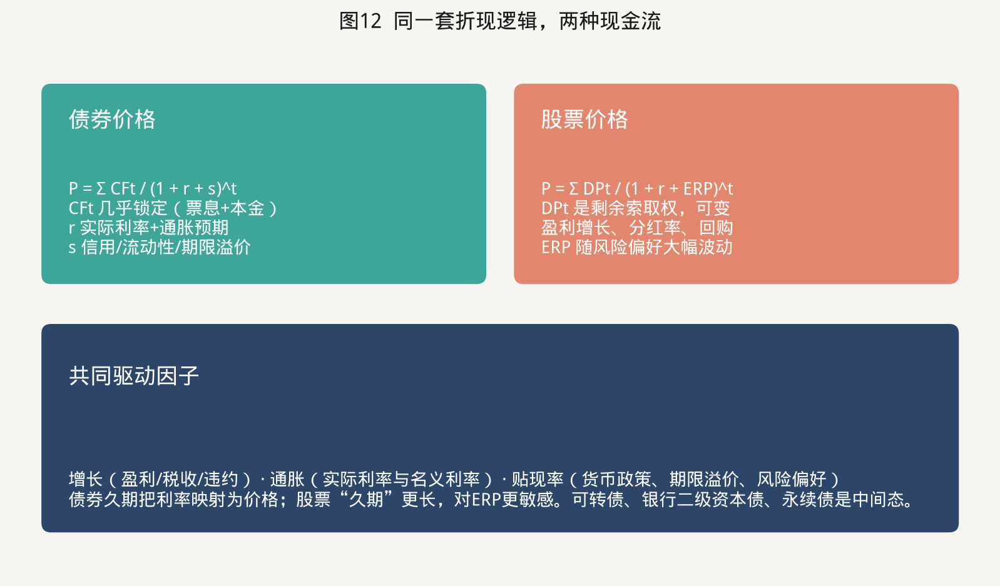

### 2.1 债券：把不确定性装进三个溢价

一张债券的定价可以写成：

\[
P=\sum_{t=1}^{T}\frac{CF_t}{(1+r+s)^t}
\]

对国债，\(CF_t\) 几乎是确定的票息与本金，\(r\) 是实际利率加通胀预期，\(s\) 主要是期限溢价。对企业债和城投债，\(s\) 还包含信用溢价和流动性溢价。投研的日常动作因此高度模块化：

- **利率：看久期。** 修正久期把收益率变动翻译成价格变动，\(\Delta P/P \approx -D_{\text{mod}}\Delta y\)。凸性在利率大幅下行时提供额外收益，在低利率环境里变得更重要。
- **信用：看利差。** 利差补偿违约损失、评级迁移和风险偏好。中国信用债长期存在“信仰溢价”（城投、国企），利差不是纯违约概率。
- **杠杆与流动性：看资金。** 回购是中国债市的血液。DR007、存单利率、银行欠配/欠负债，往往比宏观叙事更快地决定短端。

Bodie、Kane、Marcus 的教科书表述是：债券是固定收益，但价格并不固定。从业者必须把“票息确定”和“市值波动”分开，否则会在利率上行年把债券误当成现金。

### 2.2 股票：剩余索取权，久期更长

股票是对公司自由现金流的剩余要求权。最简形式是Gordon模型：

\[
P=\frac{D_1}{k-g},\quad k=r_f+ERP
\]

三个变量同时动：分红（或回购）\(D\)、增长 \(g\)、股权成本 \(k\)。Campbell 与 Shiller（1988）以及 Campbell 与 Ammer（1993）进一步把收益分解为**现金流新闻**和**贴现率新闻**。对债券，贴现率新闻几乎就是全部故事；对股票，两者经常互相抵消——盈利改善的同时风险偏好升温，价格可以涨得比盈利更快，也可以在盈利尚可时因 \(k\) 上升而大跌。

这就是为什么股票的“有效久期”远长于债券。一份永续增长的权益，对折现率1个点的变化，价格弹性可以达到20–40倍市盈率对应的量级；10年期国债久期大约7–8年。**同样是降息，债的涨幅有限且可估算，股的涨幅取决于降息是“好的宽松”还是“差的衰退”。**

### 2.3 企业金融视角：它们是同一家公司的不同分层

Modigliani–Miller 指出，在完美市场里，资本结构不改变企业总价值，只改变风险在股债之间的分配。Merton（1974）把股权看成以企业资产为标的、以负债面值为行权价的看涨期权：杠杆越高，股权越像期权，债越像短了看跌。这一视角对理解中国市场里的“中间态”特别有用：

| 品种 | 更像债还是更像股 | 主要风险 |
| --- | --- | --- |
| 利率债 | 债 | 利率、通胀、政策预期 |
| 高等级产业债 | 债 | 利率 + 有限信用 |
| 城投 / 民企弱资质 | 债的壳、股的尾部 | 信仰、再融资、流动性 |
| 银行二级资本债、永续债 | 债 + 条款期权 | 赎回预期、资本监管 |
| 可转债 | 债底 + 看涨期权 | 正股、估值、转股溢价 |
| 高分红公用事业 / 银行股 | 股的壳、债的现金流 | 监管、息差、分红可持续性 |
| 成长股 | 股 | 增长叙事与贴现率 |

配置上不要把可转债当“低波动股票”，也不要把银行股当“高票息债券”。条款和治理会在压力情景中突然改变权利顺序。

### 2.4 从组合理论到长期投资者

投研范式的进化可以按一条主线记忆：

1. **Markowitz（1952）均值—方差。** 资产的价值不在于单独收益，而在于对组合方差的贡献。股债低相关，是有效前沿弯曲的主要原因。
2. **Sharpe（1964）CAPM。** 股票的超额收益来自不可分散的市场风险；债券（尤其是短债）接近零贝塔或利率因子。
3. **Merton ICAPM / Fama–French。** 风险不止一个市场因子。债券提供利率因子；股票提供市场、价值、动量、盈利等。Bridgewater的全天候和风险平价，本质上是把组合从“资产权重”改写为“增长、通胀、贴现率”因子权重。
4. **Campbell–Viceira（1999, 2001, 2002）。** 长期投资者与单期投资者不同。股票收益若有均值回复，长期股权的风险低于短期波动暗示的水平；长期债券（尤其是通胀挂钩债）是保守投资者对冲实际利率风险的工具，而不是“低收益的将就”。
5. **Ilmanen《Expected Returns》。** 把各类溢价拆成构建模块：期限溢价、信用溢价、股权溢价、流动性溢价。配置变成对模块的预算，而不是对指数名称的偏好。

对中国实践最有用的一句翻译是：**股票解决“钱够不够花”，债券解决“晚上睡不睡得着”；长期资金还要问债券能否对冲负债。**

### 2.5 预期收益从哪里来

从业者需要一套可重复的预期收益工作底稿，而不是故事。

**债券预期收益（持有期视角）≈ 起始YTM + 滚动效应 + 利差收窄/走阔 + 违约损失 − 融资成本。**  
在降息周期，资本利得可以很大，但那是不可重复的；SBBI中国数据也显示，票息才是债券长期回报的主体。利率已经到1.7%附近时，再把6%的历史年化当作前向收益，是最常见的错误。

**股票预期收益 ≈ 股息率 + 盈利增长 + 估值变化。**  
有知有行对A股21年的供给侧分解给出一个重要结论：长期收益的主引擎是企业盈利增长，而不是估值趋势抬升。这纠正了“A股只是政策市”的半截话——政策影响贴现率和节奏，但不替代盈利。

股权风险溢价有三种算法，必须同时看、不能混用：

- **历史溢价：** A股年化减长期国债，约6个百分点（10.40% − 4.36%）。样本短、波动极大，标准误很高。
- **调查/隐含溢价：** Damodaran式，用盈利收益率或股利贴现倒推。当前沪深300盈利收益率约7%、十年国债约1.7%，隐含溢价约5个百分点。
- **相对溢价（股债性价比）：** 用分位数而不是绝对水平做仓位。2022年后该指标长期高位而股价仍弱，说明必须用增长预期和全球利率去修正（见第五节）。

---

## 三、中国股债市场的制度与结构

理论给出“应该怎样”，结构决定“在中国实际怎样”。

### 3.1 规模：债市是主体市场，股市是风险定价市场

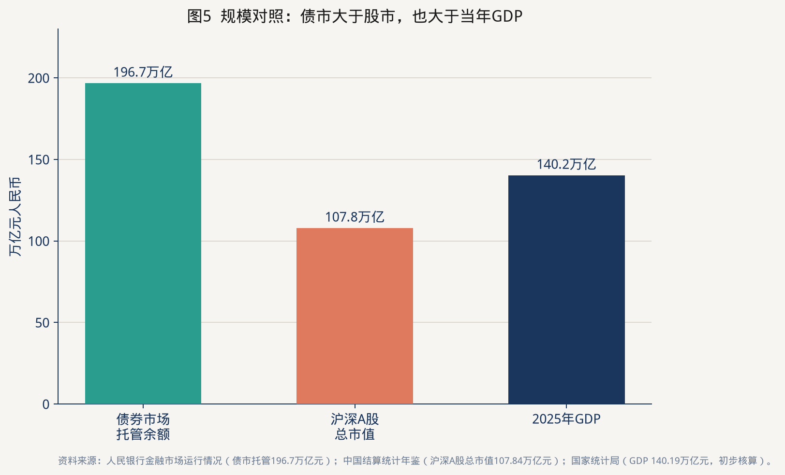

2025年末三组官方数字并排：

| 指标 | 规模 | 相对GDP | 出处 |
| --- | --- | --- | --- |
| 债券市场托管余额 | 196.7万亿元 | 约140% | 人民银行《2025年金融市场运行情况》 |
| 沪深A股总市值 | 107.84万亿元 | 约77% | 中国结算《统计年鉴2025》 |
| GDP（初步核算） | 140.19万亿元 | 100% | 国家统计局 |

债市已经大于经济总量，股市深度仍明显低于美国（世界银行口径下美国股票市值/GDP长期可超过200%）。对中国配置的含义是：利率债和高等级信用是“容量最大的压舱石”；权益能提供溢价，但无法单独吸收全社会保障和银行理财的规模，必须和债券共存。

世界银行2024年数据显示，中国私人部门信贷/GDP约194%，股票市值/GDP约63%。这与Demirgüç-Kunt和Levine所定义的**银行主导金融结构**一致：中国更接近德国、日本的历史形态，而不是当代美国。

### 3.2 债券：政府信用搭建供给，银行资金搭建需求

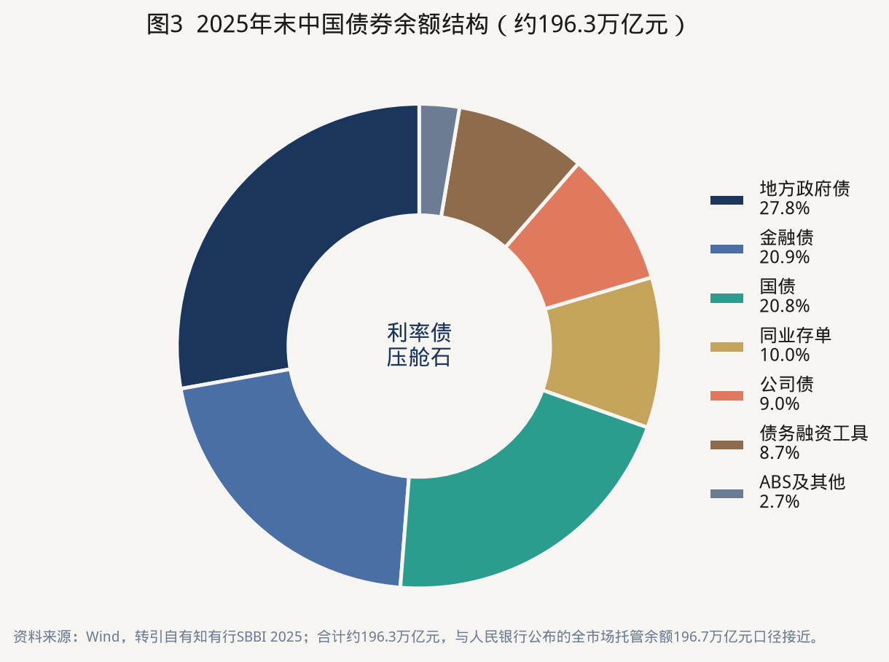

按Wind券种，2025年底地方政府债、国债、金融债合计约七成。人民银行口径下，2025年政府债券净融资13.8万亿元，企业债券净融资仅2.4万亿元。申万宏源把这一结构概括为：“由政府信用和银行资金搭建的中国债券市场。”

持有人结构同样一边倒。中央结算公司2025年统计：商业银行持有全部券种托管量 **81.28万亿元，占比63.17%**；非法人产品（基金、理财等）约15%；境外机构约2%。商业银行尤其偏爱地方债、国债、政金债。结果是：

- 利率中枢高度依赖银行缺配、存款成本和监管考核，而不只是增长和通胀。
- 信用利差经常“板块定价”，个体基本面差异反映不足。
- 外资占比低（全市场约1.8%–2.0%），中国利率债与全球债市的相关性低于日欧，是全球组合里可用的分散工具（BlackRock等外资机构反复强调这一点）。

交易层面，2025年现券成交425.3万亿元，银行间换手率230%；10年国债活跃券价差0.44个基点，流动性在利率债上已经接近成熟市场。信用债和国债期货（2025年成交97.0万亿元）正在把市场从“方向交易”推向“配置 + 交易 + 对冲”。

### 3.3 股票：融资功能弱，定价与财富效应强

社融把真相说得很直白：

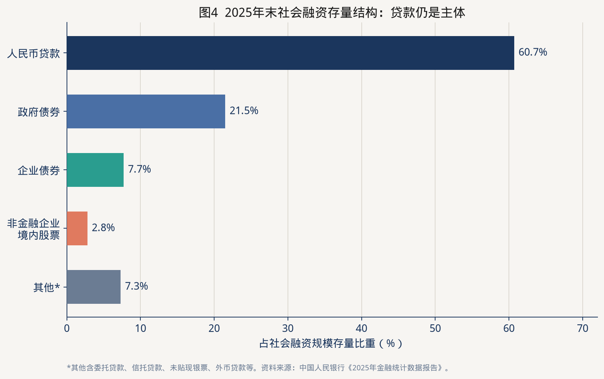

非金融企业境内股票存量12.2万亿元，仅占社融2.8%；2025年股票融资4763亿元，而贷款增加约16万亿元、政府债券净融资13.8万亿元。A股的宏观功能首先不是“给企业融资”，而是**给居民和机构做风险资产定价、做财富管理、做激励与治理。**

市场微观结构与债市几乎相反：

- **投资者。** 中国结算投资者数量已超2.5亿；公募持有A股流通市值2024年末约5.96万亿元、占流通市值7.4%（基金业协会）。外资经QFII和沪深股通持有流通市值约3万亿元量级。零售和短线资金的权重，远高于债市。
- **换手。** 2025年沪深日均成交1.70万亿元，全年成交约413万亿元，首次突破400万亿元。高换手降低了“长期持有股票就能轻松收获溢价”的假设——溢价存在，但持有体验极差。
- **结构分化。** 2025年创业板指涨约50%，上证指数涨18.4%，深证成指涨29.9%。指数选择本身就是一种配置决策。
- **政策敏感。** 回购增持再贷款、印花税、减持规则、中长期资金入市，都会在贴现率通道里快速显影。这不是“没有基本面”，而是基本面之上叠了一层政策凸性。

### 3.4 一张对照表

| 维度 | 中国债券 | 中国股票 |
| --- | --- | --- |
| 权利 | 合同现金流，违约前优先 | 剩余索取权 |
| 主导发行人 | 政府、政策性银行、金融机构 | 上市公司（国企+民企混合） |
| 主导持有人 | 商业银行自营 | 个人 + 公募/保险/外资 |
| 定价主驱动 | 货币政策、供给、机构行为 | 盈利、风险偏好、流动性、政策 |
| 主要风险 | 利率、信用、杠杆踩踏 | 盈利下修、估值压缩、流动性枯竭 |
| 流动性 | 利率债极好，信用债分层 | 头部好、尾部差，整体换手高 |
| 开放程度 | 外资持仓约2% | 外资流通市值约3万亿元 |
| 对宏观的映射 | 更贴近“总量与利率” | 更贴近“结构、预期与风险偏好” |
| 2025年体验 | 短强长弱，信用垫底 | 结构性牛市，中小盘占优 |

---

## 四、风险与收益：二十一年证据，而不是一年故事

### 4.1 长期财富：股票大约是长期国债的三倍

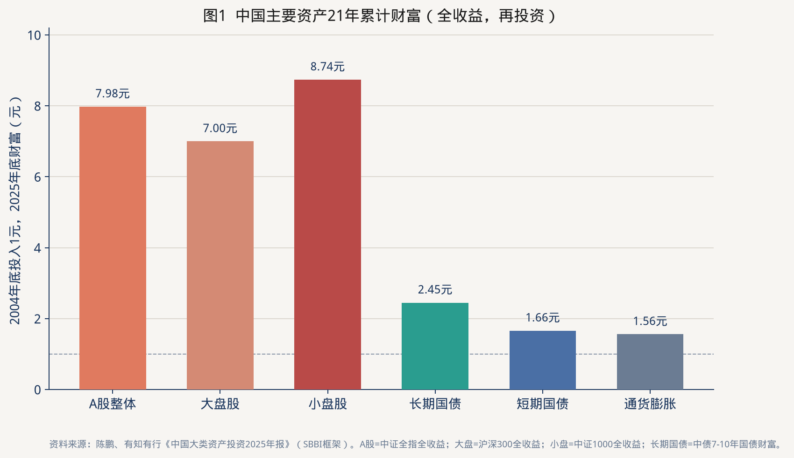

按全收益再投资，2004年底的1元到2025年底：

| 资产 | 代表指数 | 期末财富 | 年化收益 | 年化波动* |
| --- | --- | --- | --- | --- |
| 小盘股 | 中证1000全收益 | 8.74元 | 10.87% | 60.93% |
| A股整体 | 中证全指全收益 | 7.98元 | 10.40% | 54.10% |
| 大盘股 | 沪深300全收益 | 7.00元 | 9.71% | 53.44% |
| 长期国债 | 中债7–10年国债财富 | 2.45元 | 4.36% | 6.16% |
| 短期国债 | 中债0–1年国债财富 | 1.66元 | 2.43% | 0.88% |
| 通货膨胀 | CPI | 1.56元 | 2.13% | 1.69% |
| 长期信用债（2007起） | 中债高信用7–10年财富 | 2.61元 | 5.19% | 6.18% |

\*波动为年度收益率标准差，Ibbotson/SBBI传统口径。若改用日度收益年化，股票波动通常落在20%–30%区间，债券长端约3%–5%。**比较必须在同一口径内进行。**

这组数字与美国1926–2025年SBBI同构：股票 ≫ 长期债 > 短债 > 通胀。差别在于中国样本短、股票波动显著更高，因而**溢价“存在”但“难拿”。** 21年里，股票总财富大约是长期国债的3.3倍；美国百年样本里这个倍数是几十到上百倍——时间会放大复利，但前提是投资者活过回撤。

### 4.2 风险—收益平面：股票给溢价，债券给效率

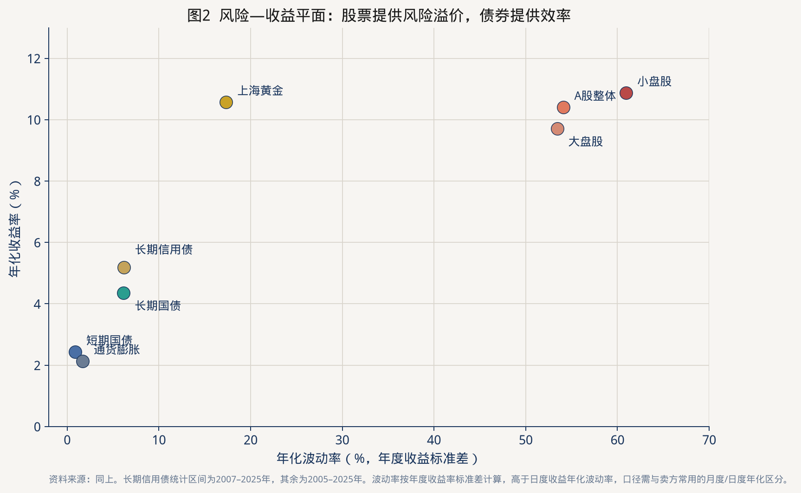

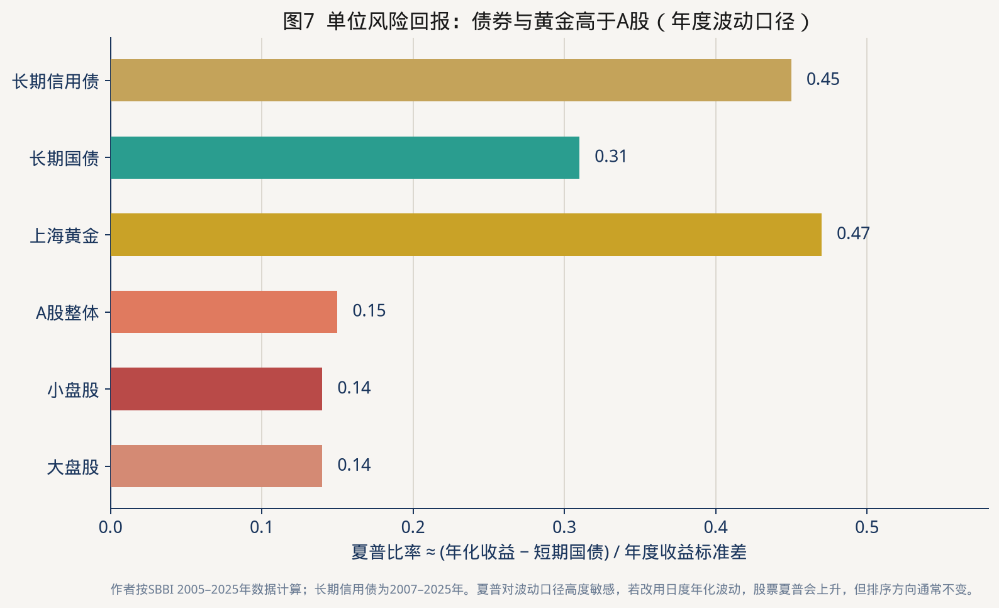

用短期国债作现金代理，粗算夏普：长期信用债约0.45，长期国债约0.31，A股整体约0.15。这不是说不该买股票，而是说：

- 股票的价值在于**提高组合的期望终端财富**，尤其在投资期超过十年、能够再平衡的时候；
- 债券的价值在于**提高单位风险回报、压低最大回撤、匹配负债**；
- 黄金在中国样本里夏普很高，但它不是股债的替代，而是通胀/地缘的卫星。

A股最大回撤在全收益口径下可深至约−70%量级（卖方常用沪深300全收益回撤亦常超过−50%）。债券组合的回撤通常是一个数量级更小。任何把股票当“高息存款”的说法，都与数据冲突。

### 4.3 收益分解：不要把牛市的资本利得写进中枢

**债券。** 票息是长期回报的主体；资本利得来自收益率下行。2022–2024年中国利率快速下行，财富指数收益被一次性抬高。2025年出现反转：长期国债仅0.89%，长期信用债0.30%，短债1.23%反而最好——曲线平坦化、供给放量、信用分化，资本利得没了，票息又已经很低。前向看，把4.3%的历史年化当作10年期国债的预期收益，高估了一倍以上。

**股票。** \(R \approx\) 股息率 + 盈利增长 + 估值变化。2005–2025年起点的市盈率并不低于终点，估值变化对长期年化是负贡献或接近零。长期能留下的，是盈利和分红。2025年A股整体+27%，其中相当部分是估值和风险偏好，不能外推。

### 4.4 2025年：把“股强债弱”读成状态，而不是新定律

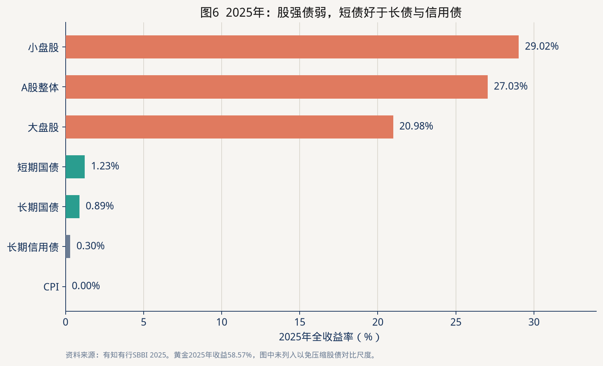

2025年是教科书式的风险偏好修复年：权益大涨、债券“短强长弱、信用垫底”，CPI为0。它验证了三件事：

1. 当增长预期和产业叙事（AI、新质生产力）改善时，股票对贴现率下行的弹性远大于债券。
2. 在低利率约束下，长债的资本利得空间被供给（超长期国债、地方债）封住，债券不再自动上涨。
3. 股债“跷跷板”可以在上半年出现，下半年因债市进入震荡而“脱敏”（财信证券、卖方跨资产报告的复盘）。对冲效率是状态变量。

---

## 五、股债关系：相关性、性价比与宏观驱动

配置的核心不是分别看懂股和债，而是看懂它们何时互相帮助、何时一起倒下。

### 5.1 理论：相关性是体制，不是常数

Campbell与Ammer（1993）证明，股债收益的协方差取决于共同的贴现率冲击、通胀冲击和增长冲击如何组合。Vanguard对全球样本的综述可以压成三句话：

- 1990年代以后，多数发达市场股债长期相关为负或接近零，债券能在股市下跌时充当缓冲；
- 只要相关系数小于1，分散化就有价值；
- **供给冲击和高通胀会把相关推正**，2022年全球60/40失效是近例。

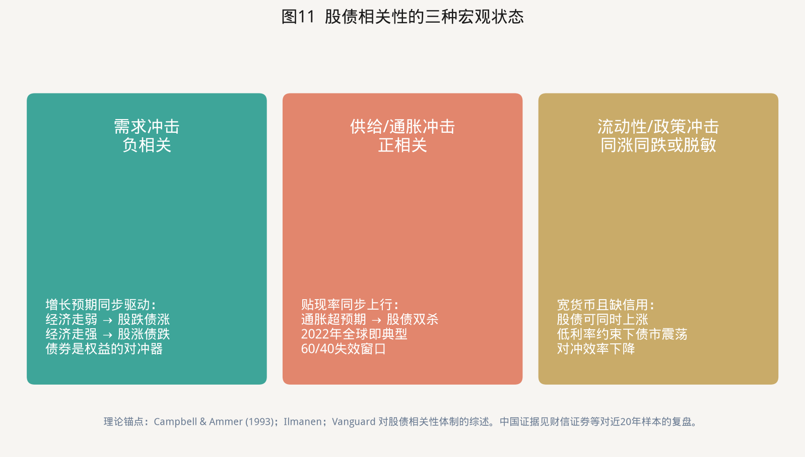

中国近二十年的卖方复盘（财信证券等）给出本土化事实：

1. 约七成时间股债呈现“常联动”（相关系数绝对值≥0.3）。
2. 持有期越长，相关性越弱——这有利于战略配置，不利于短线对冲。
3. 长期看负相关仍是主导，但同向波动的年份并不罕见。
4. 2025年上半年是强负相关的“跷跷板”，下半年转为弱相关。

学术上，Chen等（2025）用自适应Lasso-DCC-MIDAS发现：繁荣期中国股债更易“同步”为正，衰退期更易“异步”为负；股票换手率和实际有效汇率是重要驱动。含义很实践：**不要在模型里写死 ρ = −0.3。** 给相关设置体制（需求/供给/流动性），再决定债券对冲额度。

### 5.2 股债性价比：最常用、也最容易用坏的指标

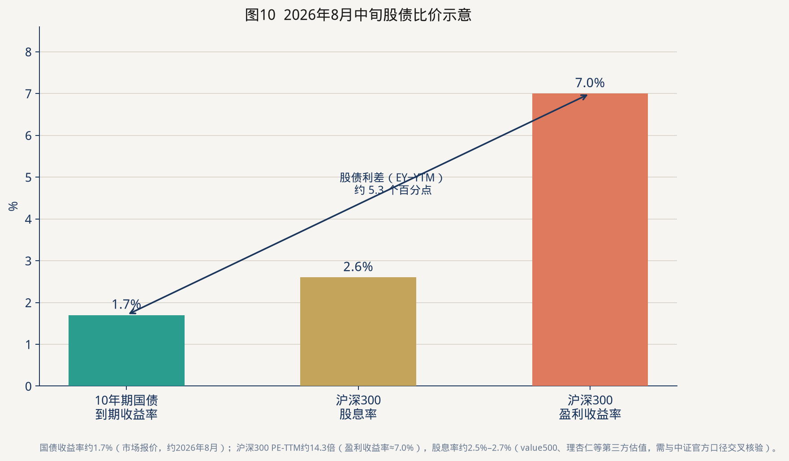

国内主流量化形式来自Fed模型：

\[
\text{股债利差}=\frac{1}{PE_{\text{TTM}}}-YTM_{10Y}
\]

或用股息率：\(\text{DY}-YTM\)。2026年8月中旬，沪深300 PE-TTM约14.3倍，盈利收益率约7.0%；十年国债约1.7%；股息率约2.6%。两种算法都显示股票相对债券有吸引力：

- 盈利收益率 − 国债 ≈ **5.3个百分点**
- 股息率 − 国债 ≈ **0.9个百分点**（股息已高于国债，这在过去十年并不常见）

使用纪律：

1. **看分位，不看绝对水平。** 利率中枢下移后，历史分位会被系统性抬高。
2. **用增长和全球利率修正。** 2022年后传统ERP长期高位而股指偏弱，因为它忽略了盈利下修和中美利差。改进指标把盈利预期和美债纳入后，轮动效果恢复（卖方“固收+”系列的经验）。
3. **仓位映射要钝化。** 常见做法是：用过去十年分位数Q作为权益权重，每月再平衡。不要在指标极值做100%切换。
4. **指数要匹配。** 用沪深300对利率债，用中证1000对成长，用红利指数对“类债股票”，结论会不同。

### 5.3 美林时钟必须中国化，且要叠加货币—信用

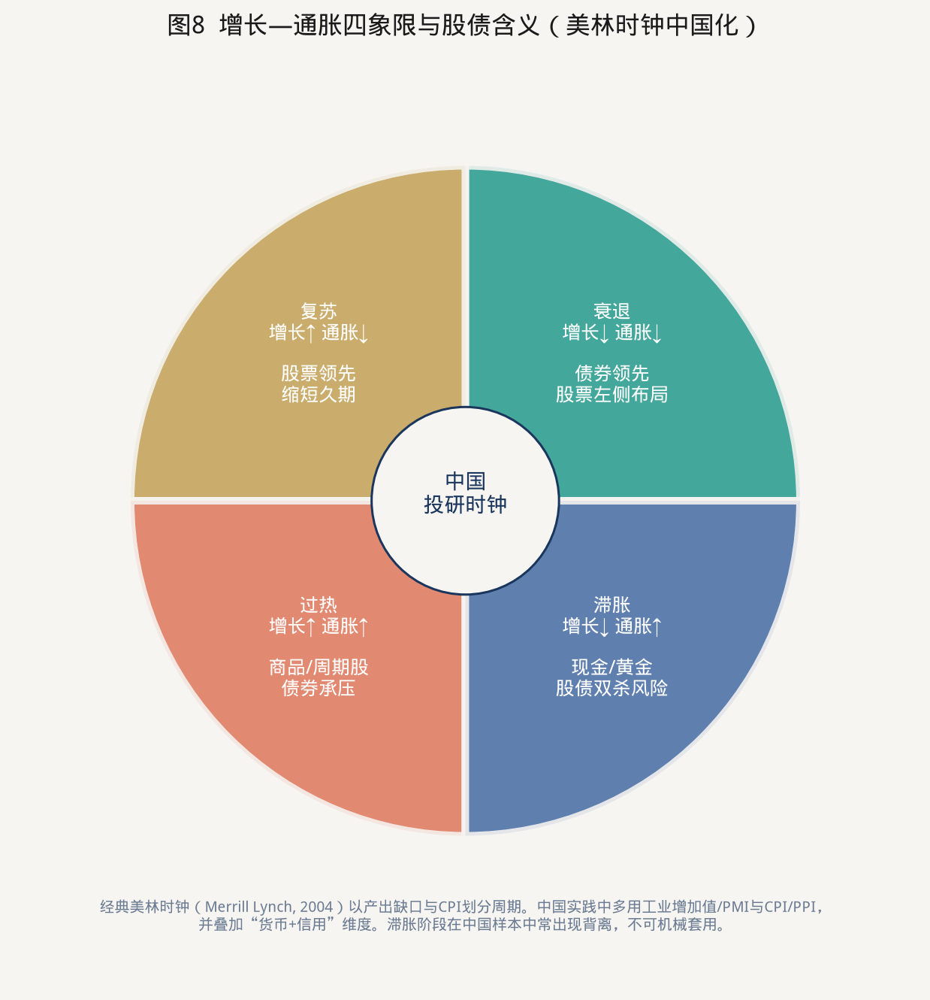

Merrill Lynch（2004）用产出缺口和CPI把周期分成复苏、过热、滞胀、衰退，对应股、商、现金、债的轮动。中国不能原样照搬：

- 增长指标改用工业增加值、PMI，通胀用CPI与PPI（中金等建议）；
- 必须叠加**货币（利率、社融、M2）和信用（信贷脉冲、城投/地产融资）**。中国多次出现“宽货币、紧信用”：债牛、股不强。2024–2025部分时间接近这一状态，随后权益在产业叙事和资金入市下单独修复。
- 滞胀象限在中国样本中常背离（方正等复盘：滞胀阶段股票有时并不最差）。
- 周期轮动快、政策干预密，时钟更适合做**状态识别**，不适合做精确择时。

一张可执行的对照：

| 状态 | 增长 | 通胀 | 货币信用 | 债券 | 股票 |
| --- | --- | --- | --- | --- | --- |
| 衰退 | ↓ | ↓ | 转向宽松 | 拉长久期，利率债为王 | 控制仓位，布局高股息 |
| 复苏 | ↑ | ↓ | 信用改善 | 缩短久期，防调整 | 提高仓位，成长/周期 |
| 过热 | ↑ | ↑ | 收紧 | 低配长债 | 周期、资源；注意估值 |
| 滞胀 | ↓ | ↑ | 两难 | 短久期、防双杀 | 低配，黄金/现金提高 |
| 宽货币弱信用 | 平 | 低 | 利率下行、信贷弱 | 债牛，但空间取决于供给 | 结构行情或磨底 |
| 供给冲击 | 不定 | ↑ | 被动收紧 | 与股票正相关 | 股债双杀，降杠杆 |

### 5.4 中国独有的第三极：房地产

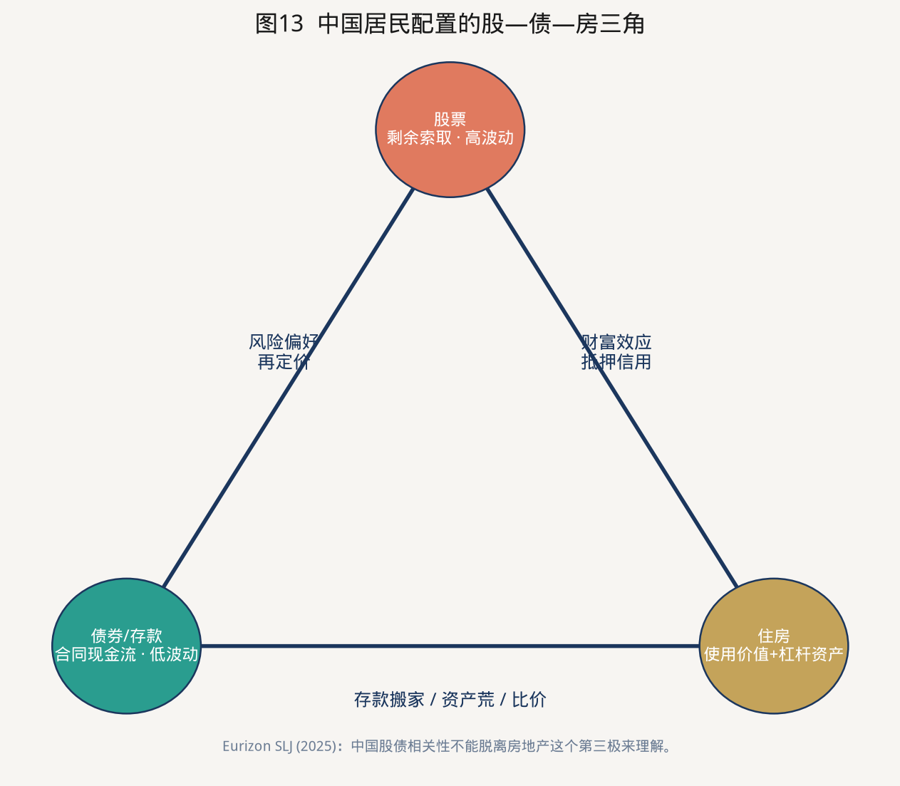

Eurizon SLJ（2025）指出，中国投资者的套利发生在**股、债、房**之间，而不是单纯股债。地产不再吸收居民增量储蓄后，资金进入存款和债券，把国债收益率压到极低；只有当住房或股票重新具备吸引力，利率才会有趋势性回升。2025年股债并未完美负相关，一个解释就是“多余储蓄同时溢出到两个金融市场”。

对配置的直接含义：观察居民存款活化、新房销售和按揭，与观察PMI同样重要。地产稳，则债的“资产荒”逻辑减弱；地产弱，则利率债仍有配置盘，但信用和银行股会承压。

---

## 六、投研范式：从业者如何把理论变成日常流程

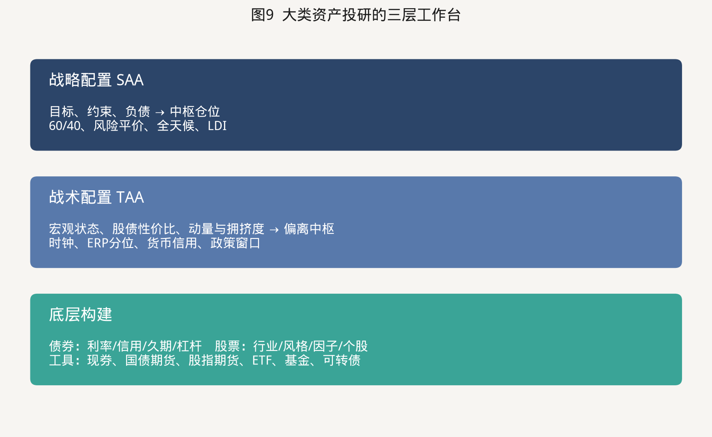

### 6.1 战略配置：先写目标函数

SAA不预测明年涨跌，只回答：在负债、流动性和回撤约束下，中枢应该在哪。常用四套，不要混用。

| 范式 | 做法 | 适合谁 | 中国落地注意 |
| --- | --- | --- | --- |
| 60/40及变体 | 资本权重固定，年度再平衡 | 教学、个人、简单FOF | A股波动高，60权益的回撤常不可接受，实际多用20/80到40/60 |
| 风险平价 | 让股、债对组合波动贡献相等 | 绝对收益、银行理财 | 债券权重要非常高；需用国债期货管理久期；相关转正时失效 |
| 全天候 | 对增长上升/下降、通胀上升/下降四格风险预算 | 长期资金 | 商品工具不足；可用黄金、资源股、通胀挂钩近似 |
| LDI | 债券匹配负债久期，权益做盈余增长 | 保险、养老金 | 会计分类（FVOCI vs 损益）往往比经济久期更决定行为 |

一个可用的中枢起点（不是建议，是校准锚）：

- 低风险、一年以内要赔付：短债 70–90，长债 10–30，股票 0–10
- 保险盈余账户、十年负债：利率债匹配久期，权益 10–25（监管与偿付能力内）
- 个人三十年养老：权益 40–70，债券/现金补齐，纪律再平衡
- 公募“固收+”：权益风险预算先定（例如年化波动 3%–6%），再反推股票仓位

再平衡本身是阿尔法的重要来源。A股大起大落，定期把股票卖出/买回到中枢，等于系统性地“高卖低买”。卖方回测中，简单再均衡相对买入持有能显著降低回撤。

### 6.2 战术配置：只允许围绕中枢偏离

TAA是状态识别，不是天天预测。建议把指标分成互不替代的四组，打分后才能动仓。

**A组 宏观状态：** PMI、工业增加值、CPI/PPI、社融脉冲、出口。决定时钟象限。  
**B组 货币价格：** DR007、十年国债、曲线形态、存单—国债利差。决定债券久期。  
**C组 比价：** ERP分位、股息率−国债、股债相对动量。决定股债切分。  
**D组 拥挤与行为：** 两融、基金仓位、新发、换手、波动率。决定不要把正确的方向做成错误的时点。

偏离幅度要事先写死，例如权益中枢30%，战术区间20%–40%。没有区间的TAA会退化成择时赌博。

### 6.3 债券内部的研究流程

一条标准的债券投研流水线：

1. **政策利率与资金面** → 短端（0–1年）
2. **增长、通胀、供给（国债发行、地方债）** → 曲线与久期
3. **机构行为（大行欠配、保险配置、理财赎回）** → 超预期的利差与拥挤
4. **信用：总量利差 → 行业 → 主体 → 条款** → 信用债是否赚的是风险还是溢价
5. **杠杆：回购成本 vs 票息** → 利差策略的真实夏普
6. **工具：现券、国债期货、IRS** → 表达观点的最便宜方式

中国利率债的超额经常来自对**供给节奏和银行配置盘**的判断，而不是对GDP的判断。2025年长债弱于短债，就是供给和曲线交易压过了“低通胀该买长债”的简单宏观。

### 6.4 股票内部的研究流程

1. **指数与风格：大盘/小盘、价值/成长、红利/质量。** 2025年小盘显著占优，风格错了，个股对了也跑输。
2. **盈利周期：一致预期修订、工业企业利润、出口与资本开支。**
3. **估值：PE/PB分位、股权风险溢价、与全球同业比较。**
4. **流动性与微观结构：北向、ETF份额、主动基金拥挤。**
5. **政策与产业：产能、补贴、反垄断、资本市场改革。**
6. **个股：治理、自由现金流、杠杆。** 大类配置研究员可以不做深度个股，但不能没有“什么公司不该以债的逻辑去买”的清单。

### 6.5 可转债：股债之间的专门赛道

可转债提供债底和期权。它在“债券票息不够、又不能把回撤做成股票”的账户里非常有用，但研究范式是期权的：看隐含波动、平价溢价、正股拥挤和条款博弈。把它放进纯债组合，等于偷偷提高权益风险预算。

### 6.6 风险管理：组合语言必须统一

| 风险 | 债券侧监控 | 股票侧监控 | 组合层 |
| --- | --- | --- | --- |
| 市场 | DV01、关键期限暴露 | Beta、行业偏离 | 波动率预算、VaR |
| 极端 | 利率+50bp、信用利差+100bp | 指数−20%、风格反转 | 最大回撤触发再平衡 |
| 流动性 | 回购依赖、信用债成交 | 停牌、冲击成本 | 赎回覆盖天数 |
| 相关 | 股债60日相关、与商品相关 | 同上 | 相关转正时降低名义杠杆 |
| 操作 | 杠杆上限 | 集中度、停牌 | 合规与会计分类 |

一条经验法则：固收+产品先定**回撤红线**（例如−3%或−5%），再定股票上限。用股票仓位去“赌回来”，是这类产品最常见的毁灭路径。

---

## 七、机构实践：约束不同，同样的宏观会变成相反的交易

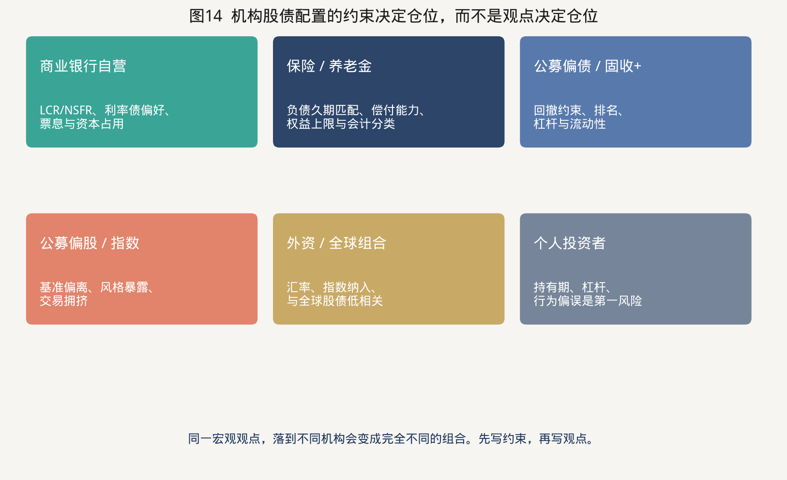

### 7.1 商业银行自营

银行是利率债的定价者。LCR、NSFR、地方债政治任务、贷款不足时的“资产荒”，使银行在衰退和宽货币期成为国债和地方债的吸盘。对银行而言，股票主要在子公司和理财，不在自营主账户。研究银行行为，是债券战术配置的第一步。

### 7.2 保险与养老金

这是最接近Campbell–Viceira理论的资金：负债久、需要匹配。利率下行时，保险会“抢配”长久期利率债，进一步压低长端——这是中国超长期国债需求的微观基础。权益配置受偿付能力、会计波动和考核约束，往往在市场低位反而买不进。理解保险，才能理解为什么ERP已经很高，增量资金仍慢。

### 7.3 公募基金

- 纯债：久期和杠杆是阿尔法，回撤来自信用和流动性。
- 固收+：权益风险预算产品。股债性价比、可转债、打新（历史）都是工具。
- 偏股：基准是股票指数，债券只是现金管理。
- FOF/投顾：最需要本报告的三层工作台，避免“用一堆基金重复暴露同一个A股Beta”。

### 7.4 外资与全球组合

中国利率债与全球股债低相关、信用在部分外部冲击中表现韧性（BlackRock）。A股与全球股票十年相关约0.3（Allianz Global Investors）。对全球配置者，中国股债是分散化资产；对境内配置者，全球资产才是分散化。方向相反，逻辑相同。汇率、指数纳入（WGBI、彭博全球综合）和地缘溢价，是外资的额外因子。

### 7.5 个人投资者的主要误区

1. 用单一年份判断资产优劣（2025年股完胜，2014年下半年债也很强）。
2. 把债券当现金，在加息或供给冲击年意外亏损后永不再买。
3. 在A股回撤40%时斩仓，等于主动放弃唯一能补偿高波动的风险溢价。
4. 忽略费用和杠杆。高换手会把10%的Beta磨成负的净收益。
5. 没有再平衡。牛市把组合变成100%股票，下一次回撤就变成命运。

---

## 八、当前环境（2025—2026）的配置含义

把前面的范式应用到当下，而不是给出交易指令。

**利率：中枢下移，票息变薄。** 2025年末十年国债1.85%，2026年8月约1.7%。债券的战略价值从“吃票息”转向“做对冲和匹配负债”。长端资本利得空间受制于供给和“低利率下的震荡市”。

**通胀：暂时缺席。** 2025年CPI同比0%。对债券是支撑，对“商品/滞胀”时钟是关闭。一旦食品或能源供给冲击出现，股债相关可能转正，需要预留现金或黄金预算。

**权益：溢价仍在，但分位已升。** 盈利收益率相对国债仍有约5个百分点；股息率已高于国债。同时沪深300 PE的近五年分位不低。含义是：相对债券，股票仍值得在中枢之上超配；相对自身历史，不能按2022–2023的“极度便宜”来加杠杆。

**结构：K型。** 新经济与出口链、AI硬件可以很好，地产链和部分传统产能仍然差。债市定价总量偏弱，股市定价结构偏强，这是2025–2026“股债脱敏”的基本面解释。

**居民再配置。** 存款利率下行、地产吸引力下降，理论上利好股债两者。谁赢得资金，取决于风险偏好和产品供给（ETF、红利策略、债券ETF）。这是未来两三年最重要的增量故事，也是最容易过度叙事的故事。

**操作层面的稳健做法：** 维持可解释的股债中枢；用ERP分位和货币信用做有限偏离；债券侧降低对资本利得的依赖，重视曲线、杠杆和高等级票息；股票侧把风险预算花在盈利能见度高的红利质量和真正有自由现金流的成长，而不是把所有弹性都押在单一主题；相关转正或波动跳升时，先降杠杆，再辩论观点。

---

## 九、从业者速查清单

**每天：** 资金面（DR007、存单）、十年国债、沪深300/中证1000、北向与成交、重要政策。

**每周：** 股债60日相关、ERP与股息率−国债、基金仓位和两融、信用利差、国债期货基差。

**每月：** 更新增长/通胀/信用脉冲；检查组合相对中枢的偏离；再平衡；压力测试（利率+30bp、权益−10%、相关=+0.5）。

**每季：** 重写预期收益：债券用起始YTM，股票用股息+盈利增长+估值回归；复核风格暴露和流动性。

**每年：** 只允许一次SAA讨论。把中枢、战术区间、回撤红线写进投资政策说明书（IPS）。没有IPS的“观点”，不是配置。

**五条口诀：**

1. 债券看约束，股票看预算。
2. 票息是债券的Beta，估值波动是债券的噪音；盈利是股票的Beta，主题是股票的噪音。
3. 相关是体制，对冲不是免费的。
4. 性价比看分位，仓位要钝化。
5. 先再平衡，再表达观点。

---

## 十、结论

中国债券和中国股票不是“稳健”与“进取”的形容词差异，而是两种法律权利、两套定价方程、两个投资者生态。理论要求我们用折现、因子和跨期对冲来理解它们；中国结构要求我们承认银行配置盘、零售交易盘和房地产第三极；二十年数据要求我们同时接受两个事实——**股票长期显著战胜债券，以及股票的波动高到足以让大多数人拿不住。**

因此，合格的大类资产投研不是预测下一次牛熊，而是建立可重复的三层工作台：用负债和风险承受力写下中枢，用宏观体制和股债比价写下有限偏离，用久期、信用、风格和工具把观点变成可交易、可风控的组合。掌握这一范式之后，行业轮动、择时和个券研究才有位置；在此之前，它们只是没有坐标系的故事。

---

## 附录A 关键数据一览（截至2025年末，除注明外）

| 项目 | 数值 | 出处 |
| --- | --- | --- |
| 债券市场托管余额 | 196.7万亿元 | 人民银行 |
| 其中：境外机构托管 | 3.5万亿元（占1.8%） | 人民银行 |
| 现券成交 | 425.3万亿元 | 人民银行 |
| 10年期国债收益率 | 1.85%（2025年末）；约1.7%（2026年8月） | 人民银行；市场报价 |
| 10年−1年国债利差 | 51bp（2025年末） | 人民银行 |
| 沪深A股总市值 | 107.84万亿元 | 中国结算 |
| 上证指数 / 深证成指 | 3968.8 / 13525.0，年涨18.4% / 29.9% | 人民银行 |
| 沪深日均成交 | 17045.4亿元（+61.9%） | 人民银行 |
| 社融存量 | 442.12万亿元 | 人民银行 |
| 人民币贷款 / 政府债券 / 企业债 / 股票占社融 | 60.7% / 21.5% / 7.7% / 2.8% | 人民银行 |
| GDP | 140.19万亿元 | 国家统计局 |
| A股21年年化收益 / 波动 | 10.40% / 54.10% | 有知有行SBBI |
| 长期国债21年年化收益 / 波动 | 4.36% / 6.16% | 有知有行SBBI |
| 沪深300 PE-TTM / 股息率 | 约14.3倍 / 约2.6%（2026年8月中） | 第三方估值，须核验 |

## 附录B 术语表

| 术语 | 含义 |
| --- | --- |
| 全收益 / 财富指数 | 把票息或分红再投资后的指数，比较资产必须用它 |
| 久期 | 债券价格对收益率的敏感度 |
| ERP / 股债利差 | 股票预期收益或盈利收益率相对国债的超额 |
| SAA / TAA | 战略 / 战术资产配置 |
| 风险平价 | 按风险贡献而不是资本权重配置 |
| LDI | 负债驱动投资 |
| 信用利差 | 信用债收益率减同期限利率债 |
| 刚兑预期 | 投资者认为某些债券（如部分城投）会获隐性支持，从而压缩利差 |
| 资产荒 | 合意资产供给不足，配置盘追逐利率债 |

## 附录C 主要参考文献

**经典理论**

1. Markowitz, H. (1952). Portfolio Selection. *Journal of Finance*.
2. Sharpe, W. (1964). Capital Asset Prices. *Journal of Finance*.
3. Merton, R. (1974). On the Pricing of Corporate Debt. *Journal of Finance*.
4. Campbell, J. & Shiller, R. (1988). The Dividend-Price Ratio and Expectations of Future Dividends and Discount Factors. *Review of Financial Studies*.
5. Campbell, J. & Ammer, J. (1993). What Moves the Stock and Bond Markets? *Journal of Finance*.
6. Campbell, J. & Viceira, L. (1999, 2001, 2002). 跨期消费—组合选择与战略配置系列（QJE, AER, JFE）。
7. Brinson, G., Hood, L. & Beebower, G. (1986). Determinants of Portfolio Performance. *Financial Analysts Journal*.
8. Ilmanen, A. (2011/2012). *Expected Returns*；CFA Institute Research Foundation, *Expected Returns on Major Asset Classes*.
9. Ibbotson, R. & Sinquefield, R. (1976起). Stocks, Bonds, Bills, and Inflation.
10. Damodaran, A. 历年股权风险溢价更新。
11. Merrill Lynch (2004). *The Investment Clock: Making Money from Macro*.
12. Maillard, S., Roncalli, T. & Teiletche, J. (2010). The Properties of Equally Weighted Risk Contribution Portfolios.

**中国市场与数据**

13. 中国人民银行，《2025年金融市场运行情况》《2025年金融统计数据报告》《2024年金融市场运行情况》。
14. 中国证券登记结算有限责任公司，《中国证券登记结算统计年鉴2025》。
15. 国家统计局，国内生产总值初步核算与最终核实。
16. 中国证券投资基金业协会，《中国证券投资基金业年报2025》。
17. 中央国债登记结算有限责任公司，债券托管与持有人统计。
18. 陈鹏、有知有行，《中国大类资产投资2025年报》（SBBI框架）。
19. 世界银行 WDI：私人部门信贷/GDP、股票市值/GDP。
20. Demirgüç-Kunt, A. & Levine, R. 银行主导与市场主导金融结构的系列研究。

**卖方、外资与学术补充**

21. 申万宏源，《中国特色债券市场系列：由政府信用和银行资金搭建的中国债券市场》。
22. 财信证券，《如何看待股债相关性的变化》。
23. 国金证券，《基于宏观因子风险预算的资产配置策略》。
24. Chen, Q. 等 (2025). What drives the synchrony and asynchrony between China’s stock and bond markets? *International Review of Economics & Finance*.
25. Eurizon SLJ Capital (2025). *China: RMB Bonds and Equities: 2025 Outlook*.
26. Allianz Global Investors, *Ten Reasons to Reconsider China Equities*.
27. BlackRock, *Unleash the potential of China bonds*.
28. Vanguard, *Understanding the dynamics of stock/bond correlations*.

---

*本报告供投研训练与框架学习使用，不构成任何证券、基金或衍生品的投资建议。数据口径若与最新官方修订不一致，以原发布机构为准。*
