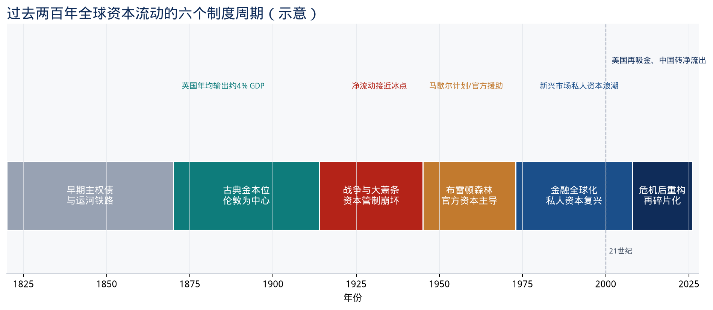
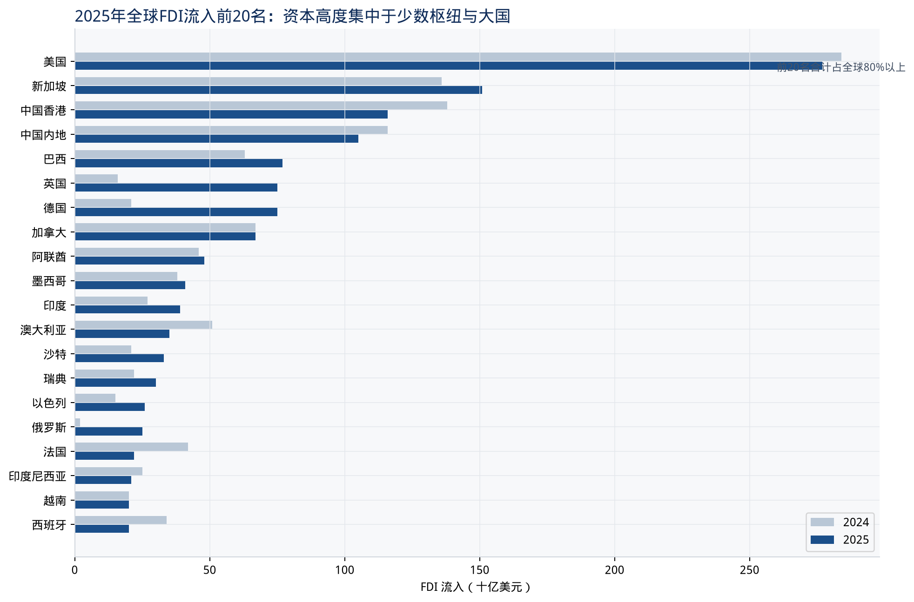
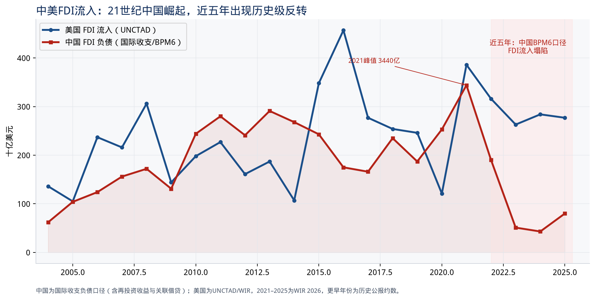
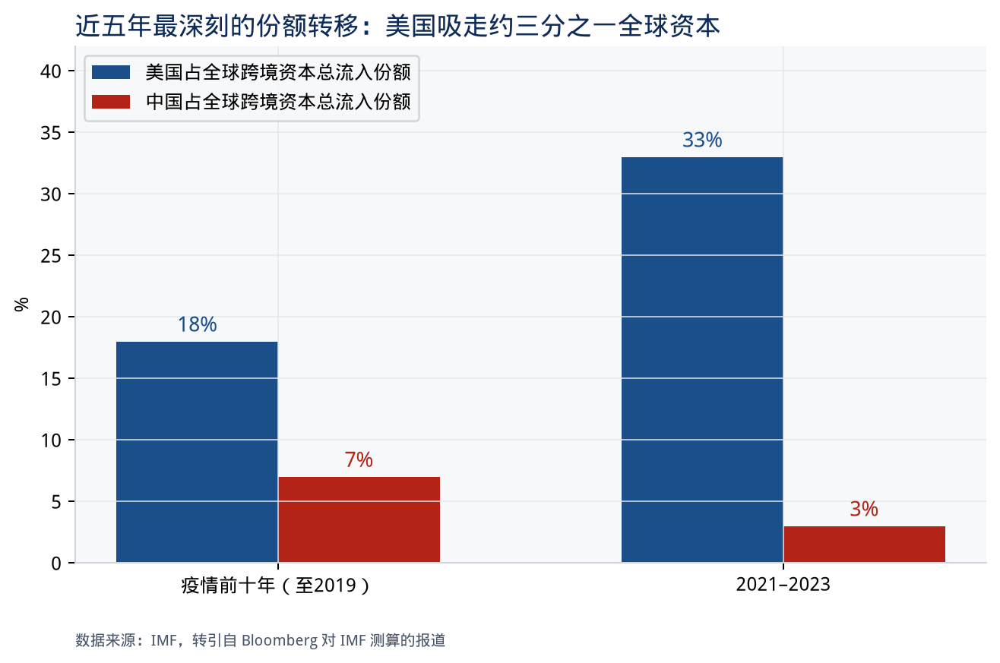
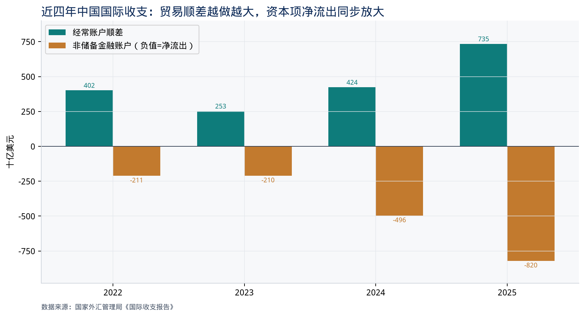
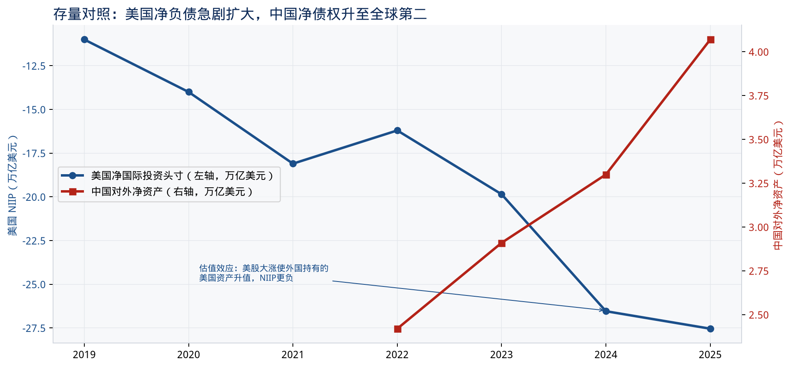
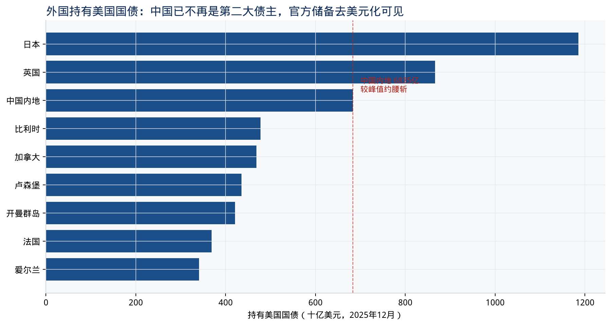

# 全球资本流向研究：从金本位到 2026 年

**研究区间：** 约 1820–2026 年（重点 1975 年以来，尤其 2000 年以来与近五年）  
**完稿：** 2026 年 9 月  
**口径：** 国际收支（FDI、证券投资、其他投资、储备）、国际投资头寸、双边持仓（IMF PIP / 美国 TIC）

---

## 执行摘要

过去两百年，全球资本并不是匀速、单向地从富国流向穷国，而是沿着一条被 Obstfeld 与 Taylor 概括为 **“U 型”** 的轨迹运动：1870–1914 年古典金本位时期达到第一次全球化高峰；两次世界大战与大萧条把它打断；布雷顿森林体系用资本管制换汇率稳定；1970 年代以后私人资本重新崛起，并在 1990–2008 年把跨境头寸推到历史新高。

**净流向**与教科书相反的时间很长。标准理论预期资本应“下山”——从资本丰裕的富国流向资本稀缺的穷国。现实中，19 世纪确实大体如此（英国、法国、德国输出资本到新大陆）；但 21 世纪的主导形态是 **“上山”**：中国、德国、日本、石油输出国把经常账户顺差以储备、国债、股权的形式输往美国。Lucas（1990）提出的悖论，在 2000 年以后变成全球宏观的主轴。

**21 世纪以来，资本的主要目的地可以分成四层：**

1. **美国**是全球最大、最稳定的“终极蓄水池”——吸收 FDI、组合投资（股票+国债+公司债）和其他投资。疫情后其占全球跨境资本总流入的份额由约 18% 升至约 1/3。
2. **中国**在 2000–2021 年是发展中世界最重要的生产性资本目的地，2014 年一度成为全球第一大 FDI 接收国；2022 年起发生历史级反转，国际收支口径的 FDI 流入从 2021 年峰值 3440 亿美元掉到 2024 年 186 亿美元量级。
3. **金融枢纽**（新加坡、中国香港、荷兰、卢森堡、爱尔兰、开曼、英属维尔京）在统计上长期占据流入前列，但大量是过境、避税与资金池，不等于最终生产性投资落点。
4. **第二梯队生产性目的地**在近十年明显换挡：墨西哥、越南、印度、印尼、阿联酋、沙特、巴西承接“中国+1”、近岸外包、能源转型与主权财富再布局。

**近五年（约 2021–2026）确实发生了深刻转变，而且中美是这场转变的两极：**

- 美国继续、甚至更强地吸收全球储蓄：经常账户逆差 2024 年约 1.19 万亿美元、2025 年约 1.12 万亿美元；2025 年末净国际投资头寸（NIIP）**-27.54 万亿美元**。外国持有美国国债约 9.3 万亿美元。
- 中国从“世界工厂+储备积累器”转向“贸易顺差创纪录、资本项持续净流出”：2025 年经常账户顺差 **7350 亿美元**，非储备金融账户逆差 **8201 亿美元**；对外净资产升至 **4.07 万亿美元**，居全球第二。外商直接投资由净流入转为接近零甚至净流出，居民对外证券投资急剧放大。
- 中国持有的美国国债从峰值约 1.3 万亿美元降至 2025 年末约 6835 亿美元、2026 年 6 月约 6334 亿美元，官方储备的“去美债化”是事实；但全球资本并没有离开美元体系——美国吸收的全球资本份额反而上升。

一句话：**近五年不是“美元衰退、资本东流”，而是“生产链部分离开中国、金融资本更集中涌向美国”。**

---

## 一、先把口径说清楚：什么叫“资本流向”

媒体常把“外资进入某国股市”或“FDI 排名”直接叫做资本流向。研究上必须拆开四层，否则会被金融中心和估值效应带偏。

| 层次 | 测什么 | 主要数据 | 容易误读的地方 |
| --- | --- | --- | --- |
| 经常账户 | 货物、服务、初次收入 | IMF BOP、各国央行 | 顺差国必然对应资本净流出（或储备增加） |
| 金融账户流量 | FDI / 证券投资 / 其他投资 / 储备 | 同上 | 总额（gross）远大于净额（net）；一年内大进大出很常见 |
| 国际投资头寸 | 对外资产与负债存量 | Lane–Milesi-Ferretti EWN、BEA、外管局 | 存量变化一半来自估值（股价、汇率），不是当年“流进来的钱” |
| 双边持仓 | 谁持有谁的证券 | IMF PIP（原 CPIS）、美国 TIC | 托管地偏差：比利时、英国、开曼往往是“名义持有人” |

本研究同时看 **总额**（资金进出的活跃度）和 **净额**（谁在给谁融资）。21 世纪以后，总额爆炸、净额仍集中在少数顺差国与美国之间，是最重要的结构事实。

---

## 二、约 200 年：资本流动的六次制度周期

Obstfeld 与 Taylor 用利率平价、储蓄–投资相关性和跨境头寸证明：全球资本市场一体化不是线性进步，而是 **U 型**——1914 年前已经很高，两次大战掉到谷底，1970 年代后再爬回去，1990 年代才重新接近金本位时期的开放度。更关键的是：今天的 **总额** 远大于 1913 年，但 **净流动占 GDP 的比例** 并不必然更高。金本位时代英国连续四十多年把约 1/3 的国内储蓄、约 4% 的 GDP 输往海外，这种持续净输出在当代几乎没有国家能复制（挪威、部分海湾国家接近，但体量不同）。

### 2.1 1820–1870：伦敦债券市场与早期主权债

拿破仑战争结束后，伦敦迅速成为欧洲主权债的发行中心。Baring 在 1815–1818 年为法国发行 rentes；Rothschild 随后为普鲁士、俄国发行贷款。1820 年代拉丁美洲独立国家涌入伦敦市场，巴西、秘鲁、墨西哥、哥伦比亚、智利、阿根廷、危地马拉集中发债，随后几乎全部违约——这是近代第一次“新兴市场债危机”。1840 年前后英国对美国的投资估计在 2200 万至 4000 万英镑，主要进入运河、州政府和早期铁路。

这一阶段的流向特征是：**西欧储蓄 → 欧洲边缘主权债 + 北美基础设施**。产业资本（工厂、矿业）的跨国直接投资仍然很少，信息与管理半径不够。

### 2.2 1870–1914：古典金本位，伦敦是世界的银行

这是两百年里最接近“教科书式资本流动”的时期。英镑与黄金挂钩提供可信的汇率锚，电报与蒸汽船压缩信息与运输成本，伦敦、巴黎、柏林形成三级资本市场。1914 年全球对外投资存量中，**英国约 42%、法国约 20%、德国约 13%**，加上荷比瑞士，西欧占约 87%（Maddison）。

英国资本的地理分布（1913 年末，Goetzmann–Ukhov 根据当时统计整理，单位：千英镑）大致是：

| 目的地 | 规模 | 含义 |
| --- | --- | --- |
| 美国 | 754,617 | 单一最大接收国，约 20% |
| 加拿大及纽芬兰 | 514,870 | 自治领铁路与开发 |
| 印度及锡兰 | 378,776 | 殖民铁路与政府债 |
| 南非 | 370,192 | 黄金与矿业 |
| 澳大利亚 | 332,112 | 另一块“新大陆” |
| 阿根廷 | 319,565 | 拉美最大接收者 |
| 巴西 | 147,967 | 咖啡与铁路 |
| 新西兰 | 84,334 | 小型定居殖民地 |

行业结构同样集中：**铁路约占 40%，外国及殖民地政府债约 30%**，公用事业、矿业种植园、银行各占一截。资本跟着劳动力和土地走——美国、加拿大、阿根廷、澳大利亚都是地广人稀、移民涌入的经济体。这就是所谓 **“资本与劳动一起流向新世界”**。印度是例外：它接收大量英国资本，但主要是殖民公共工程和担保铁路，而不是自由移民驱动的开发。

法国资本更多流向俄罗斯、奥斯曼、地中海和殖民地；德国资本更多流向中东欧与奥斯曼。全球格局是 **西欧核心输出、资源型外围输入**。

### 2.3 1914–1945：战争、赔款、美元崛起、然后冻结

一战打断金本位。协约国向美国借款，美国从净债务国变成净债权国——这是两百年里第一次全球金融中心的权杖交接。1920 年代美国私人资本输往欧洲（道威斯计划相关的德国债）和拉丁美洲，形成短暂的第二波全球化。1929–1933 年崩盘后，金本位成为紧缩机器，各国竞相管制资本、双边清算、以邻为壑。到二战结束时，跨境私人资本几乎停摆，贸易也退回易货与美元短缺。

### 2.4 1945–1973：布雷顿森林——官方资本的三十年

布雷顿森林选择了 **固定汇率 + 国内货币政策独立**，代价是资本管制。马歇尔计划（约 130 亿美元，按当时价格）和世界银行、IMF 的官方融资，是这一阶段最醒目的“资本流动”。欧洲支付同盟帮助恢复贸易，1958 年后西欧经常账户可兑换，但金融账户长期不开放。日本、韩国、台湾的工业化更多靠国内储蓄和官方援助/出口信贷，而不是私人组合投资。

对发展中国家而言，1950–1960 年代的跨境融资以 **官方贷款 + 少量FDI** 为主。IMF 后来估计，直到 1973 年以前，成熟市场与新兴市场之间的私人资本流动规模很小。

### 2.5 小结：200 年里“钱往哪去”的三次大逻辑

1. **1870–1914：** 钱跟着铁路、移民和黄金走，目的地是新大陆与帝国。
2. **1914–1973：** 钱跟着战争、赔款和官方重建走，目的地先是美国（作为债权国），再是西欧（作为受援国）。
3. **1973 以后：** 钱跟着石油、利率、汇率制度和跨国公司走，目的地重新私人化，并在 21 世纪被美国资本市场和中国工厂同时改写。

---

## 三、过去 50 年（约 1975–2025）：私人资本回来之后的五次浪潮

1971–1973 年布雷顿森林崩溃后，美国、德国（1974）、英国和日本（1979）先后放开资本账户。此后五十年可以看成五次浪潮，每一次都改变了“钱流向哪里”。

### 3.1 1973–1982：石油美元再循环 → 拉丁美洲

两次石油危机把 OPEC 变成巨大顺差集团。石油美元存入欧美大银行，再以银团贷款形式贷给发展中国家，尤其是墨西哥、巴西、阿根廷。IMF 估计 1973–1982 年流向新兴市场的私人资本约 **1630 亿美元**，其中银行贷款（含贸易信贷）约占 57%。这是战后私人资本的第一次大规模“下山”。

1982 年墨西哥宣布无力偿债，沃尔克加息刺破了以浮动利率美元债支撑的循环。1980 年代剩余时间，流向新兴市场的私人资本塌缩至约 1030 亿美元，拉美陷入“失去的十年”。资本从“涌向南方”变成“逃回北方”。

### 3.2 1989–1997：证券化与东亚奇迹

1980 年代末起，流向发展中国家的资本不仅规模超过 1970 年代峰值，结构也变了：**银行贷款让位于 FDI 和组合投资**。1990–1997 年新兴市场私人资本流入接近每年 2000 亿美元，约 3/4 被亚洲和拉美吸收。1993–1996 年亚洲明显超过拉美。东亚此轮流入以 FDI 为主，拉美则以组合投资和债券更突出——这也部分解释了为什么亚洲危机后生产性资本恢复更快。

1994 墨西哥危机、1997–1998 亚洲危机、1998 俄罗斯、1999 巴西、2002 阿根廷，把“突然停顿”（sudden stop）写成新兴市场的标准剧本。危机后东亚集体转向：**少借外债、多攒储备、用经常账户顺差自我保险**。中国、韩国、台湾、部分东盟从此成为全球净资本输出方。Bernanke 2005 年提出的“全球储蓄过剩”，源头正在这里。

### 3.3 1999–2008：中国加入 WTO、美国双赤字、金融全球化巅峰

这十年同时发生三件事：

- **中国**成为世界工厂，经常账户顺差急速扩大，外汇储备从加入 WTO 时的约 2000 亿美元升至 2008 年的约 1.95 万亿美元，再在 2014 年见顶约 4 万亿美元。对应的资本流出主渠道是央行购买美国国债和机构债。
- **美国**成为全球最大的经常账户逆差国（2006 年逆差约 8160 亿美元），用国债、机构债、公司债和股票吸收亚洲与石油国的储蓄。
- **欧洲**内部形成德国顺差–南欧逆差的欧元区循环；伦敦、都柏林、卢森堡、荷兰把全球公司的资金簿记在自己名下，跨境头寸（总额）膨胀到远超实体贸易。

Lane 与 Milesi-Ferretti 的 External Wealth of Nations 显示：2000–2007 年全球对外资产/负债相对 GDP 急剧上升，2008 年见顶后先进经济体（尤其是欧洲银行）去杠杆，总额增速放缓，但 FDI 因跨国公司和特殊目的实体（SPE）继续膨胀。

### 3.4 2009–2019：后危机的“新常态”——银行退、市场进，中国独特

国际清算银行（BIS，CGFS 第 66 号报告）把危机后十年的变化概括为：

- 全球资本流动 **总量下降**，唯独流向中国的资本显著上升。
- 债权人从银行转向市场：新兴市场本币债市场对外开放，外国投资者进入当地国债。
- 债务人从银行转向企业和主权。
- 美元作为融资和投资货币的地位没有下降。

对中国，这十年是“引进来”和“走出去”叠在一起：FDI 流入仍居世界前列；对外直接投资在 2008–2014 年年均增长约 27%，2015 年后仍维持在每年约千亿美元量级；“一带一路”配套的开发性贷款形成官方资本的新通道。2015–2016 年人民币贬值预期触发一轮储备下降（约 1 万亿美元量级的压力），是后来资本项开放放缓的直接原因。

对美国，后危机十年的经常账户逆差收窄（相对 GDP），但作为全球安全资产供给者的角色更重：每次风险事件（欧债、2013 taper tantrum、2015 中国、2018 贸易摩擦），资本都回流美债。

### 3.5 2020–2026：疫情、加息、地缘政治——第五次浪潮

这是下一章的主题。先给出 50 年尺度上的定性结论：

> 过去五十年，全球资本的“生产性落点”从拉美转向东亚再转向中国，再在近五年部分转向墨西哥–东盟–印度；而“金融性落点”几乎从未离开美国。谁生产、谁融资，在 21 世纪是分开的。

---

## 四、21 世纪以来：资本主要流向哪些国家（分类型、分阶段）

必须把 **FDI、组合投资、银行/其他投资、官方储备** 分开。它们的目的地清单并不相同。

### 4.1 外国直接投资（FDI）：生产性资本的地图

UNCTAD《世界投资报告 2026》显示，2025 年全球 FDI 流入 **1.6 万亿美元**，结束连续两年下降，但复苏极不均衡：发达经济体 +11%，发展中经济体仅 +2% 至 9010 亿美元。**前 20 名接收经济体占全球 80% 以上。**

2025 年流入前 20 名（UNCTAD，十亿美元）：

| 排名 | 经济体 | 2025 | 2024 | 角色 |
| --- | --- | --- | --- | --- |
| 1 | 美国 | 277 | 284 | 终极市场 + 科技/芯片/能源再工业化 |
| 2 | 新加坡 | 151 | 136 | 亚太总部与资金簿记枢纽 |
| 3 | 中国香港 | 116 | 138 | 内地门户 + 金融中心 |
| 4 | 中国内地 | 105 | 116 | 仍大，但趋势向下 |
| 5 | 巴西 | 77 | 63 | 资源、可再生、国内市场 |
| 6 | 英国 | 75 | 16 | 波动极大，受并购与重组驱动 |
| 7 | 德国 | 75 | 21 | 同上 |
| 8 | 加拿大 | 67 | 67 | 能源与北美供应链 |
| 9 | 阿联酋 | 48 | 46 | 海湾枢纽、主权资本再配置 |
| 10 | 墨西哥 | 41 | 38 | 近岸外包、USMCA |
| 11 | 印度 | 39 | 27 | 人口市场 + 制造业政策 |
| 12 | 澳大利亚 | 35 | 51 | 资源 |
| 13 | 沙特 | 33 | 21 | 愿景 2030、能源转型 |
| 14–20 | 瑞典、以色列、俄罗斯、法国、印尼、越南、西班牙 | 30–20 | — | 科技、能源、中国+1 |

**解读这张表有三个关键：**

第一，**美国在 21 世纪绝大多数年份都是第一大接收国。** 例外是 2014 年：沃达丰出售 Verizon 股权导致美国流入异常偏低，中国以约 1280 亿美元短暂登顶。不要把 2014 年当成趋势反转，那是一次会计事件。

第二，**新加坡、中国香港长期排在中国内地前面或紧随其后，不能把它们读成“资本更喜欢这两个经济体的实体经济”。** UNCTAD 自己也写：排名变化经常由金融中心的少数大额交易驱动，而不是生产能力的 Broad-based 变化。荷兰、卢森堡、爱尔兰、开曼在很多年份同样会冲进前十，本质是 SPE 和基金注册地。

第三，**真正的 21 世纪生产性故事是中国，然后是“中国之后”。**

#### 中国：2000–2021 的超级目的地，以及口径陷阱

商务部“实际使用外资”与外管局/国际收支（BPM6）不是一回事：

- **商务部口径**：项目落地的资本金，不含再投资收益、不含关联公司借贷。2022 年见顶约 1891 亿美元，2023 年 1633 亿，2024 年 1162 亿。
- **国际收支负债口径**：含再投资收益和公司内部贷款。2021 年峰值 **3440 亿美元**，2023 年 513 亿，2024 年仅 **186 亿**（AMRO / OECD 转引），2025 年加拿大全球事务部汇编约 800 亿。UNCTAD 综合口径则给出 2024 年 1160 亿、2025 年 1050 亿。

2023 年第三季度，中国国际收支口径 FDI **首次录得季度净流出**（约 -108 亿美元）。这被部分舆论读成“西方撤离”。更细致的分解（PIIE、AMRO、加拿大全球事务部 2026 年 7 月研究）表明：

- 塌陷的大头是 **再投资收益下降 + 向境外母公司偿还关联贷款**，不是工厂被打包卖掉。
- 美欧对华直接投资流量在 2023–2024 年走弱，但只解释了塌陷的一小部分（大约 13% 量级），不是主体。
- 香港仍是对华 FDI 的统计门户；高技术产业在商务部口径里的占比反而上升（约 37%）。

所以：中国作为 21 世纪最大的发展中接收国，这个判断在 **存量** 上仍然成立（2025 年末外商直接投资存量约 3.98 万亿美元）；但在 **流量** 上，2022 年以后已经不再是全球增量资本的首选工厂。

#### 美国：21 世纪的“双料冠军”

美国既是最大接收国，也是最大对外投资国。UNCTAD 2025 年：流入 2770 亿，流出 2630 亿。BEA 2025 年末：美国对外直接投资头寸 7.14 万亿美元，外国在美直接投资头寸 5.86 万亿美元。增量来自欧洲（德国、加拿大居前），行业上电气设备、化工、半导体和数字基础设施权重上升。CHIP 法案、通胀削减法案把补贴变成了看得见的选址参数：绿电、芯片、电动车电池的绿地项目公告值在 2021 年后显著抬升。

#### 21 世纪其他生产性目的地，按“为什么来”分类

**A. 始终在场的发达经济体**  
英国、加拿大、澳大利亚、德国、法国、西班牙：深度资本市场 + 并购。英国和德国的年度数字会因为一两笔重组大起大落（2024→2025 英国从 160 亿跳到 750 亿），读趋势要用多年平均，不要用单年排名。

**B. 中国供应链外溢：越南、墨西哥、印度、印尼、马来西亚**  
这是 2018 年贸易摩擦之后最重要的地理重构。

- **墨西哥**：近岸外包的最大赢家。UNCTAD 2024 年 380 亿、2025 年 410 亿美元；USMCA、对美陆路、汽车与电子集群是基本盘。亚洲资本（含中国企业）把墨西哥当成进入美国市场的跳板，但美国和欧盟仍是存量最大的投资来源。
- **越南**：2024–2025 年 UNCTAD 均为约 200 亿美元，规模不大但占 GDP 比重高。电子、纺织、半导体封测是主赛道，韩国、新加坡、中国、日本企业是主力。
- **印度**：2025 年 390 亿美元，从 2024 年 270 亿明显回升。政策工具是 PLI（生产挂钩激励）、Make in India、单一窗口。绿地项目在电子、半导体、数据中心、可再生能源上非常强，但落地率低于公告值，这是印度长期的“承诺–执行缺口”。
- **印尼**：镍–电池链条吸引中国和韩国资本，2025 年约 210 亿美元。
- **马来西亚、泰国**：半导体、数据中心、电子；2025 年东盟整体流入从 2220 亿升至 2440 亿美元，成为发展中亚洲最大的次区域接收地。

**C. 海湾：从石油美元来源地变成目的地**  
阿联酋 2025 年 480 亿美元，稳居前十；沙特 330 亿美元。21 世纪前 15 年海湾主要是 **资本来源**（石油顺差回流纽约、伦敦）；近几年主权财富基金（PIF、ADIA、Mubadala、QIA）同时在国内 mega-project 和全球科技/基础设施两端下重注，使海湾成为少有的“来源 + 目的地”重合区。

**D. 资源与能源转型：巴西、澳大利亚、加拿大、部分非洲**  
巴西 2025 年跳升至 770 亿美元，可再生和自然资源是 UNCTAD 点名的原因。非洲整体约 700 亿美元，仍只有全球一个零头；最不发达国家 430 亿美元，仅占 2.7%，而且集中在少数资源国。**两百年了，资本仍然很少流向最穷的国家。** 这是 Lucas 悖论最残酷的一面。

**E. 2025 年对外直接投资来源（钱从哪来）**  
美国 2630 亿、日本 1860 亿、中国 1740 亿，然后是卢森堡、香港、新加坡、德国、英国、阿联酋。中国已经是全球第三大对外投资国——这与它作为接收国地位下降，是同一枚硬币的两面。

### 4.2 组合投资（股票与债券）：金融资本的地图，几乎就是美国

FDI 还有中国、新加坡、墨西哥可看；**股票和债券跨境持仓的中心就是美国和少数金融中心。**

IMF PIP（原 CPIS）2026 年 3 月简报：2025 年 6 月末跨境组合投资资产 **89 万亿美元**，半年增长 11.6%，其中估值效应 9.1 个百分点、净买入仅 2.5 个百分点。股权占 57%，债券 43%。增长贡献最大的是欧元区，其次是其他发达经济体，美国自身对资产和负债增长都有显著贡献。新兴市场贡献很小，且主要是估值。

21 世纪组合投资的目的地结构可以概括为：

1. **美国国债、机构债、公司债、股票** 是全球官方与私人机构的核心配置。2025 年 12 月外国持有美国国债 **9.27 万亿美元**；2026 年 6 月 TIC 报 **9.30 万亿美元**。这还只是国债，不含股票和公司债。美国对外负债 2025 年末 **70.49 万亿美元**，资产 42.96 万亿。
2. **欧元区主权债与核心公司债** 是第二大池子，但 2010–2012 年欧债危机证明它不是同等安全资产。爱尔兰、卢森堡是基金注册地，统计上的“爱尔兰吸收巨额组合投资”很大程度是美国和全球基金的壳。
3. **英国** 仍是欧洲美元和托管中心。TIC 里英国长期是美国国债前三大持有地之一，其中相当部分是全球客户的托管。
4. **中国债券与股票市场** 在 2014–2021 年是最大的“新目的地实验”：沪港通、深港通、债券通、纳入全球指数。外资持有中国债券和股票的峰值出现在 2021 年前后。2022–2024 年股票通多次净流出，2024 年债券重新净流入 468 亿美元，股票仍净流出 202 亿美元。2025 年外管局称股票恢复净流入、债券转为净流出。中国始终没有成为可以替代美国的组合投资目的地——市场规模、资本账户可兑换、法治与信息环境都不支持。
5. **新兴市场本币债** 在 2010 年代是热门（印尼、墨西哥、南非、马来西亚），2013 taper tantrum、2020 年 3 月、2022 年美联储加息三次打回原形。IMF 2025 年《外部部门报告》强调：除中国外的新兴市场仍有正的净流入，但显著低于十年前。

### 4.3 其他投资与银行跨境债权：美元体系

BIS 定位银行跨境债权的货币结构：美元始终是主导融资货币。危机后欧洲银行收缩美元资产，日本、加拿大、部分亚太银行补位，但计价货币还是美元。2022 年美元走强、利率跳升时，对中国的跨境银行流入下降尤为明显。

中国 2024 年“其他投资”项下净流出 1498 亿美元（存款、贷款、贸易信贷），说明企业和银行在主动配置境外流动性，而不只是央行在买储备。

### 4.4 官方储备：21 世纪前 15 年的隐形巨流

2000–2014 年，全球资本流动里最被低估的一条是：**东亚和石油国央行把贸易顺差变成美国国债。** 中国外汇储备从约 0.2 万亿升至约 4 万亿，是人类历史上最大的官方资本输出。2014 年以后储备增长停滞，2025 年末中国储备约 3.36 万亿美元（含估值）。官方资本让位给企业和居民的对外证券投资与直接投资——中国的资本输出“民营化”了。

### 4.5 21 世纪目的地：一张总表

若问“21 世纪资本主要流向哪些国家”，按 **最终风险承担和收益来源** 而不是按注册地，答案是：

| 优先级 | 经济体 | 吸收的主要是什么 | 2000–2015 | 2016–2021 | 2022–2026 |
| --- | --- | --- | --- | --- | --- |
| 1 | 美国 | 国债、股票、公司债、FDI | 核心 | 核心 | **更核心** |
| 2 | 中国内地 | FDI、少量组合投资 | 快速上升 | 高峰 | **大幅下降** |
| 3 | 欧元区核心 + 英国 | 债券、FDI、银行 | 核心 | 欧债后分化 | 随并购波动 |
| 4 | 新加坡 / 香港 | 枢纽、总部、过境 | 稳定高 | 稳定高 | 稳定高 |
| 5 | 日本 | 作为来源国而非目的地 | 输出 | 输出 | 输出（FDI 第二大来源） |
| 6 | 巴西、印度、墨西哥、东盟、海湾 | FDI、部分组合 | 周期性 | 印度/东盟上升 | **近岸与中国+1 加速** |
| 7 | 开曼 / 卢森堡 / 爱尔兰 / BVI | 基金与 SPE | 统计巨人 | 统计巨人 | 统计巨人 |

---

## 五、近五年：是否发生了深刻转变？尤其是中美

**结论先讲：发生了，而且是 1970 年代以来最重要的一次方向转换之一。** 它不是“全球化结束”那么简单，而是三件事叠在一起：

1. 全球风险资本和组合资本更集中于美国（AI、财政扩张、高利率、制度溢价）。
2. 中国从净资本输入国变成持续净资本输出国，且输出渠道从央行储备变成企业与居民对外投资。
3. 生产性 FDI 从“世界工厂单极”变成“美国再工业化 + 中国存量 + 墨西哥/东盟/印度增量”。

### 5.1 份额上的深刻转变

IMF 测算（Bloomberg 2024 年引用）：疫情前美国约占全球跨境资本总流入的 **18%**，2021–2023 年升至约 **1/3**；中国从约 **7%** 降至约 **3%**。同一时期美国净流入约相当于 GDP 的 1.5%。这是宏观意义上的“美国吸走全球储蓄”，不是某一两个并购项目。

Stephen Jen 的概括仍然准确：FDI 流入中国、组合投资流入美国，这两条曲线都相对疫情前发生了量级变化；除非两国政策转向，新格局不会自动回去。

### 5.2 美国：近五年的流入与存量

**经常账户（BEA，2026 年 3 月修订）：**

| 年 | 经常账户 | 约占 GDP |
| --- | --- | --- |
| 2021 | -8586 亿美元 | — |
| 2022 | -9931 亿美元 | — |
| 2023 | -9280 亿美元 | — |
| 2024 | **-1.185 万亿美元** | 约 4.0% |
| 2025 | **-1.116 万亿美元** | 3.6% |

经常账户逆差在会计上几乎等于美国在向全世界发行净金融负债。谁在买？外国官方与私人部门买美债、美股、美国公司、美国工厂。

**国际投资头寸：**

| 时点 | 美国 NIIP | 资产 | 负债 |
| --- | --- | --- | --- |
| 2023 年末 | -19.85 万亿 | — | — |
| 2024 年末 | -26.54 万亿 | 约 35.9 万亿 | 约 62.1 万亿 |
| 2025 年末 | **-27.54 万亿** | **42.96 万亿** | **70.49 万亿** |

2024 年一年 NIIP 恶化约 6–7 万亿美元，远超当年经常账户逆差。差额来自 **估值**：美股大涨，外国持有的美国股票升值；美元一度走强，美国对外资产的外币价值缩水。IMF 2025 年《外部部门报告》把全球净债务扩张几乎全部记在美国头上。这是“美国例外论”在国际金融上的镜像：你越成功，账面净负债越大，因为别人都想持有你的股权。

**国债持有结构（CRS / TIC）：**

2025 年 12 月前三大外国持有者：日本 1.19 万亿美元（12.8%）、英国 0.87 万亿（9.3%）、中国内地 0.68 万亿（7.4%）。中国份额从早年的 13% 量级降下来。2026 年 6 月 TIC：日本 1.12 万亿，中国 6334 亿美元。比利时、卢森堡、开曼、爱尔兰的巨大数字提醒我们：真正的受益所有人被托管地掩盖，中国的实际持有可能高于 TIC 的“内地”一行，但下降趋势本身很清楚。

**FDI：** 美国维持全球第一，2021–2025 年 UNCTAD 口径大致在 2630–3860 亿美元之间波动，没有出现中国那样的塌陷。美联储 2026 年 6 月的 FEDS Note 显示，近年再投资收益占比上升，绿地项目向半导体、数据中心、清洁能源集中。

**为什么钱更想去美国？** 近五年的拉力是叠加的：相对增长优势（2023–2024 美欧增长差）、美债实际利率转正、AI 资本开支与股市、美元安全资产、法治与流动性深度，以及中国资产的制度与地产风险溢价上升。2025 年美元贸易加权汇率一度贬值约 9.4%（外管局转述），但并没有改变资本“买美国资产”的大方向——汇率贬值更多是利率交易与政策不确定性，不是美元体系被替代。

### 5.3 中国：近五年的流出与存量

外管局《国际收支报告》给出的近四年主账户（亿美元）：

| 年 | 经常账户顺差 | 非储备金融账户 | 含义 |
| --- | --- | --- | --- |
| 2022 | +4019 | 约 -2110（与经常账户对冲的官方量级） | 开始转向“顺差输出” |
| 2023 | +2530（1.4% GDP） | **-2099** | 直接投资逆差 1426 亿 |
| 2024 | +4239（2.2% GDP） | **-4962** | 十年新高的净流出 |
| 2025 | **+7350** | **-8201** | 规模再上一个台阶 |

2025 年的结构尤其重要，因为它已经不是“外资撤了一点”：

- 货物贸易顺差 **1.0606 万亿美元**（国际收支口径）。
- 服务贸易逆差 2381 亿美元（旅行仍是大头）。
- 初次收入逆差 1284 亿美元。
- 境内主体对外投资净增加 **8076 亿美元**：其中股权对外直接投资 1401 亿，对外证券投资 **3606 亿**（沪深港通南向、银行买外国债）。
- 来华投资总体小幅净流出 125 亿美元：股权 FDI 因利润再投资同比 +20%，股票恢复净流入，债券净流出，其他投资流出放缓。

2024 年更细的拆解（外管局）：

- 直接投资：**-1537 亿美元**（对外资产 +1722 亿，来华负债仅 +186 亿）。来华股权资本金仍有 909 亿新增，说明“新项目资本金没断”，断的是关联借贷和利润留存。
- 证券投资：**-1876 亿**（对外 +2142 亿，来华 +266 亿）。来华以债券为主（+468 亿），股票 -202 亿。
- 其他投资：**-1498 亿**。

**存量（2025 年末）：**

| 项目 | 规模 |
| --- | --- |
| 对外金融资产 | 11.786 万亿美元（+15%） |
| 对外负债 | 7.715 万亿美元（+9%） |
| **对外净资产** | **4.071 万亿美元（+28%，全球第二）** |
| 储备资产 | 3.744 万亿美元（占对外资产 32%） |
| 对外直接投资资产 | 3.579 万亿美元 |
| 来华直接投资负债 | 3.982 万亿美元（占总负债 52%） |
| 来华证券投资负债 | 2.351 万亿美元（30%） |

中国仍然不是“外资清空的经济体”。外商直接投资仍占对外负债一半以上，这在 G20 里属于偏高、偏长期的负债结构。转变在于：**增量资金不再把中国当作必须超配的目的地，中国自己的钱开始大规模出海。**

IMF 2025 年 7 月《外部部门报告》的措辞比中文官方更直：中国净资本流出加速至“十年新高”；总流入接近零；总流出由组合投资和其他投资推动；2024 年经常账户顺差扩大 1610 亿美元至 4240 亿美元，与美国逆差扩大一起，把全球经常账户差额重新撑开。

### 5.4 中美对照：近五年到底换了什么

| 维度 | 美国 | 中国 |
| --- | --- | --- |
| 经常账户 | 巨额逆差，2024–2025 连续超过 1.1 万亿美元 | 顺差从 2023 年 2530 亿扩至 2025 年 7350 亿 |
| 金融账户 | 持续净流入，组合投资是主力 | 持续净流出，2025 年超 8000 亿 |
| FDI 流量 | 全球第一，大致稳定 | 商务部口径下滑，BPM6 口径塌陷后略回升 |
| FDI 存量 | 外来直接投资头寸 5.86 万亿 | 来华 3.98 万亿，对外 3.58 万亿，已接近双向平衡 |
| 组合投资 | 全球最大目的地，外资增持美股美债 | 双向开放，但居民对外买股买债远大于外资买中国 |
| 官方储备/国债 | 全球安全资产供给者 | 持美债从约 1.3 万亿降至约 0.63–0.68 万亿 |
| 净头寸 | 全球最大净债务国，-27.5 万亿 | 全球第二净债权国，+4.1 万亿 |
| 估值 | 美股上涨让净负债更差 | 2025 年资产价格与非美货币升值推高净资产 |
| 在全球总流入中的份额 | 18% → ~33% | ~7% → ~3% |

有三件事 **没有** 发生，需要单独写清楚，避免把“深刻转变”说成另一套叙事：

1. **美元体系没有崩。** 美国占全球资本流入的份额上升，而不是下降。俄罗斯资产冻结确实提出了“储备会不会被制裁”的问题，中国和部分新兴市场增加了黄金（2025 年金价大涨），但替代美债的深度市场并不存在。
2. **中国没有突然“关闭”。** 股权 FDI 资本金仍在进，高技术占比上升，2025 年来华股票恢复净流入。发生的是相对地位下降和利润汇出/还贷，不是 1998 年式的突然停顿。
3. **除中国以外的新兴市场没有集体失血。** IMF 和 2025 年 11 月 EM BOP 监测都显示：EM ex-China 过去四季度总流入约 8400 亿美元，相当于 GDP 的 4.7%，略高于 2015–2019 年均值。钱是绕开中国、而不是绕开整个南方。

### 5.5 近五年转变的机制：不只是“情绪”

按重要性排列：

1. **利差与增长差。** 2022–2024 年美联储把政策利率推到 5% 以上，中国则降息稳地产。利差倒挂直接驱动：在华外资企业偿还美元债、中国居民通过港股通买美股、全球基金把久期和股权风险预算留给美国。
2. **中国国内吸收能力下降。** 地产长周期、地方政府隐性债务、民营预期、青年失业，使国内投资率下降。IMF 明确写：2024 年全球经常账户分化，主要来自投资率——美国投资升、中国/欧元区/日本投资降。中国“过剩储蓄”重新变成贸易顺差，而不是变成国内资本形成。
3. **地缘政治与供应链。** 出口管制、投资审查、对等限制，改变的是 **边际新增项目的选址**，尤其是半导体、AI、生物、关键矿物。存量工厂大多还在，增量绿地去了美国、墨西哥、越南、印度、马来西亚。
4. **美国产业政策。** CHIPS、IRA、国防与数据中心，把补贴变成可计算的 IRR。这是 1980 年代以来美国第一次用大规模财政工具和资本流入抢工厂。
5. **制度与信息溢价。** 2021 年后中概监管、平台整治、数据与咨询业安全审查，提高了组合投资者要求的风险补偿。即使 BPM6 的 FDI 塌陷主要是财务操作，股票投资者用脚投票是真的。
6. **中国政策选择。** 资本项没有全面开放，但南向通、QDII、企业走出去被允许甚至鼓励。官方叙事把金融账户逆差解释为“全球配置、互利共赢”，会计上这就是居民部门在买世界。2025 年对外证券投资 3606 亿美元，已经接近一个中等国家一年的 FDI。

### 5.6 这算不算“历史级”？和过去五十年比

- 相对 1982、1997、2008：近五年 **没有** 全球性突然停顿，银行体系没有崩。它更像慢变量的方向扭转。
- 相对 2003–2007 的“储蓄过剩”：镜像反转了一半——中国仍在输出储蓄，但不再主要经央行买美债，而是经企业 FDI 和居民买美股；美国仍在吸收，但吸收的是股权和科技，而不只是住房相关的机构债。
- 相对 1870–1914：当时资本和劳动一起去新大陆；现在是 **工厂迁一部分，钱更集中去美国资本市场**。人和钱再次分道。

所以：深刻，但是 **结构性再配置**，不是体系崩溃。

---

## 六、把四层时间尺度叠在一起

| 时间尺度 | 主导来源 | 主导目的地 | 典型工具 | 历史地位 |
| --- | --- | --- | --- | --- |
| 1870–1914 | 英、法、德 | 美、加、澳、阿根廷、印度 | 铁路债、政府债 | 第一次金融全球化 |
| 1918–1931 | 美国 | 德、拉美 | 美元债 | 中心转移，随即崩盘 |
| 1945–1973 | 美国官方 | 西欧、日韩 | 援助、官方贷款 | 管制下的重建 |
| 1974–1982 | OPEC + 欧美银行 | 拉美 | 银团贷款 | 石油美元 |
| 1990–1997 | 欧美私人资本 | 东亚、拉美 | FDI + 组合 | 第二次新兴市场浪潮 |
| 2000–2014 | 中国、德、日、石油国 | **美国（金融）+ 中国（工厂）** | 储备、国债、FDI | 全球失衡 1.0 |
| 2015–2019 | 先进经济体机构、中国企业 | 美国、中国、东盟 | 本币债、ODI | 后危机新常态 |
| 2021–2026 | 全球机构 + 中国居民/企业 | **美国 >> 墨西哥/东盟/印度/海湾；中国转为净输出** | 美股美债、南向通、近岸 FDI | 全球失衡 2.0 |

---

## 七、结论

1. **两百年尺度：** 资本流动被国际货币制度和战争塑造，U 型开放度是主线。金本位下钱去新大陆；布雷顿森林下钱跟官方走；浮动汇率时代钱跟私人机构和储备经理走。
2. **五十年尺度：** 私人资本回归后，目的地从拉美到东亚再到中国，危机一次次把净流动打回发达国家。2000 年以后形成“中国生产、美国融资”的分工。
3. **21 世纪目的地：** 美国是金融资本的终局；中国是 2000–2021 年生产性资本的终局；新加坡与香港是簿记终局；墨西哥、越南、印度、印尼、阿联酋、沙特是 2018 年以后的增量终局。不要把卢森堡、开曼、爱尔兰的统计流入当成工厂搬家。
4. **近五年：** 深刻转变成立。美国吸收全球资本的份额接近三分之一，NIIP 落到 -27.5 万亿美元；中国经常账户顺差与资本项流出同步放大，2025 年非储备金融账户逆差 8201 亿美元，对外净资产 4.07 万亿美元。中国持美债腰斩，但全球并没有“去美元化成功”——资本用脚投票的方向是美国资产，不是人民币资产。
5. **尚未逆转的东西：** 美元仍是融资货币；最穷国家仍几乎分不到资本；金融中心仍扭曲国别统计；估值仍比流量更能左右存量。

若只用一句话回答最初的问题：

> 过去两百年，资本先跟着帝国和铁路走，再跟着官方重建走，再跟着石油和亚洲工厂走；21 世纪的前二十年，世界把工厂建在中国、把储蓄存进美国。近五年，工厂开始分散，储蓄却更集中地存进美国——中国不再是全球增量资本的首选目的地，而变成重要的资本输出国。

---

## 主要数据来源

- Maurice Obstfeld & Alan M. Taylor, *Global Capital Markets: Integration, Crisis and Growth*；NBER 工作论文 *Globalization and Capital Markets*。
- William Goetzmann & Andrey Ukhov, “British Investment Overseas 1870–1913,” NBER w11266。
- Philip Lane & Gian Maria Milesi-Ferretti, External Wealth of Nations。
- UNCTAD, *World Investment Report 2026: International Investment in a Turbulent Era*；WIR 2015；中国国别事实表。
- IMF, *External Sector Report 2025*（2025 年 7 月）；*External Sector Report 2023*；PIP 数据简报（2026 年 3 月 11 日）；EM BOP Capital Flows Monitor（2025 年 11 月）。
- BIS, CGFS Paper No. 66, *Changing patterns of capital flows*。
- 国家外汇管理局：《2022、2023、2025 年年报》英文版；《2024 年中国国际收支报告》；2025 年国际收支初步数据。
- U.S. BEA：2024、2025 年国际交易与国际投资头寸；经常账户历史序列（2026 年 3 月 25 日）；Direct Investment by Country and Industry, 2025。
- U.S. Treasury TIC Table 5；Congressional Research Service, *Foreign Holdings of Federal Debt*。
- Ben S. Bernanke, “The Global Saving Glut and the U.S. Current Account Deficit,” 2005 年 3 月 10 日。
- AMRO, “Is Declining FDI into China a Cause for Concern?”（2025 年 4 月）；Global Affairs Canada, “Exploring China's investment landscape”（2026 年 7 月）；PIIE, “Foreign direct investment is exiting China”（2023）。
- OECD, *FDI in Figures*, 2025 年 4 月。
- Bloomberg / IMF staff calculation：疫情前后美国与中国占全球资本流入份额。

**需要谨慎对待的差异：** 中国 FDI 的商务部口径、外管局 BPM6 口径、UNCTAD 综合口径三者不可直接横比；美国 TIC 按托管地而非最终受益人统计；PIP 不含部分官方储备（SEFER 另计）；单年 FDI 排名受金融中心并购干扰极大。文中凡涉及 2021 年以前部分美国 FDI 与 NIIP 的较早年份，采用 UNCTAD/BEA 历史公报的四舍五入值，精确到十亿美元量级，解释趋势足够，不宜当审计数字使用。
